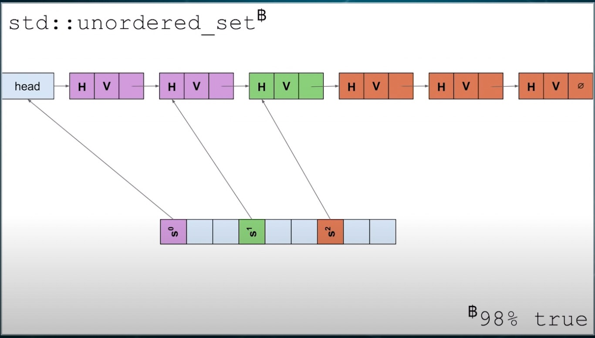
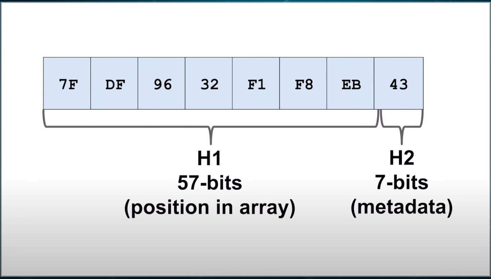
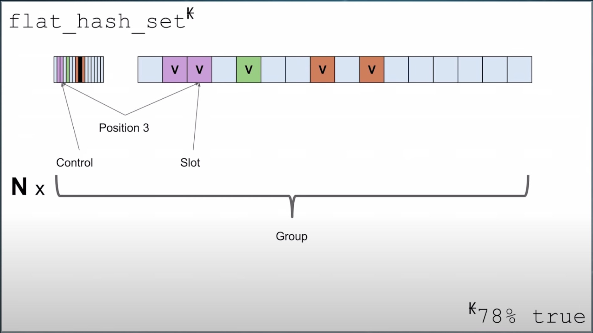

# Hash Table in Rust: SwissTable

在看 Rust 的文档的时候看到了这么一句：

> The hash table implementation is a Rust port of Google’s SwissTable. The original C++ version of SwissTable can be found here, and this CppCon talk gives an overview of how the algorithm works.

SwissTable 主要希望解决 cpp 标准库中 `std::unordered_map`, `std::unordered_set` 的一些痛点，包括：

- 由于使用链表解决哈希冲突，对 cpu 缓存不友好
- 对于每个值，需要存储 hash value，导致额外的内存使用
- 每次 find 操作都需要 3 步，即：1) 找到 bucket，2) 跳过链表的 dummy head 节点，3) 开始遍历链表，其中第二步是可以优化的（flat map）


出于好奇，了解了下 SwissTable 和 cpp 标准库的 HashTable 实现有什么区别。

## 1 HashTable in cpp standard library



如图所示：

- 标准库 HashTable 使用链地址法解决冲突，即 bucket + linked list。
- 对于每个值，在链表里存储它的 hash value 和 pointer，一共 16 字节，还有链表节点指针的额外开销 8 字节。

值得注意的是：

1. 对于每个 bucket 的 linked list，都有一个 dummy head（为了插入新的元素方便）
2. 在标准库的实现里，把所有的 value 连接成了一个大的 linked list，这是为了优化迭代性能（跳过空的 bucket）
3. 在 2 的前提下，dummy head 被设置为上一个 bucket 的最后一个元素

## 2 SwissTable

> High level concepts to keep in mind:
- open-addressing
- searches in parallel using SIMD
- first-come-first-serve collision resolution
- chunked (SIMD) triangular (quadratic-ish) probing
- tombstones to avoid backshifts

相对于标准库的实现，SwissTable 做了一些修改。

| # | Modification | What we gain | What we lose |
| :-: | :-: | :-: | :-: |
| 1 | 去掉 dummy head | find 时减少一次链表节点操作 | 迭代整个容器需要遍历所有空桶 |
| 2 | 去掉 hash value | payload 从 16 字节减少到 8 字节 | rehash 的时候需要重新计算 hash value，但是用户也可以选择自己存在结构体里 |
| 3 | 不再使用链地址法，转而使用开放地址法解决冲突 | 去掉了链表节点指针的开销 8 字节，并且对缓存友好 | 需要记录元素状态，load factor 失效 |
| 4 | 直接把值放到 bucket 里 | 省去从 bucket 跳转具体值的过程 | 需要哨兵，且元素越多性能越差 |
| 5 | 将哨兵换成 meta data | 性能更优 | 实现复杂 |

对于 5，meta data 需要表示每一个坑位处于哪一种状态：

- empty
- full
- deleted

因为有 3 个状态，没办法用一个 bit 表示一个坑位，这就非常蛋疼了。

### 2.1 Control Bytes and Hashes

SwissTable 通过 __两级的 hash value__ 解决了这个问题，分别是 57 bits 的 H1 和 7 bits 的 H2。



其中，meta data 由一个 bit 以及 H2 组成，一共 1 个字节。它可能表示：

1. `0b11111111`, empty
2. `0b10000000`, deleted
3. `0b0xxxxxxx`, full, and the lower 7 bits is H2

注意，__meta data 是单独存放的__，即 H2 并不和 hash value 共用。并且 SwissTable 中的值本来也不保存其 hash value。


### 2.2 Searching and Probing

Here's the pseudo code:

```cpp

// higher 57 bits
size_t H1(size_t hash) {return hash >> 7;}
// lower 7 bits
size_t H2(size_t hash) {return hash & 0x7f;}

iterator find(const K& key, size_t hash) const {
  size_t pos = H1(hash) % size_;
  while (true) {
    // H1, H2 and key match
    if (H2(hash) == ctrl_[pos] && key == slots_[pos]) {
      return iterator_at(pos);
    }

    // note that "kEmpty" (but not "kDeleted") indicates the ends of elements under H1
    if (ctrl_[pos] == kEmpty) {
      return end();
    }

    // H1 matches, H2 or key does not match, try next element with the same H1
    pos = (pos + 1) % size_;
  }
}
```

`find` 操作的基本步骤：

1. 求得 key 的 hash value，得到 H1 和 H2
2. 通过 H1 取余找到对应的 bucket index (`pos`)
3. 对比 H2 和 `pos` 对应的 meta data，如果匹配，再比较 key，若匹配，返回找到的元素
4. 若没找到，移动到 `pos + 1` 继续比较，直至找到 meta data 是 EMPTY

优势：

- extremely cache friendly. 我们对比的 meta data (`ctrl_`) 只有一个字节大小，64kB 的 L1 cache 可以存 64*1024 个。

### 2.3 SIMD optimization

上面的算法看起来已经非常完美了，但是我们可以使用 SIMD(Single Instruction Multiple Data) 进一步优化 meta data 的比较。这些指令可以同时操作 16 字节的数据，带来极大的效率提升。但是他们只作用于 Intel 而非 ARM 的芯片，因为 ARM 采用精简指令集（sorry， Apple M1/M2)。

用到的指令：

1. `_mm_set1_epi8` 令 16 bytes 的数据等于某个相同的值
2. `_mm_cmpeq_epi8` byte-wise 地对比两个 16 bytes 的数据
3. `_mm_movemask_epi8` 将每个 byte 的最高位取出，16 bytes 的数据变为了 16 bits

组合起来：

```cpp
BitMask<uint32_t> Match(h2_t hash) const {
  auto match = _mm_set1_epi8(hash);
  return BitMask<uint32_t>(_mm_movemask_epi8(_mm_cmpeq_epi8(match, ctrl)));
}
```

因为可以并行处理 16 个 meta data，我们可以把每 16 个元素的 meta data 和 slots 捆绑成一个 Group，并以 Group 为单位实现 `find` 操作。



```cpp
iterator find(const K& key, size_t hash) const {
  // pos of a group
  size_t pos = H1(hash) % num_groups_;
  while (true) {
    Group g{ctrl_ + pos * 16};
    // use SIMD function above to group-wise compare and find matched buckets
    for (int i : g.Match(H2(hash))) {
      if (key == slots_[pos + i]) {
        return iterator_at(pos * 16 + i);
      }
    }

    if (g.MatchEmpty()) {
      return end();
    }

    // next Group, instead of bucket
    pos = (pos + 1) % num_groups_;
  }
}
```


#### Real Code in Rust

hashbrown 使用 Rust 实现了 SwissTable，它的 `find` 实现如下：

```rust
#[inline]
fn probe_seq(&self, hash: u64) -> ProbeSeq {
    ProbeSeq {
        pos: h1(hash) & self.bucket_mask,
        stride: 0,
    }
}

/// Searches for an element in the table. This uses dynamic dispatch to reduce the amount of
/// code generated, but it is eliminated by LLVM optimizations.
#[inline]
fn find_inner(&self, hash: u64, eq: &mut dyn FnMut(usize) -> bool) -> Option<usize> {
    let h2_hash = h2(hash);
    let mut probe_seq = self.probe_seq(hash);

    loop {
        let group = unsafe { Group::load(self.ctrl(probe_seq.pos)) };

        for bit in group.match_byte(h2_hash) {
            let index = (probe_seq.pos + bit) & self.bucket_mask;

            if likely(eq(index)) {
                return Some(index);
            }
        }

        if likely(group.match_empty().any_bit_set()) {
            return None;
        }

        probe_seq.move_next(self.bucket_mask);
    }
}
```

可以看出基本和上文描述一致，但是它使用了三角数组来选择下一个探测位置。

## Reference

1. [Designing a Fast, Efficient, Cache-friendly Hash Table, Step by Step](https://www.bilibili.com/video/BV1Vx411V7Rd?p=104)

2. [hashbrown](https://github.com/rust-lang/hashbrown)

3. [hashbrown notes](https://gankra.github.io/blah/hashbrown-tldr/)
