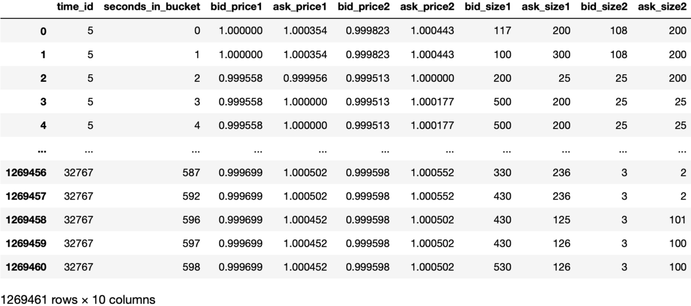
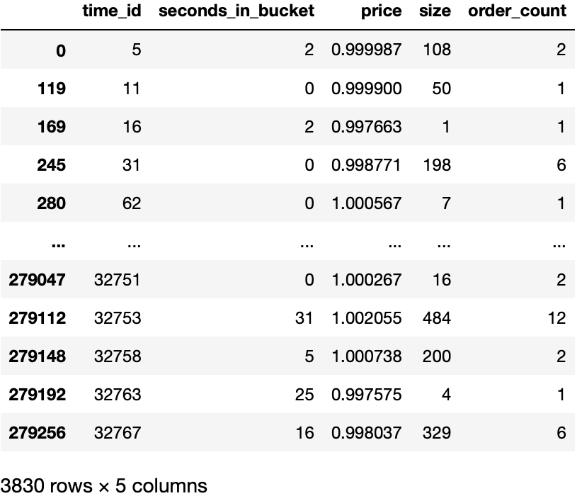
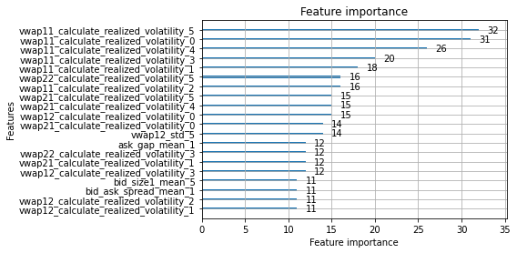

# LightGBM 实战：波动率预测(1)

这是 Kaggle 上的一个比赛：[Optiver Realized Volatility Prediction](https://www.kaggle.com/c/optiver-realized-volatility-prediction)。
目的是通过股票的历史 order book 和 trade 来预测它接下来十分钟的volatility。基本金融概念就不赘述了。

## 1. Data overview
该比赛给出的训练数据包含 112 支股票。每支股票以 10 分钟为采样时间（time_id），记录了 order book 和 trade 的详细数据。

### 1.1 Order book



- time_id: 每十分钟为一个 bucket，time_id 也是 bucket 的 id
- seconds_in_bucket: 10分钟=600秒，每个 bucket 重置
- price: 归一化后的价格，也称为回报率。以第一条记录为基准值 1.00
- size: 在这个价格上面报价的订单数量

### 1.2 Trade



## 2. Benchmark

为了衡量我们预测的效果，需要一个简单的预测作为 benchmark，低于这个 benchmark 说明模型是无效的。

最简单的预测就是直接用过去 10 分钟的 volatility 来预测未来 10 分钟
的。如果我们选取均方根百分比误差（RMSPE）作为评分标准，则其误差为 0.341，即34.10%。

RMSPE 计算方式为：
$$\text{RMSPE} = \sqrt{ \frac{ 1 }{ N } \sum_{i=1}^N (\frac{y_i - \hat{y}_i}{y_i})^2 }$$

### 2.1 Benchmark code
可以用以下代码计算 benchmark，计算 volatility 和 RMSPE 的方法与之后 LightGBM 中是一致的。

```python
vol = get_histocal_volatility('data/book_train.parquet/')
print_score(vol)
```
#### 2.1.1 Volatility calculation
```
import pandas as pd
import numpy as np
import glob
import multiprocessing as mp

def vwap(row):
    return (row.bid_price1 * row.ask_size1 + row.ask_price1 * row.bid_size1) / (row.ask_size1 + row.bid_size1)
def calculate_realized_volatility(frame):
    # theo_price = frame.apply(vwap, axis=1)
    theo_price = vwap(frame)
    log_return = np.log(theo_price).diff().dropna()
    return np.sqrt(np.sum(log_return**2))

def get_stock_volatility(path):
    book = pd.read_parquet(path)
    vol = book.groupby('time_id').apply(calculate_realized_volatility).reset_index(name='volatility')
    vol['stock_id'] = int(path.split('=')[1])
    return vol.reindex(['stock_id', 'time_id', 'volatility'], axis=1)

def get_histocal_volatility(train_dir):
    paths = glob.glob(f'{train_dir}/*')
    with mp.Pool(4) as p:
        results = p.map(get_stock_volatility, paths)
        return pd.concat(results)
```
#### 2.1.2 RMSPE calculation
```
def convert_to_submit_format(vol):
    row_id = pd.Series(vol.stock_id.astype(str) + '-' + vol.time_id.astype(str), name='row_id')
    return pd.concat([row_id, vol.iloc[:,2]], axis=1)

def print_score(vol):
    train = convert_to_submit_format(pd.read_csv('data/train.csv'))
    pred = convert_to_submit_format(vol)

    from sklearn.metrics import r2_score
    def rmspe(y_true, y_pred):
        return  (np.sqrt(np.mean(np.square((y_true - y_pred) / y_true))))
    joined = pd.merge(pred, train, on='row_id')
    R2 = round(r2_score(y_true = joined.target, y_pred = joined.volatility),3)
    RMSPE = round(rmspe(y_true = joined.target, y_pred = joined.volatility),3)
    print(f'Performance of the naive prediction: R2 score: {R2}, RMSPE: {RMSPE}')
```

## 3. 用 LightGBM 预测 volatility

本节将简单应用 LightGBM 预测 volatility，暂时不涉及任何调参以及特征工程的优化。仅仅验证 LightGBM 在默认参数下、利用简单的特征即可获得超过 benchmark 的预测效果，重点阐述如何调包 :)。


### 3.1 特征提取

对于 book 和 trade，我们都需要做一些简单的计算来将原始数据稍作加工。

归根到底，波动率反应的是价格变化剧烈程度。理论上，当某个股票流动性不佳（即买卖价差大、挂单数量少）时，它的波动率会显著上升。此外，如果某个股票交易量相对其挂单量较大，也会有较大的波动率。

另外，由于每个 time_id 有 10 分钟的数据，直觉上，这些数据对未来交易的影响应该是会 decay 的，因此有必要根据时间将其分为多个 batch。

#### 3.1.1 book features

book 方面，由于 volatility 是基于 vwap 的，我计算了多种 vwap，用于表现某一个 level 被全部 take 的情况。此外，买卖价差、买 1 和买 2 价差、卖 1 和 卖 2 的价差都可以纳入考虑。


```
def vwap(row, bid_idx, ask_idx):
    # TODO: multi-level
    return (row[f'bid_price{bid_idx}'] * row[f'ask_size{ask_idx}']
            + row[f'ask_price{ask_idx}'] * row[f'bid_size{bid_idx}']) / (
                row[f'ask_size{ask_idx}'] + row[f'bid_size{bid_idx}'])

def get_book(stock_id):
    book = pd.read_parquet(f"data/book_train.parquet/stock_id={stock_id}")

    # VWAPs

    # level 0 price does not change
    book['vwap11'] = vwap(book, 1, 1)
    # ask level 0 is fully traded
    book['vwap12'] = vwap(book, 1, 2)
    # bid level 0 is fully traded
    book['vwap21'] = vwap(book, 2, 1)
    # bid and ask level 0 is fully traded
    book['vwap22'] = vwap(book, 2, 2)

    book['bid_ask_spread'] = book.ask_price1 - book.bid_price1
    book['bid_gap'] = book.bid_price1 - book.bid_price2
    book['ask_gap'] = book.ask_price2 - book.ask_price1

    book['bid_imbalance'] = book.bid_size1 / book.bid_size2
    book['ask_imbalance'] = book.ask_size1 / book.ask_size2

    return book

def get_book_features(book, window):
    book['batch_id'] = cut_by_time(book, window)

    feature_dict = {
        'vwap11': ['mean', 'std', 'max', calculate_realized_volatility],
        'vwap12': ['mean', 'std', 'max', calculate_realized_volatility],
        'vwap21': ['mean', 'std', 'max', calculate_realized_volatility],
        'vwap22': ['mean', 'std', 'max', calculate_realized_volatility],
        'bid_gap': ['mean', 'std', 'max'],
        'ask_gap': ['mean', 'std', 'max'],
        'bid_ask_spread': ['mean', 'std', 'max'],
        'bid_size1': ['mean', 'std', 'max', 'sum'],
        'ask_size1': ['mean', 'std', 'max', 'sum'],
        'bid_imbalance': ['mean', 'std', 'max'],
        'ask_imbalance': ['mean', 'std', 'max'],
    }

    return get_features(book, feature_dict)
```

#### 3.1.2 trade features

随便提取了几个 trade 的特征，例如交易数量、交易金额等等。

```python
def get_trade(stock_id):
    trade = pd.read_parquet(f"data/trade_train.parquet/stock_id={stock_id}").rename({'size':'trade_volume'}, axis=1)
    trade['trade_amount'] = trade.price * trade.trade_volume
    trade['per_trade_quantity'] = trade.trade_volume / trade.order_count

    return trade

def get_trade_features(trade, window):
    trade['batch_id'] = cut_by_time(trade, window)
    feature_dict = {
        'trade_volume': ['mean', 'std', 'max', 'sum'],
        'trade_amount': ['mean', 'std', 'max'],
        'per_trade_quantity': ['mean', 'std', 'max']
    }

    return get_features(trade, feature_dict)


def get_all_features(stock_id, window):
    book = get_book(stock_id)
    book_features = get_book_features(book, window)
    trade = get_trade(stock_id)
    trade_features = get_trade_features(trade, window)

    merged = pd.merge(book_features, trade_features, on=['time_id_'])
    return merged

def get_train_data(stocks, window):
    df = []
    for stock in stocks:
        features = get_all_features(stock, window)
        features['stock_id_'] = stock
        df.append(features)
    return pd.concat(df).reset_index(drop=True)
```

### 3.2 应用 LightGBM

我们已经在 3.1 中得到了一堆特征了（294维），现在可以将它们 feed 到 LightGBM 中进行训练了。原始数据集中提供了 `train.csv` 用于训练。在这里，我们使用经典的交叉验证来训练模型。将原始数据随机分为 5 份，其中 4 份用于训练，1 份用于验证。


```
from sklearn.model_selection import KFold
import lightgbm

# root mean squared percentage error
def rmspe(y_true, y_pred):
    return np.sqrt(np.mean(np.square((y_true - y_pred)/y_true)))
def feval_rmspe(y_pred, lgb_train):
    y_true = lgb_train.get_label()
    return 'RMSPE', rmspe(y_true, y_pred), False

result = pd.read_csv('data/train.csv')
selected_y = result[result.stock_id.isin([stock_id])].target.reset_index(drop=True)

kf = KFold(n_splits = 5, random_state = 2021, shuffle = True)
train_features = train_data.drop('time_id_', axis=1)
for train_index, test_index in kf.split(train_features):
    # print("TRAIN:", train_index, "TEST:", test_index)
    X_train, X_test = train_features.loc[train_index], train_features.loc[test_index]
    y_train, y_test = selected_y.loc[train_index], selected_y.loc[test_index]

    train_dataset = lightgbm.Dataset(X_train,
                                     y_train,
                                     weight=1/np.square(y_train))
    validation_dataset = lightgbm.Dataset(X_test, y_test, weight=1/np.square(y_test))
    model = lightgbm.train(params={},
                           train_set = train_dataset,
                           valid_sets = [train_dataset, validation_dataset],
                           early_stopping_rounds=50,
                           feval = feval_rmspe,
                           verbose_eval = 20,
                           num_boost_round=1000)
    # get prediction score
    y_pred = model.predict(X_test)
    print("RMSPE = ", rmspe(y_test, y_pred))
    lightgbm.plot_importance(model, max_num_features=20)
```
注意，`time_id` 并不属于特征，在这里需要去掉以免对训练造成负面影响。

#### 3.2.1 LightGBM 步骤

分为 3 步：

1. 建立数据集（`train_dataset  = lightgbm.Dataset(...)`）
2. 训练模型 (`model = lightgbm.train(...)`)
3. 预测 (`model.predict(X_test)`)

着重讲下第 2 步的参数，它最为复杂。
```python
    model = lightgbm.train(params={},
                           train_set = train_dataset,
                           valid_sets = [train_dataset, validation_dataset],
                           early_stopping_rounds=50,
                           feval = feval_rmspe,
                           verbose_eval = 20,
                           num_boost_round=1000)
```
- `params={}` 说明我们使用默认参数。由于篇幅所限，参数含义和调优放在下一篇文章。

- `valid_set`, `early_stopping_rounds`, `feval`：这三个参数是可选参数，他们是有关联的。目的是避免过拟合。利用 `feval` 来评价验证集在这个模型下的准确度，如果超过 `early_stopping_rounds` 都没有提高，就提前终止训练，返回局部最优的模型

- `num_boost_round` 用于控制 boost 过程的最大循环次数，每一次循环会生成一棵树来拟合残差，如果 `early_stopping_rounds` 生效，就不必运行到最后。

#### 3.2.2 特征重要性

这也是一个有趣的概念，在我们的模型中，特征重要性如下所示：




##### 3.2.2.1 特征重要性的计算

对于树方法来说（LightGBM，XGBoost，GBDT），他们的计算方法都是类似的，即在某个节点分裂前后，比较其”不纯度“，不纯度下降越多，说明效果越好。

$$ \text{importance} = \frac{ n }{ N } ( \rho - \frac{n_l}{n} \rho_l - \frac{n_r}{n} \rho_r ) $$

其中:
$n$ - 某节点样本数
$N$ - 总样本数
$\rho$ - 不纯度
下标 l, r 分别表示分裂后的左右子节点。

因此，其含义也是明显的。首先以该节点样本数占总样本数为权重，乘以分裂后降低的不纯度，得到该节点分裂的“贡献”，即重要性。

#### 3.2.3 预测结果

我们非常轻松地将预测误差 RMSPE 从 0.34 降低到了 0.22~0.25 。由于本人电脑渣，只随机选用了几个股票的数据，但是从统计意义上讲应该和训练所有数据误差类似。因此虽不严谨也足够说明 LightGBM 确实是非常有效的。

当然，这是一个很菜的成绩，在这个比赛中，前几名已经将误差降低到了 0.18 以内。这是因为我们还没有进行任何参数调优，特征也是随手选的。我们将在下一篇中详细介绍如何优化参数，以及提高特征的质量。

```console
[LightGBM] [Warning] Auto-choosing col-wise multi-threading, the overhead of testing was 0.007232 seconds.
You can set `force_col_wise=true` to remove the overhead.
[LightGBM] [Info] Total Bins 74970
[LightGBM] [Info] Number of data points in the train set: 3064, number of used features: 294
[LightGBM] [Info] Start training from score 0.003745
Training until validation scores don't improve for 50 rounds
[20]	training's RMSPE: 0.185026	valid_1's RMSPE: 0.249763
[40]	training's RMSPE: 0.141187	valid_1's RMSPE: 0.238492
[60]	training's RMSPE: 0.117718	valid_1's RMSPE: 0.240709
[80]	training's RMSPE: 0.100988	valid_1's RMSPE: 0.244922
Early stopping, best iteration is:
[34]	training's RMSPE: 0.150671	valid_1's RMSPE: 0.237703
RMSPE =  0.2377028864491903
[LightGBM] [Warning] Auto-choosing col-wise multi-threading, the overhead of testing was 0.009398 seconds.
You can set `force_col_wise=true` to remove the overhead.
[LightGBM] [Info] Total Bins 74970
[LightGBM] [Info] Number of data points in the train set: 3064, number of used features: 294
[LightGBM] [Info] Start training from score 0.003736
Training until validation scores don't improve for 50 rounds
[20]	training's RMSPE: 0.182278	valid_1's RMSPE: 0.244471
[40]	training's RMSPE: 0.139054	valid_1's RMSPE: 0.242755
[60]	training's RMSPE: 0.116214	valid_1's RMSPE: 0.249089
Early stopping, best iteration is:
[26]	training's RMSPE: 0.164368	valid_1's RMSPE: 0.240414
RMSPE =  0.24041392797196037
[LightGBM] [Warning] Auto-choosing col-wise multi-threading, the overhead of testing was 0.007414 seconds.
You can set `force_col_wise=true` to remove the overhead.
[LightGBM] [Info] Total Bins 74968
[LightGBM] [Info] Number of data points in the train set: 3064, number of used features: 294
[LightGBM] [Info] Start training from score 0.003772
Training until validation scores don't improve for 50 rounds
[20]	training's RMSPE: 0.183314	valid_1's RMSPE: 0.263333
[40]	training's RMSPE: 0.140241	valid_1's RMSPE: 0.254926
[60]	training's RMSPE: 0.116984	valid_1's RMSPE: 0.256409
[80]	training's RMSPE: 0.0994774	valid_1's RMSPE: 0.261615
Early stopping, best iteration is:
[38]	training's RMSPE: 0.143255	valid_1's RMSPE: 0.253827
RMSPE =  0.2538268499911712
[LightGBM] [Warning] Auto-choosing col-wise multi-threading, the overhead of testing was 0.007743 seconds.
You can set `force_col_wise=true` to remove the overhead.
[LightGBM] [Info] Total Bins 74970
[LightGBM] [Info] Number of data points in the train set: 3064, number of used features: 294
[LightGBM] [Info] Start training from score 0.003678
Training until validation scores don't improve for 50 rounds
[20]	training's RMSPE: 0.185122	valid_1's RMSPE: 0.224511
[40]	training's RMSPE: 0.141241	valid_1's RMSPE: 0.220552
[60]	training's RMSPE: 0.11815	valid_1's RMSPE: 0.22418
[80]	training's RMSPE: 0.101414	valid_1's RMSPE: 0.227895
Early stopping, best iteration is:
[32]	training's RMSPE: 0.154159	valid_1's RMSPE: 0.219429
RMSPE =  0.2194288855505451
[LightGBM] [Warning] Auto-choosing col-wise multi-threading, the overhead of testing was 0.004243 seconds.
You can set `force_col_wise=true` to remove the overhead.
[LightGBM] [Info] Total Bins 74969
[LightGBM] [Info] Number of data points in the train set: 3064, number of used features: 294
[LightGBM] [Info] Start training from score 0.003703
Training until validation scores don't improve for 50 rounds
[20]	training's RMSPE: 0.184329	valid_1's RMSPE: 0.238253
[40]	training's RMSPE: 0.141179	valid_1's RMSPE: 0.232793
[60]	training's RMSPE: 0.118668	valid_1's RMSPE: 0.235608
Early stopping, best iteration is:
[28]	training's RMSPE: 0.161778	valid_1's RMSPE: 0.232168
RMSPE =  0.23216812618489302
```


## 4. LightGBM 参数调整及特征优化

见下一篇
[LightGBM 实战：波动率预测(2)](https://www.jianshu.com/p/80ef7f71950e)。


## 5. Appendix

Useful tool functions, especially the `get_features`. It uses `pandas.pivot` to create "flatten" features based on trunks separated by time.

```
def calculate_realized_volatility(price):
    log_return = np.log(price).diff().dropna()
    return np.sqrt(np.sum(log_return**2))

def cut_by_time(df, window_seconds):    
    batch_id = df.groupby('time_id', group_keys=False).apply(
        lambda g: (g.seconds_in_bucket / window_seconds).astype(int))
    return batch_id

def get_features(df, feature_dict):
    features = df.groupby(['time_id', 'batch_id'], group_keys=False
                         ).agg(feature_dict).reset_index()

    # concat multi-level column
    features.columns = ['_'.join(col) for col in features.columns]
    # now each time id has several rows of features for different time window
    # use pandas.pivot to flat these rows
    flat_features = features.pivot(index='time_id_', columns='batch_id_')
    flat_features.columns = [f'{col[0]}_{col[1]}' for col in flat_features.columns]
    return flat_features.reset_index()
```


## 6. Reference

1. [Optiver Realized Volatility Prediction](https://www.kaggle.com/c/optiver-realized-volatility-prediction)
2. [lightGBM Baseline for "Optiver Realized Volatility Prediction"](https://www.kaggle.com/alexioslyon/lgbm-baseline)
