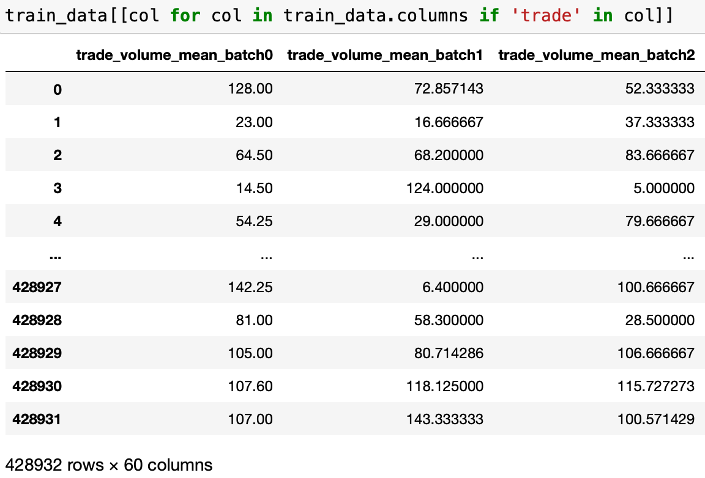
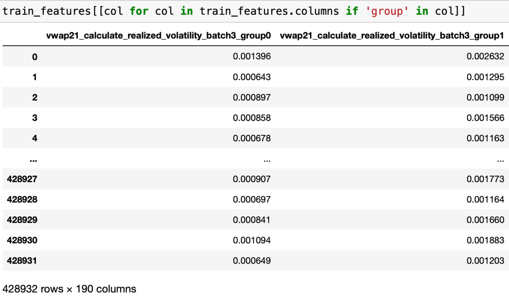
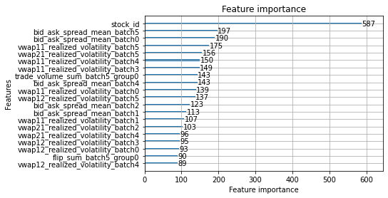
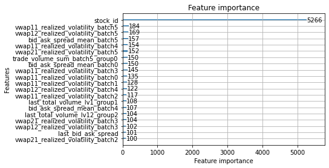

# LightGBM 实战：波动率预测(2)

在上一篇文章 [LightGBM 实战：波动率预测(1)](https://www.jianshu.com/p/b0988fcaa842) 中，我们介绍了 LightGBM 的基本用法。本篇将侧重从两个方面介绍进阶方法：

1. 如何提取更好的特征
2. 如何调节 LightGBM 参数

最终结果是将预测误差从 0.24 降低到了 0.19。这只是 KFold 验证集的结果，因为比赛已结束，没办法提交看看了，排名第一的似乎可以做到 0.18 以内。

本项目代码已上传 GitHub：[LightGBM-Volatility-Predict](https://github.com/double-free/LightGBM-Volatility-Predict).

## 1 更好的特征

实质上这是一种根据对业务的理解，不断尝试组合基础信息的过程。对于新构建的特征，可以通过训练结果是否有提升、“特征重要度“是否较高来判断是不是一个好的特征。

### 1.1 单个 stock 的特征

我们的目标是预测未来 10 分钟的波动率，那么哪些特征是好特征呢？波动率反应的是价格变化剧烈程度。理论上，当某个股票流动性不佳（即买卖价差大、挂单数量少）时，它的波动率会显著上升。此外，成交频率、挂单撤单频率等也可以纳入考虑。

#### 1.1.1 时间窗口统计特征

现实中的股票价格变化并不是一个 Markov 过程。但是，显然距离较近的事件对预测影响较大。因此，对于训练数据，由于是以 10 分钟为一个 time_id，我们可以考虑将其更进一步细分，例如，100 秒为一个 batch。将原本的 stock_id-time_id 两层结构细分为三层：stock_id-time_id-batch_id。

在生成训练数据时，每个 time_id 下多个 batch_id 之间是平行的特征，例如：



#### 1.1.2 最后时刻特征

如果只有一些类似于均值的统计特征，我们会忽略一个重要的信息：在要预测的接下来的 10 分钟，初始状态是怎样的？

因此，我们有必要保留 book 每个 time_id 的最后一条，在这里我记录了 book 的买卖差价以及每个 level 的总挂单量：

```python
    # last book state
    last_state = raw_book.drop_duplicates(["time_id"], keep="last").reset_index(
        drop=True
    )
    book_features["last_total_volume_lv1"] = last_state.bid_size1 + last_state.ask_size1
    book_features["last_total_volume_lv12"] = (
        book_features.last_total_volume_lv1
        + last_state.bid_size2
        + last_state.ask_size2
    )
    book_features["last_bid_ask_spread"] = last_state.ask_price1 - last_state.bid_price1
    return book_features
```

#### 1.1.3 一些复杂的特征

我们可以将 book 和 trade 联合起来观察，例如，使用 `pd.merge_asof` 可以知道每个 trade 发生时的 book 情况。相比于单纯的 trade 数量， trade/book 的比例更能描述到底交易者有多激进。

```python
    merged = pd.merge_asof(
        trade,
        raw_book[
            [
                "time_id",
                "time_seconds",
                "bid_size1",
                "ask_size1",
                "bid_size2",
                "ask_size2",
            ]
        ],
        by="time_id",
        on="time_seconds",
    )
    merged["trade_ratio_lv1"] = merged.trade_volume / (
        merged.bid_size1 + merged.ask_size1
    )
    merged["trade_ratio_lv12"] = merged.trade_volume / (
        merged.bid_size1 + merged.ask_size1 + merged.bid_size2 + merged.ask_size2
    )
```

此外，我们还能记录 book 发生了多少次 “flip”，即交易一整个 level 的情况。

### 1.2 全局特征

我们目前为止都只根据一个股票的信息做预测。实际上，不同股票之间肯定存在关联的。例如，同一板块、同一个行业或是同一个ETF的股票波动率显然是相关的。因此，如果能加入一些”全局“的，类似于大盘信息的特征，应该会对预测结果有帮助。

#### 1.2.1 将股票分组（Kmeans）

我们需要把股票大致分组，并每个组分别统计一些特征，作为该时段的全局信息加入训练特征中。

我们利用 KMeans 依据历史数据的波动率变化（而非波动率）进行分组。我随便尝试了下 KMeans 和 DBSCAN，发现这个数据更适合用 KMeans 分，当然也可以使用更高级的算法，不过这并不是重点。

不直接使用波动率是因为不同股票之间存在基本波动率的差异。但是如果是相关的股票（例如同一个行业的），那么他们波动率的变动趋势应该是类似的。

分组步骤大概是：
1. 获取所有股票的历史波动率 (在 `train.csv` 中）
2. 根据 time_id 分组，并求每个股票的相关度矩阵
3. 根据相关度矩阵进行分组

```python
def get_correlation(y_path):
    vol_true = pd.read_csv(y_path).pivot(
        index="time_id", columns="stock_id", values="target"
    )
    # correlation is based on the "change rate" of volatility
    # instead of the raw volatility, I think it is comparable between stocks
    return (vol_true / vol_true.shift(1)).corr()
```

例如我们将其分为 5 个组，每个组的股票个数是：
```
group_id
0    41
1    14
2    25
3    28
4     4
dtype: int64
```
最大的组，组 0 内的元素是：
```
2,   7,  13,  14,  15,  17,  19,  20,  23,  26,  28,  32,  34,
35,  39,  41,  42,  43,  46,  47,  48,  51,  52,  53,  59,  64,
67,  68,  70,  93,  95, 102, 104, 105, 107, 114, 118, 119, 120,
123, 125
```

#### 1.2.2 获取每个组的统计特征

对于不同 stock 比较 reasonable 的统计数据就是均值了。我们需要在每个 time_id，对每个组统计所需特征的均值。实现如下：

```python
def get_stock_group_features(train_features, corr, selected_features):
    copied_corr = corr.copy()
    from sklearn.cluster import KMeans

    # clustering = DBSCAN(eps=0.4, min_samples=2).fit(corr.values)
    clustering = KMeans(n_clusters=5, random_state=0).fit(copied_corr)
    copied_corr["group_id"] = clustering.labels_
    merged = train_features.merge(copied_corr[["group_id"]], on="stock_id")
    group_features = (
        merged.groupby(["time_id_", "group_id"])
        .mean()
        .reindex(selected_features, axis=1)
        .reset_index()
        .pivot(index="time_id_", columns="group_id")
    )
    group_features.columns = [
        f"{col[0]}_group{col[1]}" for col in group_features.columns
    ]
    return group_features.reset_index()
```

最后可以得到类似于这样的特征，附加在每个 stock 自身的特征后面：




### 1.3 利用特征重要度筛选特征

在上一篇文章 [LightGBM 实战：波动率预测(1)](https://www.jianshu.com/p/b0988fcaa842) 中，已经简单介绍了特征重要度的计算方法和含义。这里，我们可以尝试使用它来去掉垃圾特征，保留优秀的特征。这可以有效减少训练时间，避免过拟合。

在得到模型后，我们可以画出每个特征重要性：

```
lightgbm.plot_importance(model, max_num_features=20)
```




我们也可以通过下面的函数得到一个 DataFrame：
```python
def get_feature_importance(model):
    return pd.DataFrame(
        {"feature": model.feature_name(), "importance": model.feature_importance()}
    ).sort_values(by="importance", ascending=False)
```

整体看来，重要的特征还是比较符合直觉的。尤其值得注意的是，全局特征排名非常靠前。这说明我们在 1.2 中加入全局特征是非常有意义的。


### 1.4 特征优化结果

上述特征并没有完全利用起来，因为我电脑实在太烂了，特征超过 400 就已经内存不足无法运行了，因此对于 group 的特征，我仅选择了一部分：
```python
selected_features = []
selected_features.extend([col for col in train_data.columns if 'trade_volume_mean' in col])
selected_features.extend([col for col in train_data.columns if 'last' in col])
selected_features.extend([col for col in train_data.columns if 'vwap11_realized_volatility' in col])
# selected_features.extend([col for col in train_data.columns if 'gap' in col])
# selected_features.extend([col for col in train_data.columns if 'spread' in col])
selected_features.extend([col for col in train_data.columns if 'flip' in col])
selected_features.extend([col for col in train_data.columns if 'count' in col])
selected_features.extend([col for col in train_data.columns if 'trade_ratio_lv1_' in col])
selected_features = set(selected_features)
```

但是结果已经相当好了，轻松从之前的 0.22~0.25 优化到了 0.19~0.20（默认 LGBM 参数下）。

```console
Early stopping, best iteration is:
[548]	training's l2: 1.41377e-07	training's RMSPE: 0.173893	valid_1's l2: 1.79515e-07	valid_1's RMSPE: 0.196654
RMSPE =  0.19665403611036217

Early stopping, best iteration is:
[744]	training's l2: 1.3117e-07	training's RMSPE: 0.167791	valid_1's l2: 1.75072e-07	valid_1's RMSPE: 0.192851
RMSPE =  0.19285066677735865

Early stopping, best iteration is:
[389]	training's l2: 1.5088e-07	training's RMSPE: 0.179636	valid_1's l2: 2.03518e-07	valid_1's RMSPE: 0.209418
RMSPE =  0.20941792466116485

Early stopping, best iteration is:
[764]	training's l2: 1.30281e-07	training's RMSPE: 0.167222	valid_1's l2: 1.86109e-07	valid_1's RMSPE: 0.198835
RMSPE =  0.19883534222771257

Early stopping, best iteration is:
[672]	training's l2: 1.35331e-07	training's RMSPE: 0.170158	valid_1's l2: 1.79225e-07	valid_1's RMSPE: 0.196387
RMSPE =  0.19638739751965206
```

## 2 Light GBM 参数调节

特征确定后，参数调节很难再大幅提高精度了，没有很专业的调节，因为这个过程本身没什么意思，最终误差率如下：

```console
Did not meet early stopping. Best iteration is:
[1000]	training's l2: 1.29986e-07	training's RMSPE: 0.16674	valid_1's l2: 1.73911e-07	valid_1's RMSPE: 0.19356
RMSPE =  0.19355980904948505

Did not meet early stopping. Best iteration is:
[1000]	training's l2: 1.29211e-07	training's RMSPE: 0.166533	valid_1's l2: 1.69505e-07	valid_1's RMSPE: 0.18976
RMSPE =  0.18975971408050601

Early stopping, best iteration is:
[467]	training's l2: 1.51157e-07	training's RMSPE: 0.1798	valid_1's l2: 1.96557e-07	valid_1's RMSPE: 0.205806
RMSPE =  0.20580561455113955

Did not meet early stopping. Best iteration is:
[1000]	training's l2: 1.29565e-07	training's RMSPE: 0.166761	valid_1's l2: 1.78346e-07	valid_1's RMSPE: 0.194644
RMSPE =  0.19464427237056287

Did not meet early stopping. Best iteration is:
[1000]	training's l2: 1.30119e-07	training's RMSPE: 0.166848	valid_1's l2: 1.74124e-07	valid_1's RMSPE: 0.193572
RMSPE =  0.19357219429054603
```
贡献最大的参数就是 `categorical_colum`。将 stock id 指定为类别特征后，有明显的提高。其余参数我感觉差异不大。最终使用的参数为：
```python
params = {
     'learning_rate': 0.06,
     'bagging_fraction': 0.72,
     'bagging_freq': 4,
     'feature_fraction': 0.6,
     'lambda_l1': 0.5,
     'lambda_l2': 1.0,
     'categorical_column':[0]}
```
```python
        model = lightgbm.train(
            params=lgbm_params,
            train_set=train_dataset,
            valid_sets=[train_dataset, validation_dataset],
            feval=feval_rmspe,
            num_boost_round=1000,
            callbacks=[lightgbm.early_stopping(200), lightgbm.log_evaluation(50)],
        )
```


### 2.1 提高精度

能提高精度的参数并不是非常多，我只找到两个。个人感觉参数调节更多是为了减少训练时间以及避免过拟合。

#### 2.1.1 指定 categorical feature

基于树的方法有一个优点是能够非常好的处理类别特征（categorical feature）。在这个项目中，stock_id 就是一个类别特征，它的大小没有意义，只是表明类型。

我们可以明确告诉 LGBM `stock_id` 是 categorical feature，这样做没有任何副作用：

```python
params = {
    'categorical_column':[0]
}
models = lgbm_train.train(train_features.drop('time_id_', axis=1), train_y.target, 5, params)
```
仅一条配置就能获得明显的优化 (误差从 0.196 下降到 0.192)，并且 stock_id 的重要性显著提升，更符合直觉。



```console
Early stopping, best iteration is:
[824]	training's l2: 1.16958e-07	training's RMSPE: 0.158164	valid_1's l2: 1.71789e-07	valid_1's RMSPE: 0.192376
RMSPE =  0.19237567863942145

Early stopping, best iteration is:
[796]	training's l2: 1.17188e-07	training's RMSPE: 0.158596	valid_1's l2: 1.71186e-07	valid_1's RMSPE: 0.190699
RMSPE =  0.19069872260565224

Early stopping, best iteration is:
[550]	training's l2: 1.29443e-07	training's RMSPE: 0.166386	valid_1's l2: 1.98206e-07	valid_1's RMSPE: 0.206667
RMSPE =  0.20666692821450117

Early stopping, best iteration is:
[574]	training's l2: 1.28093e-07	training's RMSPE: 0.165812	valid_1's l2: 1.79801e-07	valid_1's RMSPE: 0.195436
RMSPE =  0.19543642931738184

Early stopping, best iteration is:
[393]	training's l2: 1.40621e-07	training's RMSPE: 0.173451	valid_1's l2: 1.77851e-07	valid_1's RMSPE: 0.195633
RMSPE =  0.19563316948191248
```

#### 2.1.2 设置更小的 learning rate

最简单粗暴的提高精度方法，但是随之而来是训练时间的增加，一般配合下面章节中的提高训练速度的参数使用。
```
'learning_rate': 0.06,
```

### 2.2 防止过拟合 & 提高训练速度

#### 2.2.1 设置 early stopping

early stopping 需要在训练时额外提供一个验证数据集，如果验证数据集上的预测效果在 N 次迭代中没办法再提高，就提前停止。涉及到 2 个参数：

- `valid_sets`
使用 KFold 分的验证集。
- `callbacks=[lightgbm.early_stopping(100)]`
100 次迭代没有提高，则返回当前最优模型

```python
        model = lightgbm.train(
            params=lgbm_params,
            train_set=train_dataset,
            valid_sets=[train_dataset, validation_dataset],
            feval=feval_rmspe,
            num_boost_round=1000,
            callbacks=[lightgbm.early_stopping(100), lightgbm.log_evaluation(50)],
        )
```
具体效果就是有时候没有训练到 `num_boost_round` 就提前终止了：

```console
Early stopping, best iteration is:
[393]   training's l2: 1.40621e-07  training's RMSPE: 0.173451  valid_1's l2: 1.77851e-07   valid_1's RMSPE: 0.195633
RMSPE =  0.19563316948191248
```

#### 2.2.2 Subsampling

通过随机丢弃一部分样本或者特征，加快训练速度，避免过拟合。

分为两种，一种是对样本（即 rows）：
```
'bagging_fraction': 0.72,
'bagging_freq': 4,
```
这两个必须一起使用，`bagging_fraction` 表示保留多少样本，`bagging_freq` 表示每隔多少轮生效一次，设置为 0 则不会生效。

还有一种是对特征（即 columns）：
```
'feature_fraction': 0.6,
```
#### 2.2.3 控制模型复杂度

我们知道 lightgbm 生成的模型其实是一堆树的组合。那么就可以从两个方向控制模型复杂度，避免过拟合：

- 控制树的总数
  - `num_boost_round`
- 控制每棵树的复杂度
  - `min_data_in_leaf`
  - `num_leaves`
  - `max_depth`

#### 2.2.4 Regularization

正则化（Regularization）是机器学习中一种常用的技术，其主要目的是控制模型复杂度，减小过拟合。最基本的正则化方法是在原目标（代价）函数 中添加惩罚项，对复杂度高的模型进行“惩罚”。

涉及 3 个参数：

- `lambda_l1`
设置一个 threshold，gain 小于这个 threshold 直接认为是 0，不再分裂。
- `lambda_l2`
为 gain 的分母（即节点样本数）增加一个常数项，作用于全程，在节点样本数已经很小的时候，能显著减小 gain 避免分裂。

- `min_gain_to_split`
如果一个节点的 gain 低于这个数，不再分裂。

在我另一篇文章 [LightGBM 参数中的 lambda_l1 和 lambda_l2](https://www.jianshu.com/p/a86b39f0b151) 中有详细的介绍。


# 参考
1. [clustering methods](https://scikit-learn.org/stable/modules/clustering.html)
2. [Understanding LightGBM Parameters (and How to Tune Them) - neptune.ai](https://neptune.ai/blog/lightgbm-parameters-guide)
3. [An Overview of LightGBM (avanwyk.com)](https://www.avanwyk.com/an-overview-of-lightgbm/)
4. [深入理解L1、L2正则化](https://zhuanlan.zhihu.com/p/29360425)
