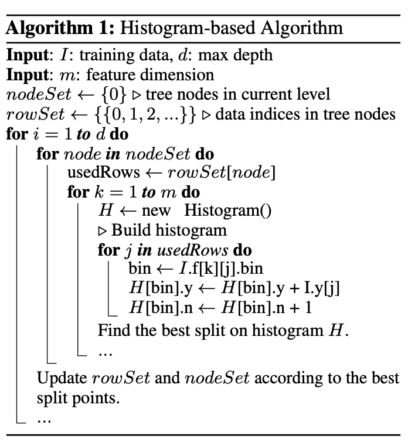
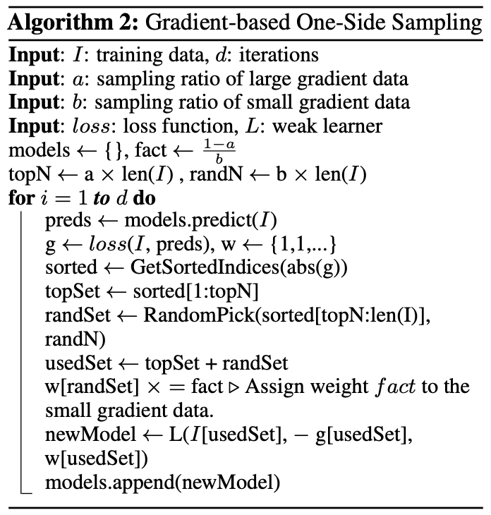

# Light GBM 原理

我们在 [Boosting Trees](https://www.jianshu.com/p/a9274dfb0007) 中介绍了 Gradient Boosting Decision Tree (GBDT) 的原理。Light GBM 是 GBDT 的一个衍生方法。相比其他的衍生方法（如 XGBoost），它最明显的优势就是训练速度快，这也是它被命名为 "light" 的原因。它在保持训练精度的前提下，将传统 GBDT 的训练速度提高了 20 倍。

## 1. 论文要点

LightGBM 的目的是缩短训练时间，而训练时间主要取决于样本数量和特征维度。

它使用了三种重要的优化：
1. （非原创）在训练树的时候，使用直方图算法来寻找最佳划分节点
2. （原创）使用基于梯度的单边采样(GOSS)降低样本数量
3. （原创）使用互斥特征捆绑 (EFB)降低特征维度

### 1.1 直方图算法

在 GBDT 的训练中，每次迭代，我们都会拟合负梯度来生成一个决策树，这也是 GBDT 训练中最耗时的部分。其中，计算量最大的部分就是寻找最佳划分节点。

最简单直接的方法就是预排序法。即，先将所有样本以某个特征为比较对象排序，再依次遍历寻找最优划分点。这种虽然能找到最优点， 但是缺点很明显：

1. 效率低下，时间复杂度是 $O(\#data \times \#feature)$
2. 对噪声敏感

LightGBM 选择了直方图法。即，先将数据划分到多个 bin 中，用 bin 的值覆盖原始值进行训练。它的优势是：

1. 将时间复杂度降低到了 $O(\#bin \times \#feature)$。由于 bin 的数量肯定远小于样本的数量，因此优化很明显
2. 不需要对样本数据进行排序
3. 增强了对数据噪声的鲁棒性

当然，它也有缺点，但是都可以接受：

1. 找到的划分点不一定是最优的
2. 由于相似的数据被划分到了一个 bin 中，忽略了一些细节特征
3. bin 的数量选择过少可能导致欠拟合

直方图算法并不是 LightGBM 的原创：
> Scikit-learn和gbm in R演变算法使用了pre-sorted algorithm算法，pGBRT算法是使用了histogram-based algorithm，而XGBoost两者都支持

## 1.2 基于梯度的单边采样
基于梯度的单边采样(Gradient-based One Side Sample, GOSS)是 LightGBM 论文中提出的一大创新点，用于减少训练样本，从而提高效率。

在 AdaBoost 中（见我之前的文章 [ESL 10.1 Boosting Methods](https://www.jianshu.com/p/ce54ba0d4e58)），每个样本都被赋予了权重，因此可以简单地丢弃掉权重小的样本。然而，GBDT 中的样本并没有权重这一概念。因此，文中提出了利用梯度来筛选样本的思路。如果一个样本的梯度较小，说明它已经是充分训练过的了，可以丢弃。

但是，这个方法的问题在于丢弃样本会改变数据的分布，影响模型精度。为了避免这个问题，LightGBM 保留所有梯度较大的样本，同时，对梯度较小的样本进行__随机采样__，因此称为“单边采样”。

其中输入：
- $a$ 是“较大梯度样本”的比例，top $a$ 的样本都被全部选取
- $b$ 是“较小梯度样本”采样后的比例（相对于所有样本）

因此必然有 $a + b < 1$，且 $ \text{fact} = (1-a) / b > 1$。

核心思想是：
1. 将样本梯度（残差）由高到低排序
2. 选取前 $a * 100 \%$ 的样本为集合 A
3. 从后 $(1-a) * 100 \%$ 的样本中选取 $ b * 100\% $ 的样本为集合 B
4. 将被选取的样本（A + B）用于训练
5. 在更新模型时，需要对集合 B 进行补偿，乘以 $(1-a)/b$

## 1.3 互斥特征捆绑
实际应用中的特征之间有时是存在互斥关系的，即，他们不会同时有值。我们可以将这一类特征“捆绑”成一个特征。这样我们可以把时间复杂度由 $O(\#data \times \#feature)$ 降低到 $O(\#data \times \#bundles)$。为了能捆绑更多的特征，LightGBM 还引入了一个”冲突率“$\gamma$，即两个特征同时不为 0 的比例。我们通过调节 $\gamma$ 来使部分几乎互斥的特征也可以捆绑成一个。

那么我们就需要处理两个问题：

1. 如何找到互斥特征
2. 如何捆绑

### 1.3.1 选取互斥特征

寻找互斥特征的问题本质上是一个图着色问题。假设把每个特征看作图的一个顶点，若两个特征互斥，那他们之间没有路径。这样就可以构造一个无向图。图着色问题就是使图的相邻顶点颜色不同，即非互斥的特征不在同一个 bundle 里。

具体来说，算法为：

1. 构造一个有权重的无向图，以特征为顶点，每条边的权重是特征之间的冲突率 $\gamma$。
2. 将特征按他们的度（degree，即边的数量）降序排列
3. 检查每个特征，若 $\gamma$ 小于阈值，则将其加入现有的 bundle，否则创建一个新的 bundle。

时间复杂度为 $O(\# feature^2)$，而且只用运行一次，完全可以接受。

### 1.3.2 捆绑互斥特征

我们在 1.3.1 中已经将特征组合成了多个 bundle，现在需要考虑如何将同一个 bundle 内的特征在不丢失信息的情况下转为一个特征。

一个简单直接的方法就是附加一个偏移量。例如，我们已知 A 特征取值范围是 [0, 10)，B 特征取值范围是 [0, 20)。那么我们可以构建一个合并的特征，取值范围是 [0, 30)，对于所有的 B 特征附加一个偏移量 10。这样就将 B 特征从 [0,20) 映射到了 [10, 30)。这个合并的特征将替代 A 和 B 两个特征进行训练。

假设互斥特征空间 F 中有 n 个特征 f。由于我们采用的是 bin，不同特征 f 可能有不同数量的 bin。他们捆绑过后的合并特征 bin 的个数应该等于所有特征 bin 的个数之和。

对于每个样本，假设它原先属于第 j 个特征的第 i 个 bin，则融合后它应该属于第$\sum_{k=0}^{j-1} \# bin_k + i $ 个 bin。即附加前 j-1 个特征的 bin 数量之和的偏移。

## 2. 实例说明

计划用这个比赛的数据 [Optiver Realized Volatility Prediction](https://www.kaggle.com/c/optiver-realized-volatility-prediction)，在另一篇更新。

（已更新，见 [LightGBM 实战：波动率预测(1)](https://www.jianshu.com/p/b0988fcaa842) ）

# Reference

1. [LightGBM 论文](https://proceedings.neurips.cc/paper/2017/file/6449f44a102fde848669bdd9eb6b76fa-Paper.pdf)
2. [深入理解LightGBM](https://mp.weixin.qq.com/s?__biz=MzI5NDMzMjY1MA==&mid=2247485433&idx=1&sn=6c65f76ed251ada52e22b875d43c1053&scene=21#wechat_redirect)
3. [LightGBM 源码阅读](https://mp.weixin.qq.com/s/XxFHmxV4_iDq8ksFuZM02w)
