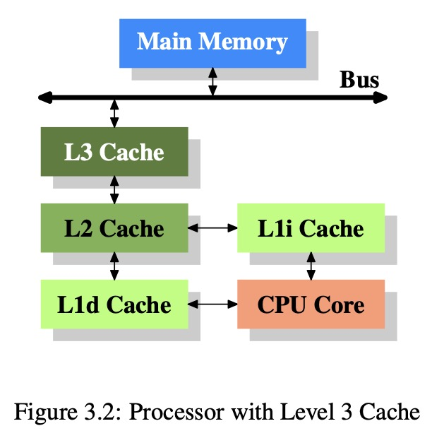
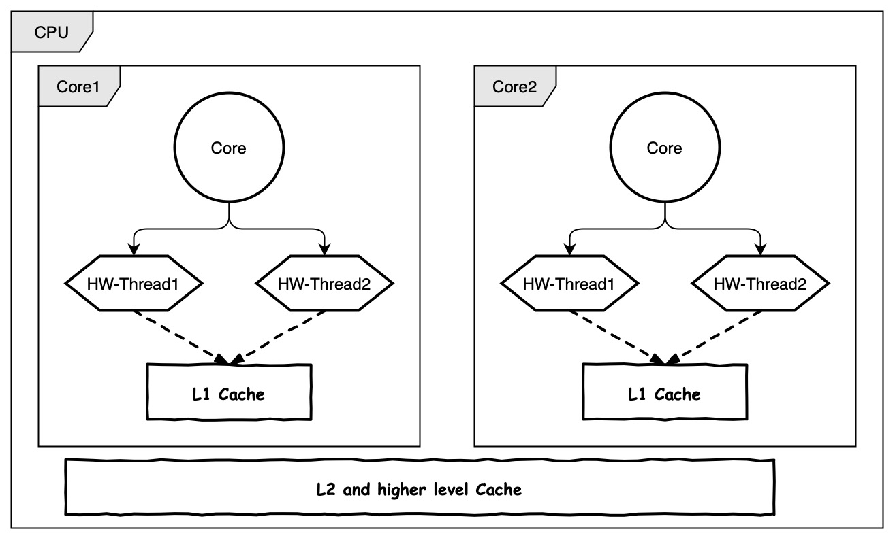
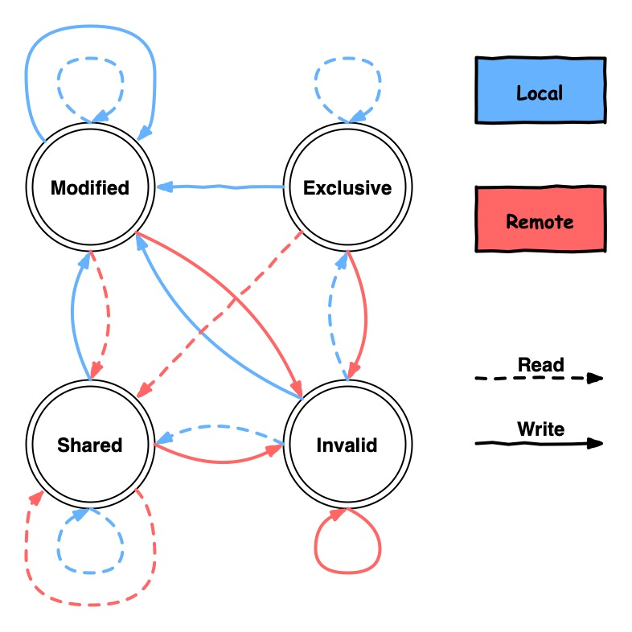

# Memory3: CPU Caches

计算机的 RAM 分为 static RAM (SRAM) 和 dynamic RAM (DRAM) 两类。SRAM 速度快但是成本高容量小，DRAM 反之。主要原因是硬件上，SRAM 要复杂许多。

因此，现代计算机仅在 CPU cache 使用 SRAM，内存则使用 DRAM。计算机可以通过将内存（慢）中的数据缓存到 CPU cache（快）中获取极大的性能提升。其原因主要是：

程序使用的指令和内存存在 __空间局部性__(spatial locality) 和 __时间局部性__(temporal locality)。具体是指：

- spatial locality: 内存上存储位置接近
- temporal locality: 被使用的时间接近

例子：

| | spatial locality | temporal locality |
| :-: | :-: | :-: |
| code | 循环中执行同样的语句 | 循环中调用函数（函数地址不接近，但是会高频率调用） |
| data | 使用数组 | 使用不久前使用过的数据 |


## 3.1 CPU Caches in the Big Picture

首先，__CPU 不直接与内存交互，所有读写必须经过缓存__。现代计算机的缓存架构如下：



可以看到，读内存时，数据从内存经过总线进入 CPU cache。依次存入各级缓存，供 CPU 使用。

注意，__L1 Cache 分为了指令缓存 (L1i Cache) 和数据缓存 (L1d Cache)__。这样设计的原因是一般情况下指令和数据是不相关的。

我们可以通过以下命令查看缓存大小：

```bash
sysctl -a | grep -e 'hw.*cache'
```

得到缓存信息（Apple M1 Max）：
```console
hw.cachelinesize: 128
hw.l1icachesize: 131072
hw.l1dcachesize: 65536
hw.l2cachesize: 4194304
```

关键信息是：

- L1i Cache 为 128 kB
- L1d Cache 为 64 kB
- L2 Cache 为 4 MB

cacheline 是 CPU cache 一次性可以加载的内存大小，这里是 128 字节。

### 3.1.1 CPU Caches Sharing

在多核、多线程（指硬件线程，如 Intel 的超线程）的现代 CPU 架构下，cache 的共享方式为：



即：

- 每个核拥有独立的 L1 cache
  - 如果这个核有多个硬件线程(e.g., Intel hyper-threading)，那么它们共享 L1 Cache。
- 所有核共享 L2 及以上的 cache

## 3.2 Cache operation at high level

为了效率，CPU cache 一次会加载 cacheline 大小的内存。现在（2022）年的普通 CPU cacheline 一般是 64 字节或者 128 字节。__cacheline 是 CPU cache 读写的最小单位__。

__无论读还是写，CPU cache 都需要先加载操作的内存所在的 cacheline__。注意，写入的时候也是覆盖一整条 cacheline，所以我们需要先加载进 CPU cache 再做修改，否则写入的时候，除了修改的内存，我们无法知道其它内存应该填写什么值。

当 CPU 更改了 cache 中的值，但是还未来得及写回内存时，这个 cacheline 被标记为 "dirty"，这个 flag 会在写入内存后清除。这在单核的时候非常直观，但是多核的时，一个核如何才知道一段内存是不是 "dirty" 的，也就是正在被别的核修改呢？

对于多核 CPU，__所有处理器观测到的内存应该是一致的(cache coherency)__。为了实现这个功能，处理器会监听彼此的写操作，并且将写入的地址与自己的 cache 做比较。当侦测到写操作时，会将自己的这段 cacheline 标记为失效。一个最重要的缓存一致性协议 __MESI__ 可以总结为：

- "dirty" 的 cacheline 不会出现在除了执行写入操作的其它处理器的 cache 中。

- "clean" 的 cacheline 可以出现在任意多个 cache 中。

## 3.3 CPU Cache Implementation Details

略。

### 3.3.3 Write Behavior

我们已经提过，CPU Cache 需要保证一致性，并且其实现对于用户是透明的。即，如果 cacheline 被更改了，在用户看来应该和没有 CPU cache 时一致，即直接反映到了内存上。

要保证这一点，有两种实现方法：

- write-through
- write-back

在 write-through 的实现中，如果某个 cacheline 被写入了，处理器会立即将这个 cacheline 写到内存。这样的实现简单但是比较慢，因为 CPU 每次更改数据都会进行内存写入。

write-back 实现有更佳的性能。当 cacheline 被修改后，处理器不马上将其写入内存，而是将它标记为 "dirty"。当 cacheline 不再使用时，带 "dirty" 标记的会被写回内存。这样做的好处是显而易见的，可以避免总线通信和内存写入的时间。


但是，write-back 实现在多核 CPU 上存在问题。如果一个核将某个 cacheline 标记为 dirty，另一个核尝试去读，由于最新的更改还未写入到内存，第二个核显然不能直接去读内存，否则就破坏了一致性。

### 3.3.4 Multi-Processor Support

为了解决 write-back 实现在多核 CPU 上的问题，显然，让一个核去直接访问另一个核的缓存是不行的。那么，只能将被改动的 cacheline 拷贝到其它核的缓存中。我们不能简单在每次写入后都执行这个拷贝，这样太慢了。于是，__MESI(Modified, Exclusive, Shared, Invalid)__ 缓存一致性协议问世了。

- 一开始，所有 cacheline 都是空的，属于 `Invalid` 状态
- 因为 __写数据__ 加载的 cacheline 标记为 `Modified`
- 因为 __读数据__ 加载的 cacheline 有两种情况：
    - 如果 __其它处理器没有加载__ 这个 cacheline，则标记为 `Exclusive`
    - 如果 __其它处理器加载了__ 这个 cacheline，则标记为 `Shared`

这里的每个状态都是对当前处理器而言的。例如，`Modified` 是指被当前处理器更改过，如果再被其它处理器修改（remote write），则变为 `Invalid` 状态。

当处理器尝试写入状态为 `Shared` 或者 `Invalid` 的 cacheline 时，它必须 __通知所有其它的处理器__ 将这个 cacheline 的状态设置为 `Invalid`。这个操作被称为 __Request For Ownership(RFO)__。由于它非常昂贵，我们需要极力避免引发 RFO 的操作。

其状态转移如下图所示：



一共有四种操作，总结其影响如下：

- local read，不可能引起 RFO
- local write，如果写入 Shared 的 cacheline，引起 RFO
- remote read by another processor，不可能引起 RFO，但是导致 `Exclusive` 变为 `Shared`
- remote write by another processor，必然引起 RFO

因此，CPU 总是希望尽可能多的 cacheline 处在 `Exclusive` 状态。因为在该状态下既可以利用缓存的优势，又对 local write 最为友好。

#### Example

现在用一个例子说明 cacheline 的影响。

在这个例子中，我们用多个核并行更改数组中元素的值。由于保证了被更改的元素不是同一个，不存在 data sharing 也不存在 race condition。但是，由于缓存的影响（被修改的元素可能存在同一个 cacheline，也就是经常说的 false sharing），速度实质上也根据选择的元素不同而不同。

```cpp
#include <chrono>
#include <iostream>
#include <thread>
#include <vector>

// a toy function to measure cache performance
void func(std::vector<int> *counter, size_t index) {
  for (int i = 0; i < 1000000; ++i) {
    (*counter)[index] += 1;
  }
}

auto run_in_parallel(size_t thread_num, size_t offset) {
  auto start = std::chrono::steady_clock::now();
  std::vector<int> counter(1024, 0);

  std::vector<std::thread> threads;
  for (size_t i = 0; i < thread_num; ++i) {
    threads.emplace_back(func, &counter, i * offset);
  }
  for (auto &t : threads) {
    t.join();
  }

  auto end = std::chrono::steady_clock::now();

  return std::chrono::duration_cast<std::chrono::microseconds>(end - start);
}

int main(int argc, char const *argv[]) {
  std::cout
    << "hardware_destructive_interference_size == "
    << std::hardware_destructive_interference_size << '\n'
    << "hardware_constructive_interference_size == "
    << std::hardware_constructive_interference_size << "\n";

  size_t thread_num = 8;

  auto offset1 = std::hardware_constructive_interference_size / sizeof(int);
  for (size_t offset = 1; offset < offset1; offset *= 2) {
    auto elapsed_us = run_in_parallel(thread_num, offset).count();
    std::cout << "Time elapsed: " << elapsed_us << "us for offset "<< offset <<"\n";
  }

  auto offset2 = std::hardware_destructive_interference_size / sizeof(int);
  for (size_t offset = offset1; offset <= offset2 + offset1; offset += offset1) {
    auto elapsed_us = run_in_parallel(thread_num, offset).count();
    std::cout << "Time elapsed: " << elapsed_us << "us for offset "<< offset <<"\n";
  }
  return 0;
}
```

这个例子的运行结果是：

```console
hardware_destructive_interference_size == 256
hardware_constructive_interference_size == 64
Time elapsed: 53215us for offset 1
Time elapsed: 33159us for offset 2
Time elapsed: 16543us for offset 4
Time elapsed: 11989us for offset 8
Time elapsed: 7003us for offset 16
Time elapsed: 6842us for offset 32
Time elapsed: 6059us for offset 48
Time elapsed: 6184us for offset 64
Time elapsed: 6113us for offset 80
```

可以看到，当并行修改的数据间隔在 64 字节以下时，速度明显慢了不少。结合之前的 MESI 协议，这是由于修改处于 `Shared` 状态的 cacheline 导致频繁 RFO 的影响。
