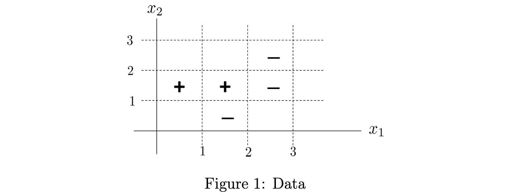

# ESL 10.1: Boosting Methods

Boosting 最初是为解决分类问题设计的，后来又被扩展到了回归问题。Boosting 的原理是将很多弱分类器组合起来产生一个强分类器。

一个弱分类器是某种比随机猜测结果略好的简单分类器。Boosting 每次将输入特征赋予不同的权重，并应用弱分类器进行分类，最后将所有结果通过投票的形式产生最终结果。

## AdaBoost

我们从最基本的 AdaBoost 开始介绍。

假设某个分类问题结果为 -1 或者 +1。一共有 $N$ 个样本，并且我们已有 $M$ 个弱分类器。AdaBoost算法表述为：

1. 初始化权重 $w_i = 1/N, i = 1,2,...,N$

2. For $m = 1$ to $M$:

    a. 对每个样本 $x_i$ 附加权重 $w_i$ 并送入分类器 $G_m(x)$

    b. 计算错误率：

    $$ \text{err}_m = \sum_{i=1}^N w_i I(y_i \neq G_m(x_i)) $$

    c. 根据错误率计算该分类器权重（错误率越低权重越高）

    $$\alpha_m = \ln((1- \text{err}_m)/\text{err}_m)$$

    d. 更新分类错误的样本权重，并归一化处理（判断错误的样本权重提高，交由下一个分类器分类）

    $$w_i = \text{normalize} [  w_i e^{\alpha_m I(y_i \neq G_m(x_i))} ]$$

3. 最终生成的强分类器为：

$$G(x) = \text{sign} [ \sum_{m=1}^M \alpha_m G_m(x)] $$

其中，$I(x)$ 是条件判断。false = 0, true = 1。

2.d 比较难理解。调整样本权重的意义在于，如果某个分类器已经正确分类 i 样本，后续的分类器的责任在于“补全” A 分类器的功能，即，不要重复正确的结论，应该把重点放在 A 分类错误的样本上。

如果后续某个分类器与 A 分类器的结论重复，那由 2.c 得到的分类器权重会很低。在最终的强分类器中，几乎不产生影响。反之，如果与 A 互补，那可能会得到一个很高的权重。

## AdaBoost 简单例子

假设有如下训练数据，两个点 (0.5, 1.5) 和 (1.5, 1.5) 被标记了 `+` 类，三个点 (1.5, 0.5), (2.5, 1.5) 和 (2.5, 2.5) 被标记了 `-` 类。



我们有如下分类器（都比随机猜测略好）：

$$G_1(x) = \begin{cases}
+1 & x_1 \leq 2 \\
-1 & x_1 > 2
\end{cases} $$

$$G_2(x) = \begin{cases}
-1 & x_2 \leq 1 \\
+1 & x_2 > 1 \\
\end{cases} $$

$$G_3(x) = \begin{cases}
+1 & x_1 \leq 1 \\
-1 & x_1 > 1
\end{cases} $$

首先，由于我们有 5 个样本，我们将样本初始权重设置为 $w_i = 0.2$，应用 $G_1$ 分类器，发现仅有位于 (1.5, 0.5) 的点分类错误，因此 $G_1$ 分类器错误率为：

$$\text{err}_1 = 0.2 $$

计算 $G_1$ 分类器权重：

$$ \alpha_1 = \ln ((1-0.2) / 0.2) = \ln 4$$

调整分类错误的样本权重并归一化：

$$ w_i = \text{normalize} [ 0.2, 0.2, 0.2, 0.2, 0.8] = [\frac{1}{8}, \frac{1}{8}, \frac{1}{8}, \frac{1}{8}, \frac{4}{8}] $$

此后再将新的权重用于 $G_2$ 的分类，$G_2$ 在 (2.5, 1.5) 和 (2.5, 2.5) 分类错误，其错误率为：

$$ \text{err}_2 = \frac{1 }{8} *1 +   \frac{1}{8} *1 =  \frac{1}{4} $$

$G_2$ 的分类器权重为：

$$ \alpha_2 = \ln ((1-0.25) / 0.25) = \ln 3$$

接下来，更新样本权重，将分类错误的样本权重提高：

$$ w_i = \text{normalize} [\frac{3}{8}, \frac{1}{8}, \frac{1}{8}, \frac{3}{8}, \frac{4}{8}] = [\frac{3}{12}, \frac{1}{12}, \frac{1}{12}, \frac{3}{12}, \frac{4}{12}] $$

再用 $G_3$ 分类，同上，它在 (1.5, 1.5) 点分类错误，而该点权重目前为 $\frac{1}{12}$，因此其错误率：

$$ \text{err}_3 = \frac{1 }{12} $$

$G_3$ 分类器权重为：

$$ \alpha_3 =  \ln 11$$

得出最终 boosted 分类器（注意，这里体现了 __加性模型__ 特点）：

$$G(x) = \text{sign} [\ln4 G_1(x) + \ln3 G_2(x) + \ln11 G_3(x)] $$

对于每个区域，我们计算其值。例如，对于 $x_1$  和 $x_2$ 都属于 [0, 1) 区间的点：

$$ G(x_0) = \text{sign} [\ln4 \times 1 + \ln3 \times (-1) + \ln11 \times 1] = \text{sign} 2.69 = 1 $$


依次计算各个区域，得到的边界为：


这个简单的例子揭示了 AdaBoost 的工作原理，我们可以看到它如何对 __线性__ 分类器进行 __线性组合__，最终得到一个 __非线性__ 的分界面。

## Boosting Trees

实际问题中的数据往往不像例子中那么简单。通常，输入可能是不同类型的组合（数字、类别、bool 等），还存在丢失部分数据等问题。“off-the-shelf“ 的方法就是可以直接使用未经过复杂的预处理的数据进行训练的方法。

在所有已知的学习方法中，决策树是最接近 ”off-the-shelf“ 的方法。它的 __唯一问题就是不够精确__，但是如果我们将决策树作为基本的分类器进行 boost，就可以大大提高它的精确度。当然，这会牺牲决策树的速度、增加它的复杂度，还会降低鲁棒性。Gradient Boosted 模型解决了 boosting tree 的这些问题。我们同样用 spam mail 的数据集来试验：

```py
from sklearn.model_selection import KFold
from sklearn.ensemble import GradientBoostingClassifier

for train_index, test_index in KFold(n_splits=5,shuffle=True,random_state=1).split(X):
    # print("TRAIN:", train_index, "TEST:", test_index)
    trainX, testX = X.loc[train_index], X.loc[test_index]
    trainY, testY = y.loc[train_index], y.loc[test_index]
    model = GradientBoostingClassifier().fit(trainX, trainY)
    print(f"GBM accurracy: {model.score(testX, testY)}")
```

从下面结果可以看出，目前我们尝试的方法中，从精确度上来讲，有 Gradient Boosting Trees > Generalized Additive Models > Linear Regression > Classification Tree.

```text
GBM accurracy: 0.9500542888165038
GBM accurracy: 0.9402173913043478
GBM accurracy: 0.9434782608695652
GBM accurracy: 0.95
GBM accurracy: 0.9434782608695652
```

我们将在下一篇文章详细介绍 Gradient Boosted Trees.


## 参考资料

1. [Lectures on Machine Learning](https://www.math.snu.ac.kr/~hichoi/machinelearning/lecturenotes/AdaBoost.pdf)
