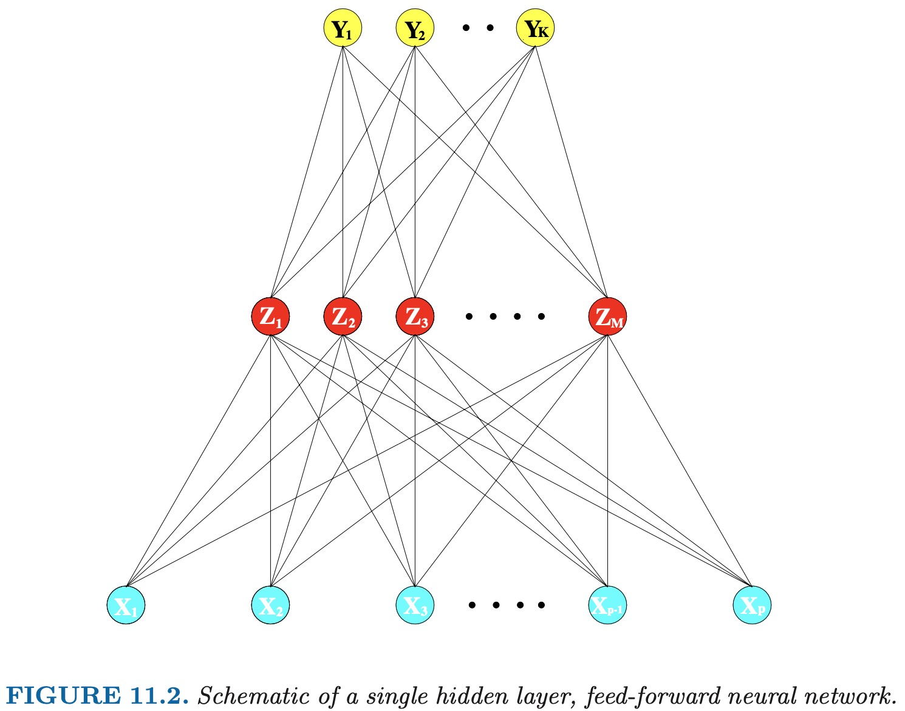
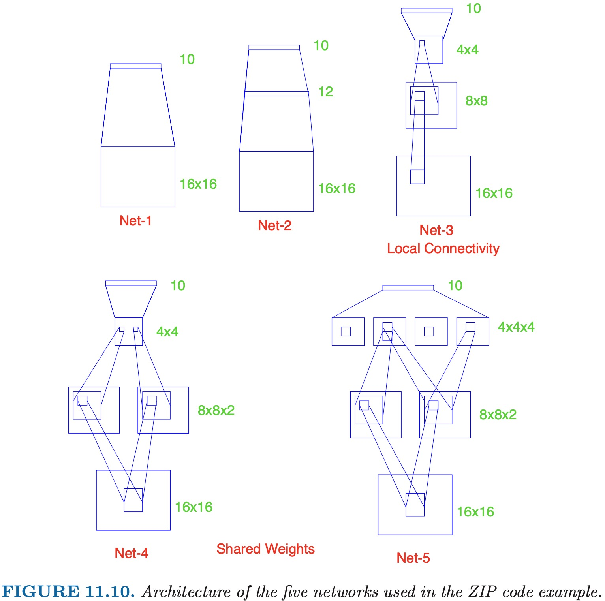

# ESL 11: Neural Networks

神经网络的中心思想是将输入 __线性组合__ 为一些衍生的特征，再建立输出与这些特征之间的 __非线性__ 模型。

## 11.2 Projection Pursuit Regression

以一个通用的监督学习问题为例，假设我们有 $p$ 维输入 $X$，输出是 $Y$。$w_m$ 是 $p$ 维单位向量，我们可以把 projection pursuit regression 模型表示为：

$$f(X) = \sum_{m=1}^M g_m (w_m^T X) $$

可以看出，这也是一个加性模型。但是区别在于，它的自变量不是直接输入 $X$，而是输入的线性组合 $w_m^T X$。

$g_m(w_m^T X)$ 被称为“岭函数” (Ridge Function)。它只沿着 $w_m$ 的方向变化，而标量 $V_m = w_m^T X$ 就是输入 $X$ 在 $w_m$ 方向上的投影 (projection)。

我们的目标是寻找 $w_m$ （即投影方向）使得模型估计误差最小。因此，这个方法叫做 projection pursuit。它的 __优点__ 是如果子模型数量 M 足够大，它能够完美拟合任何连续函数。__缺点__ 是可解释性差。因此适用于只需要做预测，不需要归因的场景。

### PPR 拟合

给定训练数据 $(x_i, y_i), i=1,2,\dots,N$，我们的目标是确定函数 $g$ 和方向 $w$ ，使预测结果的 squared error 最小：

$$ g, w = \mathop{\arg \min}_{g, w} \sum_{i=1}^N [y_i - \sum_{m=1}^M g_m(w_m^T x_i)]^2 $$

假设仅有一个子模型，即 __M = 1__，确定 $g$ 的过程其实就是一个一维 smoothing 问题。因此，$g$ 可以选择使用 spline。

已知函数 $g$ 的形式，我们需要确定使估计误差最小的方向 $w$。这是一个 __无约束的优化问题__，且 $g$ 可导，因此可以使用牛顿法来解决。

假设当前对 $w$ 的估计为 $w_{\text{old}}$，我们对 $g$ 进行泰勒展开，忽略 2 阶以上有：

$$ g(w^T x_i) \approx g(w_{\text{old}}^T x_i) + g'(w_{\text{old}}^T x_i)(w - w_{\text{old}})^T x_i $$

由于 M = 1，squared error 可以简化为：

$$\begin{align}
\sum_{i=1}^N [y_i - g(w^T x_i)]^2 &= \sum_{i=1}^N [y_i - g(w_{\text{old}}^T x_i) - g'(w_{\text{old}}^T x_i)(w - w_{\text{old}})^T x_i]^2 \\
&= \sum_{i=1}^N g'(w_{\text{old}}^T x_i)^2 [w^T x_i - (w_{\text{old}}^T x_i + \dfrac{y_i - g(w_{\text{old}}^T x_i)}{g'(w_{\text{old}}^T x_i)})]^2
\end{align}$$

等式右边可以看作一个 least squares regression 问题。有 N 个样本点，对于第 i 个样本，其平方误差的权重为 $g'(w_{\text{old}}^T x_i)^2$ ，目标是 $w_{\text{new}}^T x_i$ 尽量靠近 $w_{\text{old}}^T x_i + \frac{y_i - g(w_{\text{old}}^T x_i)}{g'(w_{\text{old}}^T x_i)}$ 。


求解这个 least squares regression 我们得到一组新的系数 $w_{\text{new}}$，更新 $w_{\text{old}} = w_{\text{new}}$ 并进行下一轮迭代，直到 $g'(w_{\text{old}}^T x_i)$ 小于某个阈值。

由于其计算量过大，PPR 的应用并不很广泛。但是，它是后来获得广泛应用的 __神经网络技术的前身__。我们将在下面的章节介绍神经网络。

## 11.3 Neural Networks

“神经网络”这个名字源于该方法最早被应用于人脑的建模。每个节点是一个神经元，他们之间的连接代表突触。单“隐藏层”的神经网络与刚才介绍的 Projection Pursuit Regression 模型非常相似，我们以它为例讲解。



我们可以看到该神经网络分为 3 层。其中 $X$ 是输入，$Y$ 是输出，$Z$ 是所谓的“隐藏层”，它被称为隐藏层是因为它不直接可见。

类似于 PPR，隐藏层 $Z$ 由输入 $X$ 线性组合，再附加一个“激活函数” $\sigma$ 得出。

$$ Z_m = \sigma(\alpha_0 + \alpha_m^T X), \quad m = 1,\dots,M $$

常见的激活函数如 sigmoid：

$$ \sigma(v) = \dfrac{1}{1 + e^{-v}} $$

而输出 $Y$ 由隐藏层 $Z$ 线性组合，再附加一个“输出函数” $g$ 得出。

$$ Y_k = g_k(T) = g_k(\beta_0 + \beta_k^T Z) $$

对于回归问题，$g$ 可以省略，对于分类问题，为确保输出都是整数且和为 1.0，通常选用 softmax 函数，属于第 k 类的概率为:

$$ g_k(T) = \dfrac{e^{T_k}}{\sum_{l=1}^K e^{T_l}} $$

我们看出，其实 PPR 与 NN 的差异就在于 NN 使用的激活函数相比 PPR 使用的 spline 简单很多，这就使得 NN 的计算量小很多，获得了更广泛的应用。

## 11.4 Fitting Neural Networks

拟合神经网络实际上就是找到刚才提到的两组参数：

1. 由输入 $X$ 到隐藏层 $Z$ 的线性组合系数 $\bf{\alpha}$。由于有 M 个隐藏层节点，而每个节点对应的系数都是 $p + 1$ 维（+1 for bias）。因此是一个 $M \times (p+1)$ 矩阵。

2. 由隐藏层 $Z$ 到输出 $Y$ 的线性组合系数 $\bf{\beta}$。由于有 K 个输出节点，而每个节点对应的系数都是 $M + 1$ 维（+1 for bias）。因此是一个 $K \times (M+1)$ 矩阵。

我们首先以损失函数 sum-of-squared-errors 为例:

$$ R(\theta) = \sum_{i=1}^N R_i = \sum_{i=1}^N \sum_{k=1}^K (y_{ik} - f_k(x_i))^2 $$

记 $l, m, k$ 分别为输入 $X$，隐藏层 $Z$ 和输出 $Y$ 的序号，对 $\alpha_{ml}$ 和 $\beta_{km}$ 求导，根据链式法则有：

$$ \dfrac{\partial R_i}{\partial \beta_{km}} = - 2(y_{ik} - f_k(x_i)) g_k'(\beta_k^T z_i) z_{mi} $$

$$ \dfrac{\partial R_i}{\partial \alpha_{ml}} = -  \sum_{k=1}^K 2(y_{ik} - f_k(x_i)) g_k'(\beta_k^T z_i) \beta_{km} \sigma'(\alpha_m^T x_i) x_{il} $$

注意，对 $\beta_{km}$ 求导结果中不含 $\sum_{k=1}^K$。我们假设现在用第 $j(j \neq k)$ 个输出对 $\beta_{km}$ 求导，由于 $\beta_{km}$ 意义是第 k 个输出与第 m 个隐藏节点的系数，与第 j 个输出无关，结果必然为 0。而对于 $\alpha_{ml}$ 求导时，由于第 m 个隐藏节点会作用给第 k 个和第 j 个输出，所以存在 $\sum_{k=1}^K$。

得到这些导数，我们可以设定 learning rate $\gamma_r$，使用梯度下降迭代更新：

$$ \beta_{km}^{(r+1)} = \beta_{km}^{(r)} - \gamma_r \sum_{i=1}^N \dfrac{\partial R_i}{\partial \beta_{km}^{(r)}} $$

$$ \alpha_{ml}^{(r+1)} = \alpha_{ml}^{(r)} - \gamma_r \sum_{i=1}^N \dfrac{\partial R_i}{\partial \beta_{ml}^{(r)}} $$

现在令：

$$ \dfrac{\partial R_i}{\partial \beta_{km}} = \delta_{ki} z_{mi} $$

$$ \dfrac{\partial R_i}{\partial \alpha_{ml}} = s_{mi} x_{il} $$

我们可以得出关系：

$$ s_{mi} = \sigma'(\alpha_m^T x_i) \sum_{k=1}^K \beta_{km} \delta_{ki} $$

这个等式被称为 back-propagation equation。利用这个等式，更新时可以简化 $s_{mi}$ 的计算。back-propagation 的过程可以描述为一个 __双向传播__ 的过程：

1. 正向传播，利用输入 $X$ 和当前的 weights 来计算预测值 $\hat{f}_k(x_i)$

2. 反向传播，首先计算出隐藏层 $Z$ 到输出层 $Y$ 的 $\delta_{ki}$，再利用上面的等式计算 $s_{mi}$，得出两个梯度的值，再更新 weights

这个算法的优势在于简单并且易于并行，劣势在于计算量大。

## 11.5 Some Issues in Training Neural Networks

训练神经网络并不是像算法原理那么简单。神经网络是一个参数很多的模型，它从原理上倾向于 overfit。

### 11.5.1 Starting Values

sigmoid 函数在 0 附近近似于线性，我们可以将 __weights 的初始值选在 0 附近__，这样我们从一个近似线性的模型开始训练，然后非线性逐步增强。注意，初始权重不能为 0，我们由公式可以看出其梯度为 0，无法收敛。

### 11.5.2 Overfitting

由于神经网络参数很多，一般我们通过 early stopping 来避免 overfitting。我们也可以通过施加惩罚项来进行 regularization。

### 11.5.3 Scaling of the Inputs

初始时，我们需要把所有输入都映射为 __标准正态分布__，同时，初始的 weights 设置为 `[-0.7, +0.7]` 之间的均匀分布。


### 11.5.4 Number of Hidden Units and Layers

通常隐藏层节点的数量在 `[5, 100]` 之间选择，输入数量越多，隐藏层节点越多。

隐藏层层数一般通过经验和背景知识选择。


## 11.6 Example

我们采用手写数字识别来检验神经网络的分类性能。

```python
import pandas as pd
from sklearn import datasets
from sklearn.neural_network import MLPClassifier
from sklearn.model_selection import KFold

digits = datasets.load_digits()
X = pd.DataFrame(digits.data, columns = digits.feature_names)
y = pd.Series(digits.target)

for train_index, test_index in KFold(n_splits=5,shuffle=True,random_state=1).split(X):
    # print("TRAIN:", train_index, "TEST:", test_index)
    trainX, testX = X.loc[train_index], X.loc[test_index]
    trainY, testY = y.loc[train_index], y.loc[test_index]

    model = MLPClassifier(solver='lbfgs',
                hidden_layer_sizes=(12,), random_state=1).fit(trainX, trainY)
    print(f"MLP accurracy: {model.score(testX, testY)}")
```

注意，`hidden_layer_sizes=(12,)` 表明我们选择了 1 层隐藏层，该隐藏层包含 12 个节点。

其分类结果为：

```text
MLP accurracy: 0.8833333333333333
MLP accurracy: 0.9111111111111111
MLP accurracy: 0.8885793871866295
MLP accurracy: 0.9303621169916435
MLP accurracy: 0.8997214484679665
```

可以看出其准确率在 90% 左右。

### 11.6.1 Improvement

我们可以通过 __增加隐藏层__ 来提高分类精确度，例如，我们简单增加一层 `hidden_layer_sizes=(12,12)`，分类结果为：

```text
MLP accurracy: 0.9111111111111111
MLP accurracy: 0.9388888888888889
MLP accurracy: 0.9387186629526463
MLP accurracy: 0.9415041782729805
MLP accurracy: 0.9220055710306406
```

此外，我们还有更精妙的方法，例如改变网络结构。

- 局部连接（local connectivity）：我们可以限定每个隐藏层节点只连接到下一层的某一部分节点。例如 3x3 的小方块。局部连接可以提取下一层的局部特征，并大大降低需要训练的 weights 总数。

- 共享权重（shared weights）：在局部连接的基础上，我们还可以让每个局部区域使用相同的 weights。这么做的结果是对图像不同的区域采用同样的操作。这也被称作 __卷积网络__(convolutional networks)。


以下面几种网络为例，我们计算其权重数量：



1. 只有输入和输出层，输入层节点 16x16，输出层节点 10，一共 16x16x10 = 2560。再加上 10 个 bias，共 2570 个参数。

2. 有一层隐藏层，12个隐藏节点。 16x16x12 + 12x10 = 3192，再加上 12 个隐藏节点和 10 个输出节点的 bias，共 3214 个参数。

3. 有两层局部连接的隐藏层。由于是局部连接，计算方式为 patch 大小乘以上一层节点数：(3x3)x8x8 + (5x5)x4x4 + 4x4x10 = 1136，再加上 64 + 16 + 10 个 bias，共 1226 个参数。

4. 两层局部连接隐藏层，第一层共享权重。由于是共享权重，每层参数个数固定。3x3x2 + (5x5)x4x4x2 + 4x4x10 = 978。再加上 64x2 + 16 + 10 个 bias，共 1132 个参数。
由于存在共享权重，连接数和参数个数不同。从输入层到第一层隐藏层，连接数是 (3x3)x8x8x2 = 1152，但是只有 18 个权重。因此总连接数是 1152 - 18 + 1132 = 2266。

5. 两层都是局部连接 + 共享权重。3x3x2 + 5x5x4x2 + 4x4x4x10 = 858，再加上 64x2 + 4x4x4 + 10 个 bias，共 1060 个参数。其两个隐藏层总连接数为 (3x3)x8x8x2 + (5x5)x4x4x4x2 = 4352 个，但是仅有 218 个参数。因此总连接数是 4352 - 218 + 1060 = 5194。

| Network Name | Network Architecture | Links | Weights | %Correct |
| :-: | :-: | :-: | :-: | :-: |
| LeNet-1 | No hidden layer, equivalent to multinomial logistic regression | 2570 | 2570 | 80.0% |
| LeNet-2 | One hidden layer, 12 hidden units fully connected | 3214 | 3214 | 87.0% |
| LeNet-3 | Two hidden layers locally connected | 1226 | 1226 | 88.5% |
| LeNet-4 | Two hidden layers, locally connected with weight sharing | 2266 | 1132 | 94.0% |
| LeNet-5 | Two hidden layers, locally connected, two levels of weight sharing | 5194 | 1060 | 98.4% |
