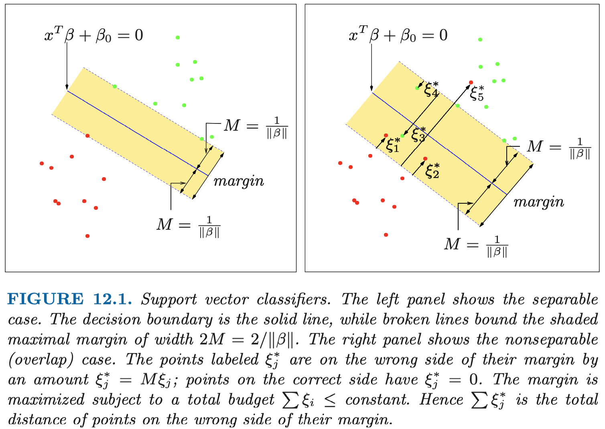

# ESL 12: Support Vector Machines and Flexibile Discriminants

## 12.1 Introduction

当两个类 __线性可分__ 时，我们可以用 Linear Discriminant Analysis 找到它们的最优分界面。当它们不是线性可分，相互重叠时，我们可以在 __更高维的特征空间__ 中构造 __线性__ 分界面。这种方法叫做支持向量机（support vector machine）。它是 LDA 的一个扩展。

相对于 LDA，它的主要优势是：

- 可以处理非线性场景
- 分界面主要由边界上的样本点确定（LDA 需要各类样本中心点）

## 12.2 The Support Vector Classifier

在第四章中我们讨论了 __线性可分__ 类型的最优分界面，这里，我们需要将其扩展至 __线性不可分__ 的情形。

假设我们有 N 个训练数据：$(x_1, y_1), (x_2, y_2), \dots, (x_N, y_N)$，其中，$x_i$ 是 $p$ 维输入， $y_i \in {-1, 1}$ 是类型输出。

定义超平面（自变量 $x$）

$$ {x: f(x) = x^T \beta + \beta_0 = 0}, $$

上式的左边定义了某个点 $x$ 与该平面的距离（有符号）。其中，系数 $\beta$ 是 __单位向量__ $\| {\beta} \| = 1$。分类标准为：

$$ G(x) = \text{sign}[x^T \beta + \beta_0]$$

我们的目的是找到在两个类型的数据中 margin 最大的分界面。

### 线性分类问题

对于线性分类问题，margin 可以定义为分界面距离最近的样本点的距离。即：

$$\begin{align}
& & \mathop{\arg \max}_{\beta, \beta_0, \| \beta \| = 1} ~ M \\
& \text{s.t.} & y_i(x_i^T \beta + \beta_0) \geq M, ~~~ i=1,\dots,N
\end{align}$$

其中，$x^T \beta + \beta_0 = 0$ 是分界面，对于每个样本，预测值 $x_i^T \beta + \beta_0$ 可能为正或者负，目标是找到一组参数 $\beta, \beta_0$，使得 margin 最大。

该优化问题并不是一个凸优化问题，比较难以求解。

首先，我们不再要求 $\beta$ 是单位向量，而是手动在约束里将其单位化，即：

$$\begin{align}
& & \mathop{\arg \max}_{\beta, \beta_0} ~ M \\
& \text{s.t.} & y_i(x_i^T \beta + \beta_0) \geq M \| \beta \| , ~~~ i=1,\dots,N
\end{align}$$

令：

$$\theta = \frac{\beta}{M\| \beta \|}$$

$$\theta_0 = \frac{\beta_0}{M\| \beta \|}$$

约束条件可以改写为：

$$ y_i(x_i^T \theta + \theta_0) \geq 1 $$

这个变换表示，对于该优化问题，对应不同的 M 取值，我们可以得到很多组解。等式右边的 1 表示对于参数 $\theta$ 的 $M_\theta$ 满足：

$$ M_\theta \| \theta \| = 1 $$

显然，此时求 $M_\theta$ 的最大值就是求 $\| \theta \|$ 的最小值。因此，优化问题简化为：

$$\begin{align}
& & \mathop{\arg \min}_{\theta, \theta_0} ~ \| \theta \| \\
& \text{s.t.} & y_i(x_i^T \theta + \theta_0) \geq 1, ~~~ i=1,\dots,N
\end{align}$$

这是一个凸优化问题，通常 SVM 用这个形式描述。

### 非线性分类问题

现实中，可能不同的类别在特征空间中有重叠。因此，它们不能用一个线性分界面分割。对于这类情况，我们 __对每个样本引入松弛变量__ $\xi$ 。并将约束条件放松为：

$$ y_i (x_i^T \beta + \beta_0 ) \geq M(1 - \xi_i) $$

$\xi_i$ 表示样本 i “越界”了多少（normalized by margin）。 这里的越界指的并非分界面，而是附加 margin 后形成的界限。$\xi_i > 1$ 说明训练出的分界面对样本 i 进行了错误的分类。

我们可以通过限制 $\sum \xi_i \leq C$ 来限制我们松弛的程度。相对于线性分类的优化问题，非线性分类需要额外引入松弛变量，并增加一个约束条件：

$$\begin{align}
& & \mathop{\arg \min}_{\theta, \theta_0} ~ \| \theta \| \\
& \text{s.t.} & ~ y_i(x_i^T \theta + \theta_0) \geq 1 - \xi_i, ~~~ i=1,\dots,N \\
& & \xi_i \geq 0, \sum_{i=1}^N \xi_i \leq C
\end{align}$$
