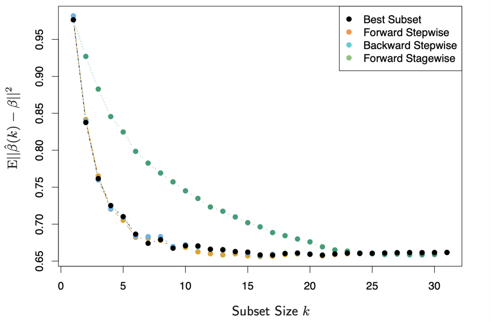

# ESL 3: Linear Methods for Regression

一个线性回归模型假设回归函数 E(Y|X) 对于输入 X 是线性的。
它的优势在于：

- 简单
- 能够表示每个输入对输出的影响
- 输入可以进行变换
- 他们有时候比复杂的方法更精准，尤其是在样本数量少、低信噪比或者稀疏矩阵的情形。

## 3.2 Linear Regression Models and Least Squares

$p$ 维线性回归模型形式如下：

$$f(X) = \beta_0 + \sum_{j=1}^p X_j \beta_j$$

我们需要估计一组参数 $\beta$，使残差平方和（Residual Sum of Squares）最小：

$$\begin{align}
\text{RSS}(\beta) &= (\textbf{y} - \textbf{X}\beta )^T(\textbf{y} - \textbf{X}\beta ) \\
&= \textbf{y}^T\textbf{y} - \textbf{y}^T\textbf{X}\beta - \beta^T\textbf{X}^T\textbf{y} + \beta^T\textbf{X}^T\textbf{X}\beta
\end{align}$$

其中，$\textbf{X}$ 是一个 $N \times (p+1)$ 矩阵，$\textbf{y}$ 是 $N \times 1$ 观测值。

对 $\beta$ 求导可以得到：

$$ \frac{\partial \text{RSS}(\beta)}{\partial \beta} = -2 \textbf{X}^T\textbf{y} + 2\textbf{X}^T\textbf{X} \beta$$

由于二阶导数正定，令一阶导数为 0 向量，得出极值点（即估计值）：

$$ \hat{\beta}= (\textbf{X}^T\textbf{X})^{-1}\textbf{X}^T\textbf{y}$$

$$\hat{\textbf{y}} = \textbf{X} \hat{\beta} = \textbf{X}(\textbf{X}^T\textbf{X})^{-1}\textbf{X}^T\textbf{y}$$

我们称 $\textbf{H} = \textbf{X}(\textbf{X}^T\textbf{X})^{-1}\textbf{X}^T$ 为估计矩阵（"hat" matrix），它满足对称性和幂等性：

$$\textbf{H}^T = \textbf{H}$$

$$\textbf{H}^T\textbf{H} = \textbf{H}$$

当 $\textbf{X}$ 中某些列线性相关（即非满秩矩阵）时，$(\textbf{X}^T\textbf{X})$ 是奇异矩阵，它只能求广义逆矩阵，不止一个解。因此，我们需要将冗余的输入剔除掉，大部分求解软件都实现了这个功能。

#### 估计参数的统计特性

为了确定估计的参数 $\hat{\beta}$ 的统计特性，我们假设：

- 每个观测值 $y_i$ 相互独立
- $y_i$有固定的噪声 $\varepsilon \sim N(0, \sigma^2)$

那么估计值 $\hat{\beta}$ 的方差为：

$$ \text{Var}(\hat{\beta}) = (\textbf{X}^T\textbf{X})^{-1} \sigma^2$$

where:

$$\hat{\sigma}^2 =  \frac{\text{RSS}}{N-p-1}= \frac{1}{N-p-1} \sum_{i=1}^{N} (y_i-\hat{y})^2$$

##### 证明

N 个 y 的观测值可以表示为：

$$ \textbf{y} =  \textbf{X}\beta +  \varepsilon $$

其中 $\varepsilon$ 是 $N \times 1$ 的噪声。因此有：

$$\begin{align}
\hat{\beta} &= (\textbf{X}^T\textbf{X})^{-1}\textbf{X}^T\textbf{y} \\
&= \beta + (\textbf{X}^T\textbf{X})^{-1}\textbf{X}^T\varepsilon
\end{align}$$

无偏性（期望值为 $\beta$）：

$$E(\hat{\beta}) = \beta + (\textbf{X}^T\textbf{X})^{-1}\textbf{X}^T E(\varepsilon) = \beta$$

协方差矩阵（注意是$\beta \beta^T$ 而非 $\beta^T \beta$，是一个矩阵）：

$$\begin{align}
\text{Var}(\hat{\beta}) &= E[(\beta - \hat{\beta})(\beta - \hat{\beta})^T] \\
&=E[(\textbf{X}^T\textbf{X})^{-1}\textbf{X}^T\varepsilon\varepsilon^T\textbf{X}(\textbf{X}^T\textbf{X})^{-1}] \\
&= (\textbf{X}^T\textbf{X})^{-1}\textbf{X}^T E(\varepsilon\varepsilon^T) \textbf{X}(\textbf{X}^T\textbf{X})^{-1} \\
&= \sigma^2 (\textbf{X}^T\textbf{X})^{-1}\textbf{X}^T \textbf{I} \textbf{X}(\textbf{X}^T\textbf{X})^{-1} \\
&= \sigma^2 (\textbf{X}^T\textbf{X})^{-1}
\end{align}$$

可以得到：

$$ \hat{\beta} \sim N(\beta, \sigma^2 (\textbf{X}^T\textbf{X})^{-1})$$

下面来确定 $\sigma^2$ 。

我们可以通过观测值 $y$ 和预测值 $\hat{y}$ 的差来得到噪声 $\varepsilon$。

$$\begin{align}
y - \hat{y} &= \textbf{X}\beta +  \varepsilon -\textbf{X}\hat{\beta} \\
&=  \textbf{X}\beta +  \varepsilon - \textbf{X}(\beta + (\textbf{X}^T\textbf{X})^{-1}\textbf{X}^T\varepsilon) \\
&= (\textbf{I -H} )\varepsilon
\end{align}$$

$$\begin{align}
\sum_{i=1}^N(y_i - \hat{y_i})^2 &= (y - \hat{y})^T (y - \hat{y}) \\
&= \varepsilon^T(\textbf{I - H}) \varepsilon \\
&= \sum_{k =1}^N \varepsilon_k^2- \sum_{i, j = 1}^N \varepsilon_i \varepsilon_j  H_{ij}
\end{align}$$

其期望值为：

$$\begin{align}
E[\sum_{i=1}^N(y_i - \hat{y_i})^2] &= E[\sum_{k =1}^N \varepsilon_k^2- \sum_{i, j = 1}^N \varepsilon_i \varepsilon_j  H_{ij} ] \\
&= N\sigma^2 - E(\sum_{i, j = 1}^N \varepsilon_i \varepsilon_j  H_{ij})
\end{align}$$

由于 $\varepsilon_i, \varepsilon_j$ 是独立的，当 $i \neq j$ 时：

$$\text{Cov}(\varepsilon_i, \varepsilon_j) = E(\varepsilon_i \varepsilon_j) - E(\varepsilon_i)E(\varepsilon_j) = 0$$

因此：

$$\begin{align}
E[\sum_{i=1}^N(y_i - \hat{y_i})^2] &= N\sigma^2 - E(\sum_{i, j = 1}^N \varepsilon_i \varepsilon_j  H_{ij}) \\
&= N\sigma^2 - E(\sum_{i=1}^{N}\varepsilon_i^2H_{ii}) \\
&= \sigma^2[N - \text{trace}(\textbf{H})]
\end{align}$$

这里再利用公式：

$$\text{trace}(ABC) = \text{trace}(CAB)$$

得到：

$$\begin{align}
E[\sum_{i=1}^N(y_i - \hat{y_i})^2] &= \sigma^2[N - \text{trace}(\textbf{H})] \\
&= \sigma^2[N - \text{trace}(\textbf{X(X^TX)^{-1}X^T})] \\
&= \sigma^2[N - \text{trace}(\textbf{X^TX(X^TX)^{-1}}_{(p+1) \times (p+1)})] \\
&= \sigma^2[N - \text{trace}(\textbf{I}_{(p+1) \times (p+1)})] \\
&= \sigma^2(N - p -1)
\end{align}$$

因此，对 $\sigma^2$ 的无偏估计就是：

$$\hat{\sigma}^2 = \frac{1}{N-p-1} \sum_{i=1}^{N} (y_i-\hat{y})^2$$

#### 模型误差的统计特性

由于我们对第 i 个样本的噪声 $\varepsilon_i$ 无偏估计就是 $\hat{\varepsilon_i} = y_i - \hat{y_i}$，我们计算其方差：

$$\begin{align}
\text{Var}(\hat{\varepsilon}) &= \text{Var}(\textbf{y} - \hat{\textbf{y}}) \\
&= \text{Var}[(\textbf{I} - \textbf{H}){\varepsilon}]
\end{align}$$

由于 $D(AX) = AD(X)A^T$：

$$\begin{align}
\text{Var}(\hat{\varepsilon}) &= \text{Var}[(\textbf{I} - \textbf{H}){\varepsilon}] \\
&= (\textbf{I} - \textbf{H}) \text{Var}(\varepsilon) (\textbf{I} - \textbf{H})
\end{align}$$

由于 $\varepsilon \sim N(0, \sigma^2)$，因此：

$$\text{Var}(\varepsilon) = \sigma^2 \textbf{I}_{N \times N}$$

而 $\textbf{H} = \textbf{X}(\textbf{X}^T\textbf{X})^{-1}\textbf{X}^T$ 满足对称性和幂等性：

$$\textbf{H}^T = \textbf{H}$$

$$\textbf{H}^T\textbf{H} = \textbf{H}$$

因此有结论：

$$\text{Var}(\hat{\varepsilon}) = \sigma^2 (\textbf{I} - \textbf{X}(\textbf{X}^T\textbf{X})^{-1}\textbf{X}^T)$$

#### 显著性分析

当我们判断哪些参数可以忽略以降低模型复杂度时，我们可以使用 F-statistic 进行显著性分析。假设我们将 $\beta$ 维度从 $p_1 + 1$ 降低到 $p_0 + 1$：

$$ F = \frac{(\text{RSS}_0 - \text{RSS}_1) / (p_1 - p_0)}{\text{RSS}_1 / (N- p_1 -1)} $$

F-statistic 描述了每个被忽略的参数对 RSS 的平均贡献，用 $\hat{\sigma}^2$ 进行了 normalize。

当 $p_1 - p_0 =1$ 即仅去掉一个参数时（假设 $\beta_j = 0$），该公式可以简化为对应的 z-score 的平方，其中 z-score 为：

$$ z_j = \frac{\hat{\beta}_j}{\hat{\sigma} \sqrt{v_j} }$$

where:

$$\hat{\sigma}^2 =\frac{\text{RSS}_1}{N-p-1} =\frac{1}{N-p-1} \sum_{i=1}^{N} (y_i-\hat{y})^2$$

$$v_j = (\textbf{X}^T\textbf{X})^{-1}_{jj}$$

##### 证明

这个证明同时也是习题 3.1

> Ex. 3.1 Show that the F statistic (3.13) for dropping a single coefficient from a model is equal to the square of the corresponding z-score (3.12).

实际上我们需要证明，在去掉模型的第 j 个参数后：

$$  \text{RSS}_0 - \text{RSS}_1 =  \frac{\hat{\beta}_j^2}{v_j} $$

上式中唯一未知的就是 $\text{RSS}_0$，它实质上是求一个带约束的优化问题：

$$\begin{align}
\min_{\beta \in \mathbb{R}^{(p+1) \times 1}} (\textbf{y} - \textbf{X}\beta)^T(\textbf{y}-\textbf{X}\beta) \\
\text{s.t.}  ~\beta_j = 0
\end{align}$$

我们可以用拉格朗日乘子法来解决。

$$L(\beta, \lambda) = (\textbf{y} - \textbf{X}\beta)^T(\textbf{y}-\textbf{X}\beta) + \lambda e_j^T \beta $$

对 $\beta$ 求导，并令导数为 0，有：

$$\frac{\partial L(\beta, \lambda)}{\partial \beta} = - 2\textbf{X}^T(\textbf{y} - \textbf{X}\beta) + \lambda e_j = 0$$

解出：

$$\begin{align}
\beta_0 &= (\textbf{X}^T\textbf{X})^{-1} \textbf{X}^T\textbf{y}  - \frac{\lambda}{2}(\textbf{X}^T \textbf{X})^{-1} e_j \\
&= \hat{\beta}- \frac{\lambda}{2}(\textbf{X}^T \textbf{X})^{-1} e_j
\end{align}$$

等式两边乘以 $e_j^T$，并带入$\beta_j = 0$，有：

$$\begin{align}
e_j^T\beta_0 = 0 &= e_j^T \hat{\beta} +  \frac{\lambda}{2} e_j^T(\textbf{X}^T \textbf{X})^{-1} e_j \\
&= \hat{\beta}_j + \frac{\lambda}{2}v_j
\end{align}$$

因此有：

$$\lambda = - \frac{2\hat{\beta}_j}{v_j}$$

带入可得：

$$\begin{align}
\text{RSS}_0 &= (\textbf{y} - \textbf{X}\beta_0)^T(\textbf{y}-\textbf{X}\beta_0) \\
&= (\textbf{y} - \textbf{X}\hat{\beta} + \frac{\lambda}{2}\textbf{X}(\textbf{X}^T \textbf{X})^{-1} e_j)^T(\textbf{y}-\textbf{X}\hat{\beta} + \frac{\lambda}{2}\textbf{X}(\textbf{X}^T \textbf{X})^{-1} e_j) \\
&= \text{RSS}_1 + \frac{\lambda}{2} [e_j^T(\textbf{X}^T \textbf{X})^{-1}\textbf{X}^T(\textbf{y} - \textbf{X}\hat{\beta}) + (\textbf{y} - \textbf{X}\hat{\beta})^T \textbf{X}(\textbf{X}^T \textbf{X})^{-1} e_j)] \\
&~~~~ + \frac{\lambda^2}{4}e_j^T (\textbf{X}^T \textbf{X})^{-1} e_j \\
&= \text{RSS}_1 + \frac{\lambda^2}{4}e_j^T (\textbf{X}^T \textbf{X})^{-1} e_j \\
&= \text{RSS}_1 + \frac{\hat{\beta}_j^2}{v_j}
\end{align}$$

其中，中间项可以消去的原因是：

$$\textbf{X}^T(\textbf{y} - \textbf{X}\hat{\beta}) = \textbf{X}^T[\textbf{y} - \textbf{X}(\textbf{X}^T \textbf{X})^{-1}\textbf{X}^T\textbf{y}] = 0 $$

直观理解，$\textbf{X}$ 和 $\textbf{y} - \textbf{X}\hat{\beta}$ 是正交的，因为 $\textbf{X}\hat{\beta}$ 正是 $\textbf{y}$ 在 $\textbf{X}$ 所在平面上的投影。

### 3.2.2 The Gauss–Markov Theorem

最小二乘法得出的 $\beta$ 在所有线性**无偏**估计中均方误差最小。当然，如果我们愿意为了进一步减小误差引入一点 bias，完全可能找到一个更小均方误差的**有偏**估计。

> the least squares estimates of the parameters β have the smallest variance among all linear **unbiased** estimates

现在我们来证明这个结论。对于线性估计：

$$\textbf{y} = \textbf{X}\beta$$

$\textbf{y}$ 中的每一个元素都可以看作 $\textbf{X}$ 中的一行与向量 $\beta$ 的线性组合。

#### 无偏性

那么，针对无偏性，我们需要证明最小二乘法估计出的 $\hat{\beta}$ 满足：

$$ E(\alpha^T \hat{\beta}) = \alpha^T\beta$$

其中 $\alpha$ 是任意向量。

$$\begin{align}
E(\alpha^T \hat{\beta}) &= E(\alpha^T  (\textbf{X}^T\textbf{X})^{-1}\textbf{X}^T\textbf{y}) \\
&= E(\alpha^T  (\textbf{X}^T\textbf{X})^{-1}\textbf{X}^T\textbf{X} \beta) \\
&= \alpha^T \beta
\end{align} $$

#### 均方误差最小

Gauss–Markov theorem 指出，如果还存在其他线性估计 $c^T \textbf{y}$ 满足：

$$ E(c^T \textbf{y}) = \alpha^T\beta$$

那么必然有：

$$\text{Var}(\alpha^T \hat{\beta}) \leq \text{Var}(c^T \textbf{y})$$

证明：

TBD

## 3.3 Subset Selection

最小二乘法的两个主要问题：

- 预测精度。虽然它是无偏的，但是方差很大。如果我们忽略一部分模型参数，虽然会变成有偏估计，但是可能会极大提高精度。
- 可解释性（即模型复杂度）。当模型参数很多时，我们想去确定一小部分具有最大影响的模型参数，为此我们愿意牺牲一部分无关紧要的参数。

因此，我们需要选取变量子集，即“model selection”。

### 3.3.1 Best-Subset Selection

最佳子集是指从所有具有 $k (k <= p)$ 个变量的子集中，RSS 最小的那个。

当然，最简单的方式就是从遍历所有的组合。这样做的复杂度是 $2^p$，只适用于小规模的问题。

### 3.3.2 Forward- and Backward-Stepwise Selection

“前向逐步选择”是一种贪心算法。它按顺序加入最能提高拟合度的参数。它虽然不一定找到最优解，但是它优势在于：

- 运算量小。当维度 $p >= 40$ 时，几乎无法算出最优解。但是依旧可以用 forward stepwise selection （即使维度 p 大于样本数 N）。
- 方差小。最优子集方差比 forward stepwise selection 大，虽然后者可能会有一定的 bias。

那么如何选择“最能提高拟合度“的参数呢？我们在之前“显著性分析”中已经证明了，去掉一个参数对残差的影响为其 z-score 的平方。那么，我们直接**从 z-score 最大的参数开始依次加入**即可。第 $j$ 个参数的 z-score 可以由于下式计算：

$$ z_j = \frac{\hat{\beta}_j}{\hat{\sigma} \sqrt{v_j} }$$

where:

$$\hat{\sigma}^2 =\frac{\text{RSS}_1}{N-p-1} =\frac{1}{N-p-1} \sum_{i=1}^{N} (y_i-\hat{y})^2$$

$$v_j = (\textbf{X}^T\textbf{X})^{-1}_{jj}$$

“后向逐步选择” 与 “前向逐步选择“相反。它从全集开始，依次去掉最无关紧要的变量（z-score 最小的）。它只能用于样本数 N 大于维度 p 的情形。

## 3.4 Shrinkage Methods

Subset selection 确实可以帮我们简化模型，并且还可能降低误差。但是，因为它是一个离散的过程（参数要么被丢弃要么被保留，没有中间状态），它通常具有较大的方差。Shrinkage methods 更加连续，因此具有更好的性能。

### 3.4.1 Ridge Regression

Ridge Regression 通过给参数数量增加一个惩罚项来降低模型复杂度。它的优化目标：

$$\hat{\beta} = \mathop{\arg \min}_{\beta}  \sum_{i=1}^N(y_i - \beta_0 - \sum_{j=1}^p x_{ij}\beta_j)^2 + \lambda \sum_{j=1}^p \beta_j^2$$

这里的 $\lambda$ 控制模型“缩小”的程度，$\lambda$ 越大，得到的模型复杂度越低。

值得注意的是，**惩罚项中不包含常数项** $\beta_0$，否则模型不稳定。当选取 $y_i = y_i + c$ 时，预测值 $\hat{y}_i$ 的变化量不是 $c$。

与经典的 Linear Regression 不同，Ridge Regression 要求输入 $\textbf{X}, \textbf{y}$ 是经过了**中心化** (centering) 的。并且，这里的模型参数 $\beta$ 是 $p$ 维而不是 $p+1$ 维的。

下面我们来证明这一点。

$\beta_0$ 由于不含 $\lambda$，可以单独优化。我们先对 $\beta_0$ 求导，并令导数为0:

$$\sum_{i=1}^N(y_i - \beta_0 - \sum_{j=1}^p x_{ij}\beta_j) = 0$$

得到：

$$\beta_0 = \frac{1}{N}(\sum_{i=1}^N y_i - \sum_{i=1}^N \sum_{j=1}^{p} x_{ij}\beta_j) $$

令 $\overline{x_j} = \frac{1}{N} \sum_{i=1}^N x_{ij}$，有：

$$\beta_0 = \frac{1}{N}\sum_{i=1}^N y_i - \sum_{j=1}^{p} \overline{x_{j}} \beta_j $$

我们以下的变形主要是为了将优化目标函数写成矩阵乘法形式，以进行运算。

$$\begin{align}
\hat{\beta} &= \mathop{\arg \min}_{\beta}  \sum_{i=1}^N(y_i - \beta_0 - \sum_{j=1}^p x_{ij}\beta_j)^2 + \lambda \sum_{j=1}^p \beta_j^2 \\
&= \mathop{\arg \min}_{\beta}  \sum_{i=1}^N(y_i - \beta_0 - \sum_{j=1}^p \overline{x_j}\beta_j - \sum_{j=1}^p (x_{ij} - \overline{x_j}) \beta_j)^2 + \lambda \sum_{j=1}^p \beta_j^2
\end{align}$$

现在我们令：

$$\begin{align}
\beta_0^c &= \beta_0 + \sum_{j=1}^p \overline{x_j}\beta_j =\frac{1}{N} \sum_{i=1}^N y_{i} \\
\beta_j^c&= \beta_j & (j>=1)
\end{align}$$

可以得出：

$$\begin{align}
\hat{\beta} &= \mathop{\arg \min}_{\beta^c}  \sum_{i=1}^N(y_i - \beta_0^c - \sum_{j=1}^p (x_{ij} - \overline{x_j}) \beta_j^c)^2 + \lambda \sum_{j=1}^p {\beta_j^c}^2
\end{align}$$

我们再令：

$$\begin{align}
y_i^c &= y_i - \beta_0^c = y_i - \frac{1}{N} \sum_{i=1}^N y_i \\
x_{ij}^c&= x_{ij} - \overline{x_j} & (j >=1)
\end{align}$$

有：

$$\begin{align}
\hat{\beta} &= \mathop{\arg \min}_{\beta^c}  \sum_{i=1}^N(y_i^c - \sum_{j=1}^p (x_{ij}^c \beta_j^c)^2) + \lambda \sum_{j=1}^p {\beta_j^c}^2 \\
&=\mathop{\arg \min}_{\beta} (\textbf{y} - \textbf{X}\beta)^T(\textbf{y} - \textbf{X}\beta) + \lambda(\beta^T\beta)
\end{align}$$

其中，$\textbf{X}, \textbf{y}, \beta$ 都经过了中心化，并且是 $p$ 维的。

该式对 $\beta$ 求导并令导数为 0，有：

$$ -\textbf{X}^T(\textbf{y} - \textbf{X}\beta)  + \lambda \beta = 0$$

解得：

$$ \beta = (\textbf{X}^T\textbf{X} + \lambda \textbf{I})^{-1} \textbf{X}^T \textbf{y}$$

我们看到，即使 $\textbf{X}^T\textbf{X}$ 是非满秩的，由于多加了一个 $\lambda \textbf{I}$，它仍是一个可逆矩阵。这也是 ridge regression 的另一个优势。

# Reference
1. [ESL solution](https://yuhangzhou88.github.io/ESL_Solution/)
2. [ESL Chinese](https://github.com/szcf-weiya/ESL-CN)
3. [Simple Linear Regression](https://webspace.maths.qmul.ac.uk/b.bogacka/SM_I_2013_LecturesWeek_6.pdf)
4. [Proofs involving ordinary least squares](https://en.wikipedia.org/wiki/Proofs_involving_ordinary_least_squares#Unbiasedness_of_.CE.B2.CC.82)
