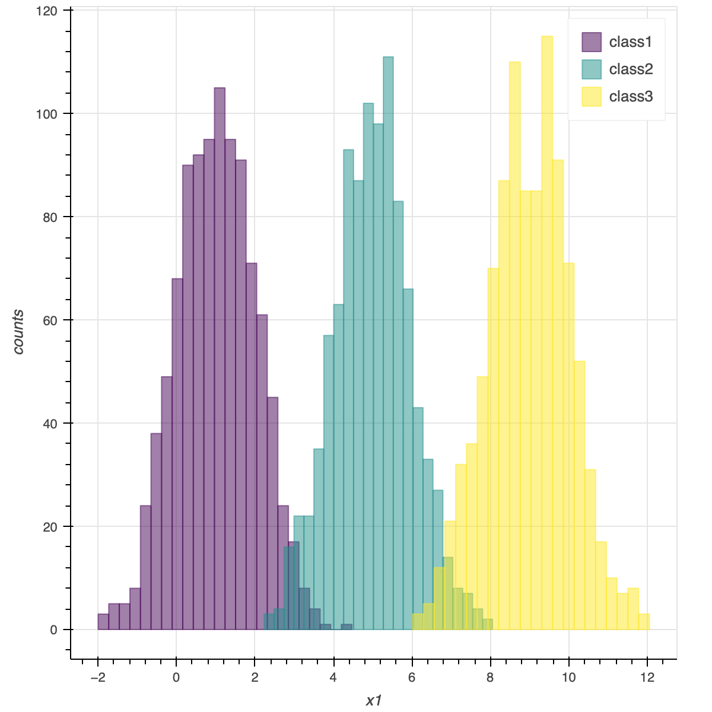
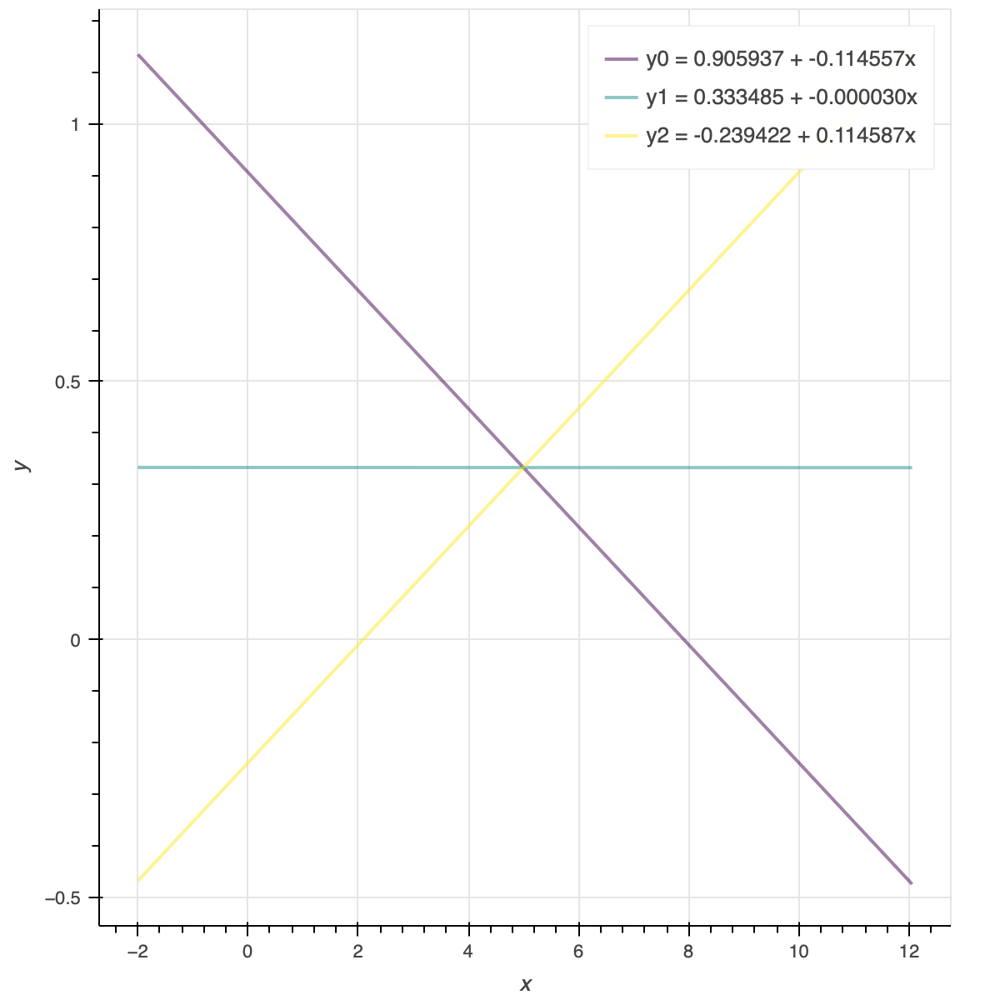
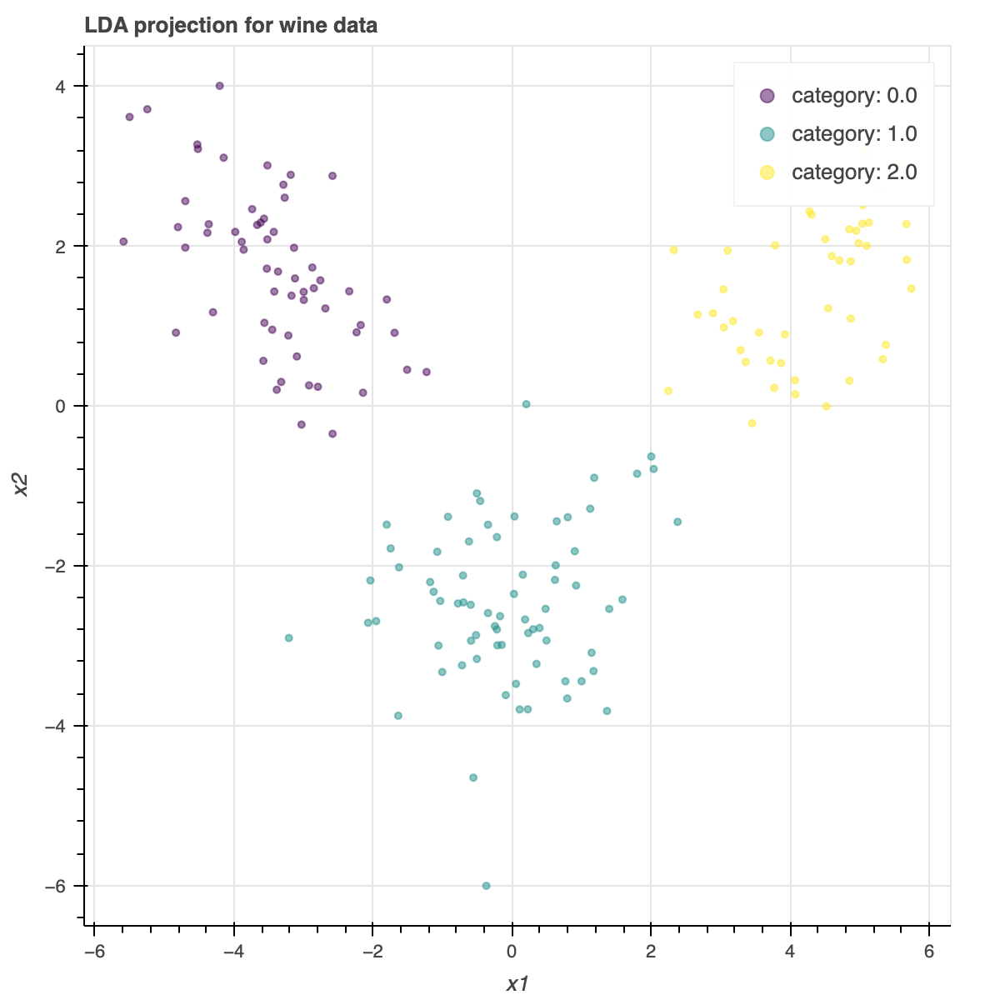
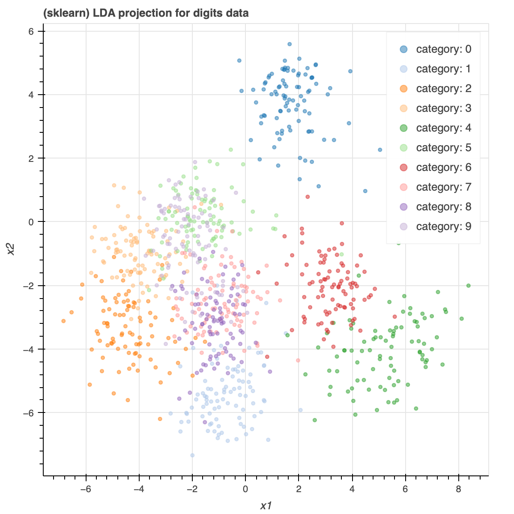
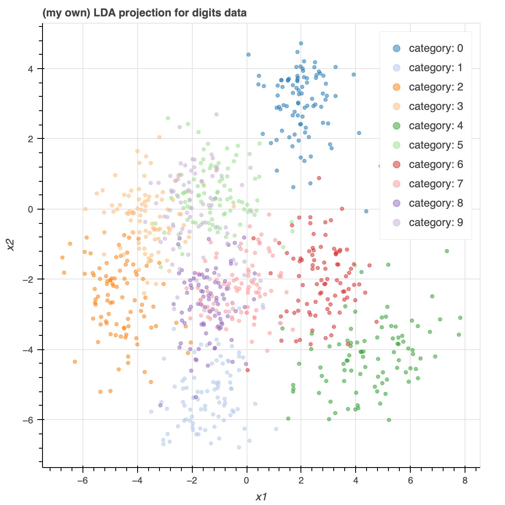
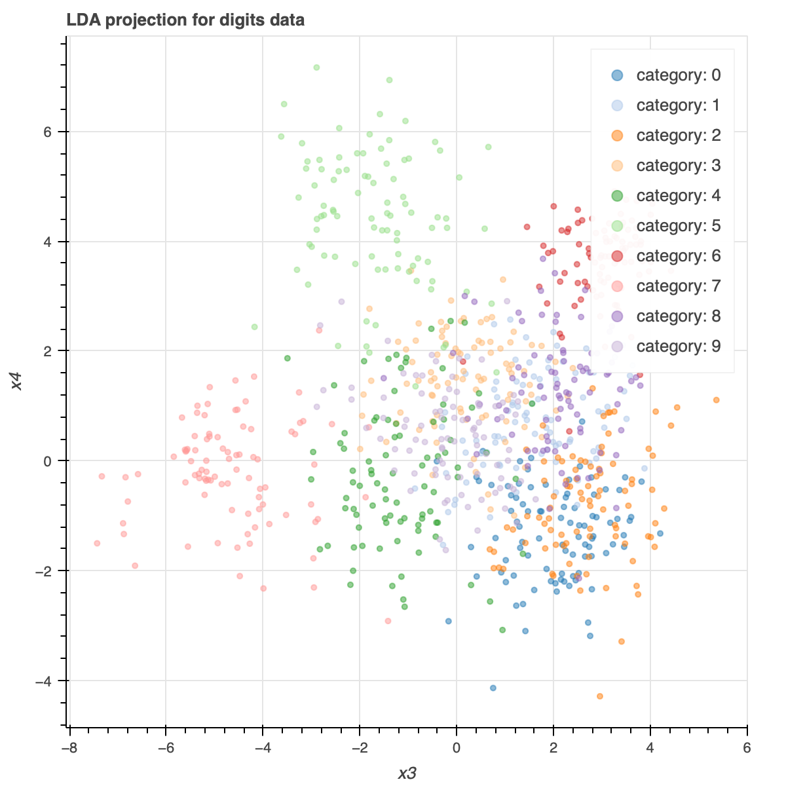

# ESL 4: Linear Methods for Classification

## 4.2 Linear Regression of an Indicator Matrix

对于分类问题，我们可以把每个分类用 indicator variable 来编码。

例如，如果有 $K$ 个类型，我们可以定义：

$$ \textbf{y} = [y_1, ..., y_K]^T $$

当样本是第 $i$ 类时，$y_i = 1$，其它值为 0。

当我们有 N 个样本时，可以写成一个 $N \times K$ 矩阵（indicator response matrix）：

$$ \textbf{Y} = [\textbf{y}_1, ..., \textbf{y}_N]^T $$

这个矩阵每一行仅有一个 1，其余值为 0。这个 1 代表该行样本的类型。

这实际上就是 one-hot 编码，这种编码相对于直接使用整数 $1, ..., K$ 来表示的有优势在于 __类型间的距离都是一样的__。

利用第三章的 Linear Regression，我们可以得出系数矩阵 $\hat{\textbf{B}}$：

$$ \hat{\textbf{B}} = \textbf{X}(\textbf{X}^T \textbf{X})^{-1} \textbf{X}^T \textbf{Y} $$

$\hat{\textbf{B}}$ 是一个 $(p+1) \times K$ 的矩阵。$\textbf{X}$ 是 $N \times (p+1)$ 矩阵。

得到估计值：

$$ \hat{\textbf{Y}} = \textbf{X}(\textbf{X}^T \textbf{X})^{-1} \textbf{X}^T \textbf{Y}$$

该方法的步骤是：

1. 对类型进行 one-hot 编码得到 $\textbf{Y}$
2. 将问题视作一个多变量的线性回归问题，对 one-hot 编码后的每个 bit 进行拟合得到 $\hat{\textbf{B}}$
3. 在判断类别时，选择 $\textbf{X}\hat{\textbf{B}}$ 每行的最大值所表示的类型

使用 Linear Regression 解决分类问题的最大问题在于，当类别数 $K \leq 3$ 时，可能会出现某个类被掩盖（mask）的情况。其本质原因是 Linear Regression 的“刚性”特质，即它的分界面是不够灵活的。

举个简单的例子，对于以下三个 1 维正态分布：

- class1: $x \sim N(1, 1)$
- class2: $x \sim N(5, 1)$
- class3: $x \sim N(9, 1)$

分布如下：



如果我们用 Linear Regression 拟合，那我们可以得到 3 组 $\beta_0, \beta_1$，分别对应第 $i$ 组，可以用来计算 $y_i$ 的值：

$$ y_i = \beta_0 + \beta_1 x $$



可以看到，$y_1$ （对应class2）从来不是最大值。也就是说我们的分类结果中只有 class1 和 class3 了，class2 被 mask 了。可以通过结果验证：

```py
pd.DataFrame(X*B).T.idxmax().value_counts()
# 2    1505
# 0    1495
# dtype: int64
```
代码：

```py
import numpy as np
import pandas as pd

def generate_nd_sample(name, mu_array, sigma, N):
    xx = {}
    for i in range(1, len(mu_array) + 1):
        xi = np.random.normal(mu_array[i-1], sigma, N)
        xx[f"x{i}"] = xi
    xx["name"] = name
    return pd.DataFrame(xx).astype({"name":"category"})

s1 = generate_nd_sample("class1", [1], 1, 1000)
s2 = generate_nd_sample("class2", [5], 1, 1000)
s3 = generate_nd_sample("class3", [9], 1, 1000)

s = pd.concat([s1, s2, s3]).reset_index(drop=True)

# Linear Regression

tmp = s.copy()
tmp.insert(0, "ones", np.ones(s.shape[0]))
X = np.matrix(tmp.drop("name", axis=1).to_numpy().T).T

Y = np.matrix(pd.get_dummies(s.name))

def LR_beta(X, Y):
    # class count
    K = Y.shape[1]
    return (X.T * X).I * X.T * Y

B = LR_beta(X, Y)

# Plot

from bokeh.io import output_notebook
output_notebook()
from bokeh.palettes import viridis
from bokeh.plotting import figure, show
import itertools

def create_histogram_figure(sample_data):
    # sample data must be like:
    # | x | category |
    assert sample_data.shape[1] == 2, "input must be of shape (N, 2)"

    x = sample_data.iloc[:, 0]
    categories = sample_data.iloc[:, 1].unique()

    fig = figure(x_axis_label=x.name, y_axis_label="counts")

    color_gen = itertools.cycle(viridis(len(categories)))
    for (category, color) in zip(categories, color_gen):
        data = sample_data[sample_data.iloc[:, 1] == category]
        counts, bins = np.histogram(data.iloc[:, 0], bins='auto')
        fig.quad(top=counts, bottom=0, left=bins[:-1], right=bins[1:],
                   alpha=0.5, color=color, legend_label=str(category))

    return fig

def create_line_figure(lines, x_start, x_end):
    fig = figure(x_axis_label="x", y_axis_label="y")
    color_gen = itertools.cycle(viridis(lines.shape[0]))
    for i in range(lines.shape[0]):
        b0, b1 = lines[i,0], lines[i, 1]
        fig.line(x=[x_start, x_end], y = [b0 + b1*x_start, b0 + b1*x_end],
                 line_width=2, alpha=0.5, color=next(color_gen),
                 legend_label=f"y{i} = {b0:.6f} + {b1:.6f}x")
    return fig

hist_fig = create_histogram_figure(s)
line_fig = create_line_figure(B.T, s.x1.min(), s.x1.max())
from bokeh import layouts
show(layouts.column(hist_fig, line_fig))
```

## 4.3 Linear discriminant analysis

为了获得最优的分类结果，我们需要知道后验概率（$X = x$ 时属于第 $k$ 类的概率）：

$$ \text{Pr}(G=k | X=x) = \frac{f_k(x) \pi_k}{\sum_{i=1}^K f_i(x) \pi_i}$$

因为本质上，我们是在找到一个 k 使得后验概率最大，即：

$$\begin{align}
\hat{k} &= \mathop{\arg \max}_{k}  \text{Pr}(G=k | X=x) \\
&= \mathop{\arg \max}_{k}  f_k(x) \pi_k \\
&= \mathop{\arg \max}_{k}  [\ln(f_k(x)) + \ln(\pi_k)]
\end{align}$$

这被称为 __判别函数__（discriminant function），其中：

- $f_i(x)$ 是第 i 类样本取 x 的概率
- $\pi_i$ 是属于第 i 类的先验概率

这里的难点在于确定 $f_i(x)$，显然 $\pi_i$ 的估计是可以通过样本数据直接得到的。

线性判别分析（Linear Discriminant Analysis, LDA）__假设变量 X 服从多维高斯分布__（X 包含多维）：

$$ f_k(x) = \frac{1}{(2 \pi)^{p/2} |\mathbf{\Sigma}_k|^{1/2}} e^{-\frac{1}{2}(x - \mu_k)^T \mathbf{\Sigma}_k^{-1} (x - \mu_k)} $$

带入最优分类的式子, 逐步去掉与 $k$ 无关的部分：

$$\begin{align}
\hat{k} &= \mathop{\arg \max}_{k}  [\ln(f_k(x)) + \ln(\pi_k)] \\
&= \mathop{\arg \max}_{k}  [- \ln((2 \pi)^{p/2} |\mathbf{ \Sigma }_k|^{1/2}) - \frac{1}{2}(x - \mu_k)^T \mathbf{ \Sigma }_k^{-1} (x - \mu_k) + \ln(\pi_k)] \\
&= \mathop{\arg \max}_{k}  [- \frac{1}{2} \ln |\mathbf{ \Sigma }_k| - \frac{1}{2}(x - \mu_k)^T \mathbf{\Sigma}_k^{-1} (x - \mu_k) + \ln(\pi_k)] \\
\end{align}$$

此时，判别函数为：

$$\delta_k(x) = - \frac{1}{2} \ln |\mathbf{ \Sigma }_k| - \frac{1}{2}(x - \mu_k)^T \mathbf{\Sigma}_k^{-1} (x - \mu_k) + \ln(\pi_k)$$

是 $x$ 的二次函数。因此称为二次判别分析(Quadratic Discriminant Analysis, QDA)。

我们再 __假设每个类中变量 X 分布的方差是相等的__，则 $\mathbf{\Sigma}$ 也与 $k$ 无关了，可以进步一化简判别函数为：

$$\delta_k(x) = x^T\mathbf{\Sigma}^{-1}\mu_k - \frac{1}{2}\mu_k^T\mathbf{\Sigma}^{-1} \mu_k + \ln(\pi_k)$$

我们可以看出，化简后判别函数对于 $x$ 是 __线性__ 的。这说明两个类的分界面（即判别函数相等时）也是线性的。因此叫做线性判别分析(Linear Discriminant Analysis, LDA)。

实际中，我们可以通过样本估计高斯分布的参数：

- $\hat{\pi}_k = N_k / N$，即第 k 类的样本数占总样本数的比例
- $\hat{\mu}_k = \sum_{g_i = k} x_i / N_k$，即第 k 类样本 X 的平均值
- $\hat{\mathbf{\Sigma}} = \sum_{k=1}^K \sum_{g_i = k} (x_i - \hat{\mu}_k)(x_i - \hat{\mu}_k)^T / (N - K)$，对协方差矩阵的无偏估计，证明在 ESL3 中

有了判别函数的表达式 $\delta_k(x)$，我们只需要依次带入 $k = 1, ..., K$, 当得到的 $\delta_k(x)$ 最大时的 $k$ 即为最佳分类。


### 4.3.2 Computation of LDA

协方差矩阵 $\mathbf{\Sigma}$ 是一个对称矩阵，可以进行特征值分解：

$$ \mathbf{\Sigma} = \mathbf{Q}\mathbf{\Lambda}\mathbf{Q}^T $$

其中：$\mathbf{Q}$ 是单位正交矩阵，$\mathbf{\Lambda}$ 是对角阵。带入判别函数有：

$$\begin{align}
\delta_k(x) &= x^T\mathbf{\Sigma}^{-1}\mu_k - \frac{1}{2}\mu_k^T\mathbf{\Sigma}^{-1} \mu_k + \ln(\pi_k) \\
&= x^T\mathbf{Q}^{T}\mathbf{\Lambda}^{-1}\mathbf{Q}\mu_k - \frac{1}{2}\mu_k^T\mathbf{Q}^{T}\mathbf{\Lambda}^{-1}\mathbf{Q}\mu_k + \ln(\pi_k)
\end{align}$$

令：

$$ x^{*} = \mathbf{\Lambda}^{-\frac{1}{2}}\mathbf{Q}x $$

$$ \mu^{*} = \mathbf{\Lambda}^{-\frac{1}{2}}\mathbf{Q} \mu $$

有：

$$ \delta_k(x^{*}) = x^{* T}\mu_k^{*} - \frac{1}{2}\mu_k^{* T} \mu_k^{*} + \ln(\pi_k) $$

当我们判断某个样本 $x_1$ 属于 m 和 n 中的哪一个类时，可以比较其判别函数，我们判断它是 m 类如果满足：

$$ \delta_m(x_1^*) > \delta_n(x_1^*) $$

带入表达式有：

$$ x^{*T} (\mu^*_m - \mu^*_n) > \frac{1}{2} (\mu^*_m + \mu^*_n)^T(\mu^*_m - \mu^*_n) - \ln(\pi_m/\pi_n)$$

这样看起来就非常直观了。 **LDA 是将样本投影在两个类中心的连线上，并且比较它更靠近哪一边，以此决定它属于哪个类**。当然，这个过程还考虑了两个类的先验概率（$\ln(\pi_m/\pi_n)$ 项）。


### 4.3.3 Reduced-Rank Linear Discriminant Analysis

LDA 也是一种降维的手段。假设我们有 $p$ 维特征，$K$ 个类别。根据 4.3.2 中介绍的计算方式，我们一共有 $K$ 个类中心点。他们一定在一个最高 $K-1$ 维的空间里。

#### 例：红酒分类

例如，对于 2 个类的分类问题，__无论特征是多少维__，我们只有 2 个类中心点。他们必定在一条直线（1维）上。同理，对于 3 个类的分类问题，我们只有 3 个类中心点。他们必定在一个平面（2维）内，如果特征维度大于等于 2。

因此，经过 LDA，原始数据总能被投影到一个超平面上，其维度为（对应 sklearn LDA 方法中的 `n_components` 参数）：

$$ L = \min(p, K-1) $$

这说明，__在 $p \gg K$ 时，使用 LDA 可以将一个 $p$ 维的输入降维到 $K-1$ 维__。

我们以 sklearn 中的 wine 数据集为例。它具有 13 维特征，3 个类别。我们使用 LDA 可以将这些数据投影到一个 2 维的平面上。



代码：

```py
import pandas as pd
import numpy as np
from sklearn import datasets

wine = datasets.load_wine()
X = pd.DataFrame(wine.data, columns = wine.feature_names)
y = wine.target

# LDA projection
from sklearn.discriminant_analysis import LinearDiscriminantAnalysis
model = LinearDiscriminantAnalysis(n_components=2).fit(X, y)
model.transform(X)

# plot
data_to_plot = pd.DataFrame(
    np.insert(model.transform(X), 2, y, axis=1),
    columns=["x1", "x2", "class"])
show(create_scatter_figure("LDA projection for wine data", data_to_plot))
```

#### Find the optimal subspace

在实际中，如果 $K$ 也很大，那还需要进一步降低维度。假设我们目标是降低到 $L$ 维（$L \ll K-1$)，即寻找超平面 $H_{K-1}$ 的最优子空间 $H_L$。

Fisher 将这个问题提炼为：

> 找到线性组合 $Z = a^T X$ 使得类间的方差相对于类内方差最大

$X$ 的类内(Within)方差为：

$$ \textbf{W} = \sum_{k=1}^K \sum_{g_i=k} (x_i - \mu_k)(x_i - \mu_k)^T $$

$X$ 的类间(Between)方差为：

$$ \textbf{B} = \sum_{k=1}^K (\mu - \mu_k)(\mu - \mu_k)^T $$

根据向量的统计特性，有 $Z$ 的类内方差为 $a^T \textbf{W} a$，类间方差为 $a^T \textbf{B} a$。

于是，Fisher 实际上是在解决这个优化问题：

$$ \mathop{\arg \max}_a \frac{a^T \textbf{B} a}{a^T \textbf{W} a} $$

由于我们总可以通过调节求得的 $a$ 的系数使得 $a^T \textbf{W} a = 1$，我们可以将其改写为：

$$\begin{align}
\mathop{\arg \max}_a & ~ a^T \textbf{B} a \\
\text{s.t.} & ~ a^T \textbf{W} a = 1
\end{align}$$

__假设 $\mathbf{W}$ 可逆__，令 $u = \mathbf{W}^{\frac{1}{2}} a$，由于 $\textbf{W}$ 是对称矩阵，有：

$$\begin{align}
\mathop{\arg \max}_u & ~ u^T \mathbf{W}^{-\frac{1}{2}}\textbf{B}\mathbf{W}^{-\frac{1}{2}} u \\
\text{s.t.} & ~ u^Tu = 1
\end{align}$$

$\mathbf{W}^{-\frac{1}{2}}\textbf{B}\mathbf{W}^{-\frac{1}{2}}$ 也是对称矩阵，必定存在特征值分解：

$$ \mathbf{W}^{-\frac{1}{2}}\textbf{B}\mathbf{W}^{-\frac{1}{2}} = \mathbf{Q} \mathbf{\Lambda} \mathbf{Q}^T $$

因此化简为：

$$\begin{align}
\mathop{\arg \max}_u & ~ u^T \mathbf{Q} \mathbf{\Lambda} \mathbf{Q}^T u \\
\text{s.t.} & ~ u^Tu = 1
\end{align}$$

再令 $v = \mathbf{Q}^T u$，由于 $\mathbf{Q}$ 是单位正交矩阵，$v^T v = 1$ 依然成立：

$$\begin{align}
\mathop{\arg \max}_v & ~ v^T \mathbf{\Lambda} v \\
\text{s.t.} & ~ v^Tv = 1
\end{align}$$

$\mathbf{\Lambda}$ 是对角矩阵，所以 __该优化问题本质是求最大特征值__。假设 $\lambda_i$ 最大，显然在 $v_i = 1$ 时取得最大值 $\lambda_i^2$。


由于 $\mathbf{\Lambda}$ 是 $\mathbf{W}^{-\frac{1}{2}}\textbf{B}\mathbf{W}^{-\frac{1}{2}}$ 的特征值，为了简化求解，我们利用定理：

>  $\mathbf{AB}$ 与 $\mathbf{BA}$ 具有同样的特征值，如果 $x$ 是 $\mathbf{AB}$ 的某个特征向量，则对应的 $\mathbf{BA}$ 的特征向量是 $y = \mathbf{B}x$

可以得到 $\mathbf{\Lambda}$ 也是 $\mathbf{W}^{-1}\textbf{B}$ 的特征值。

假设 $\mathbf{W}^{-1}\textbf{B}$ 的最大特征值为 $\lambda_i$，对应的特征向量为 $\xi$，则所求的线性变换为：

$$ a = \mathbf{W}^{-\frac{1}{2}} \xi $$

这样就找到了 $H_L$ 的 1 个维度，同理，我们选取 top L 个维度，即得到了 $H_L$。


#### 定理证明

假设 $\lambda$ 是 $\mathbf{AB}$ 的任意特征值。

$$ \mathbf{AB}x = \lambda x $$

令 $y = \mathbf{B}x$，则有：

$$ \mathbf{A}y = \lambda x $$

同时左乘 $\mathbf{B}$：

$$ \mathbf{BA}y = \lambda \mathbf{B}x = \lambda y $$


#### 例：手写数字分类

手写数字分类是通过 8x8 的手写数字图片判断是 0-9 中的哪个数字。显然，这是一个具有 $p = 8 \times 8 = 64$ 维特征，$K = 10$ 个类别的分类任务。我们可以用 sklearn 库的 LDA 得到下面的结果（降至 2 维 plot）：



```py
import pandas as pd
import numpy as np
import scipy
from sklearn import datasets

digits = datasets.load_digits()
X = pd.DataFrame(digits.data, columns = digits.feature_names)
y = digits.target

trainX = X[:len(X)//2]
trainY = y[:len(y)//2]

from sklearn.discriminant_analysis import LinearDiscriminantAnalysis

model = LinearDiscriminantAnalysis(n_components=2, solver="eigen", shrinkage=0.01).fit(trainX, trainY)

# reduce rank to 2 dimension data
reduceRankX = model.transform(trainX)
```

显然，直接调包隐藏了太多细节，为了加深理解，我们根据公式推导自己手动实现一个：

```py
def shrink(cov, shrinkage):
    dimensions = cov.shape[0]
    return (1-shrinkage) * cov  + shrinkage * np.trace(cov) / dimensions * np.identity(dimensions)

def my_lda(X, y, n_components, shrinkage):
    T = X.cov()
    W = X.groupby(y).apply(lambda g: g.cov() * (len(g)-1)
                          ).groupby(level=1).sum() / X.shape[0]

    shrunkW = shrink(W, shrinkage)
    invShrunkW = np.linalg.inv(shrunkW)
    shrunkB = shrink(T, shrinkage) - shrunkW

    # eigen values is ascending
    eigenvalues, eigenvectors = np.linalg.eigh(invShrunkW.dot(shrunkB))

    # eigen vectors with greatest eigen values
    xi = eigenvectors[:,::-1][:,:n_components]


    # L = np.linalg.cholesky(invShrunkW)
    # return L.dot(xi)

    # W^{-1/2}, not Cholesky
    return scipy.linalg.sqrtm(invShrunkW).dot(xi)
```

其中，`shrink` 函数是为了处理当 $\mathbf{W}$ 是 __奇异矩阵__ (不可逆)的情形。我们可以使用 [shrunk covariance](https://scikit-learn.org/stable/modules/covariance.html#shrunk-covariance) 来使其变为可逆矩阵再处理。这在输入 $X$ 是稀疏矩阵时很常见，例如手写数字分类。

$$ \mathbf{\Sigma}_{\text{shrunk}} = (1 - \alpha) \hat{\mathbf{\Sigma}} + \alpha \frac{\mathop{tr} \hat{\mathbf{\Sigma}}}{p} \mathbf{I}$$

其中 $\alpha$ 是 shrinkage，$p$ 是特征维度。

另外还需要注意区分矩阵平方根 `sqrtm` 与 Cholesky Decomposition。

矩阵平方根指 $\mathbf{B} \mathbf{B} = \mathbf{B}^T  \mathbf{B} = \mathbf{A}$，要求 $\mathbf{B}$ 是对称矩阵。

Cholesky Decomposition 指 $\mathbf{L}^T \mathbf{L} = \mathbf{A}$，要求 $\mathbf{L}$ 是三角矩阵。

使用自己实现的 LDA 得到与 sklearn 实现类似的结果：



可以看出，在降到 2 维后，LDA 还是能够清楚区分出数字 0, 1, 2, 3, 4, 6，但是存在一些数字的类别重叠在一起的情况。此时可以 __增加维度__ $L$ 解决。

下面是第3、4 维：



可以看出，它较好的补足了 1、2 维无法正确分类的数字。对于数字 5、7 有了清楚的分类。


## 4.4 Logistic regression

逻辑回归希望用输入 $x$ 的线性组合建模属于 k 类的后验概率，并且要求所有概率之和为 1。

以最后一个类（K 类）的后验概率 $\text{Pr} (G = K | X = x)$ 为比较基准，有：

$$ \ln \frac{\text{Pr} (G = k | X = x)}{\text{Pr} (G = K | X = x)} = \beta_{k0} + \beta_{k1}^T x$$

可以写为：

$$
\text{Pr} (G = k | X = x) = \begin{cases}
 \dfrac{e^{\beta_{k0} + \beta_{k1}^Tx}}{1 + \sum_{l=1}^{K-1} e^{\beta_{l0} + \beta_{l1}^Tx}}, & k = 1, 2, ..., K-1 \\
\dfrac{1}{1 + \sum_{l=1}^{K-1} e^{\beta_{l0} + \beta_{l1}^Tx}}, & k = K
\end{cases}$$

### 4.4.1 Fitting Logistic Regression Models

对于第 k 类的某个样本 i，我们希望找到一组模型参数 $\theta$，使模型认为该样本属于 k 的概率（即 __正确分类概率__）尽量大。我们将这个概率计作：

$$\text{Pr} (G = k | X = x) = p_{k} (x; \theta)$$

则该优化问题是：

$$\begin{align}
\hat{\theta} = \mathop{\arg \max}_{\theta} ~ p_{k} (x; \theta)
\end{align}$$

对于所有样本，我们目标是令他们 __被正确分类的概率和最大__：

$$ \ell (\theta) = \sum_{i=1}^N \ln p_{g_i} (x_i; \theta) $$

为了简化这个问题，我们只考虑而 $K=2$ 即 __二分类__ 问题情况。此时样本要么属于 1 类要么属于 2 类。

为了简单表示：

$$p_{k} (x; \theta) = \begin{cases}
p_1 (x; \theta), & k = 1 \\
1 - p_1(x; \theta), & k = 2
\end{cases}$$

我们可以假设样本观测值 $y_i = 1$ 代表属于第 1 类，$y_i = 0$ 代表 __不属于__ 第 1 类（那么肯定属于第 2 类）。则

$$p_{k} (x_i; \theta) = y_i p_1 (x_i; \theta) + (1-y_i)(1-p_1(x_i; \theta))$$

则有：

$$ \begin{align}
\ell (\theta) &= \sum_{i=1}^N \ln p_{g_i} (x_i; \theta) \\
 &= \sum_{i=1}^N {y_i \ln p_1 (x_i; \theta) + (1-y_i) \ln (1-p_1(x_i; \theta))} \\
 &= \sum_{i=1}^N {\ln(1 - p_1(x_i; \theta)) + y_i \ln \frac{ p_1  (x_i; \theta)}{1 - p_1 (x_i; \theta)} } \\
 &= \sum_{i=1}^N {\ln(1 - p_1(x_i; \theta)) + y_i \mathbf{\beta}^Tx_i } \\
 &= \sum_{i=1}^N {y_i \mathbf{\beta}^Tx_i - \ln(1 + e^{\mathbf{\beta}^Tx_i}) }
\end{align}$$

其中 $\mathbf{\beta} = [ \beta_{10}, \beta_{11}, ... \beta_{1p} ]$，对应 $x = [1, x_1, x_2, ... x_p]$。

求解这个优化问题可以令其对 $\beta$ 的导数为 0:

$$ \frac{\partial \ell(\beta)}{\partial \beta} = \sum_{i=1}^N x_i(y_i - p_1(x_i; \beta)) = 0, $$

为了求解 $\dfrac{\partial \ell(\beta)}{\partial \beta} = 0$，我们可以用凸优化中的 Newton-Raphson 法。即选取一个任意初始 $x_n$（不是初始解，因为要求的就是解），并取其切线与 x 轴交点 $x_{n+1}$：

$$ \beta^{\text{new}} = \beta - (\frac{\partial^2 \ell(\beta)}{\partial \beta \partial \beta^T})^{-1} \frac{\partial \ell(\beta)}{\partial \beta}$$

其中 $(p+1) \times (p+1)$ 维 Hessian 矩阵：

$$\begin{align}
\frac{\partial^2 \ell(\beta)}{\partial \beta \partial \beta^T} &= - \sum_{i=1}^N x_i \frac{\partial p_1(x_i; \beta)}{\partial \beta^T} \\
&= - \sum_{i=1}^N x_i \dfrac{\partial \dfrac{e^{\beta^T x_i}}{1 + e^{\beta^T x_i}} }{\partial \beta^T} \\
&= - \sum_{i=1}^N x_i \frac{x_i^T e^{\beta^T x_i}}{(1 + e^{\beta^T x_i})^2} \\
&= -\sum_{i=1}^N x_i x_i^T p_1(x_i; \beta) (1 - p_1(x_i; \beta))
\end{align}$$

我们将他们写成矩阵形式：

$$ \frac{\partial \ell(\beta)}{\partial \beta} = \mathbf{X}^T(\mathbf{y} - \mathbf{p})$$

$$ \frac{\partial^2 \ell(\beta)}{\partial \beta \partial \beta^T} = \mathbf{X}^T \mathbf{W} \mathbf{X} $$

其中 $\mathbf{X}$ 是 $N \times (p+1)$ 矩阵，$\mathbf{y} - \mathbf{p}$ 是 $N$ 维列向量，$\mathbf{W}$ 是 $N \times N$ 对角矩阵，第 i 个元素是 $p_1(x_i; \beta) (1 - p_1(x_i; \beta))$。

带入 Newton-Raphson 公式：

$$\begin{align}
\beta^{\text{new}} &= \beta - (\frac{\partial^2 \ell(\beta)}{\partial \beta \partial \beta^T})^{-1} \frac{\partial \ell(\beta)}{\partial \beta} \\
&= \beta + (\mathbf{X}^T \mathbf{W} \mathbf{X})^{-1} \mathbf{X}^T(\mathbf{y} - \mathbf{p}) \\
&= (\mathbf{X}^T \mathbf{W} \mathbf{X})^{-1}\mathbf{X}^T \mathbf{W}(\mathbf{X}\beta + \mathbf{W}^{-1}(\mathbf{y} - \mathbf{p})) \\
&= (\mathbf{X}^T \mathbf{W} \mathbf{X})^{-1}\mathbf{X}^T \mathbf{W}\mathbf{z}
\end{align}$$

这就是 __迭代更新__ 的计算公式。由于 $\mathbf{p}$ 和 $\mathbf{W}$ 都随 $\beta$ 变化，因此我们需要在每轮迭代重新计算他们的值。

上式中，我们定义了：

$$ \mathbf{z} = \mathbf{X}\beta + \mathbf{W}^{-1}(\mathbf{y} - \mathbf{p}) $$

回想 __最小二乘法__ 的公式：

$$ \hat{\beta} = (\mathbf{X}^T \mathbf{X})^{-1} \mathbf{X}^T \mathbf{y} $$

可以发现两者非常相似，区别在于逻辑回归中多了一个权重对角矩阵 $\mathbf{W}$。因此这个算法也称为 __iteratively reweighted least squares__（重新加权迭代最小二乘法）。


接下来我们还需要一个 $\beta$ 的 __初始值__。一般情况下可以选 $\beta = 0$。该算法 __不保证收敛__。


### 例：乳腺癌诊断

该案例通过 30 维特征来判断乳腺癌是恶性还是良性，是一个典型的 2 分类问题。
```py
import pandas as pd
import numpy as np
from sklearn import datasets, model_selection

def load_sklearn_data(sk_data):
    X = pd.DataFrame(sk_data.data, columns = sk_data.feature_names)
    y = pd.Series(sk_data.target, name="target").apply(
        lambda index: sk_data.target_names[index]).astype("category")
    return X, y

X, y = load_sklearn_data(datasets.load_breast_cancer())
X_train, X_test, y_train, y_test = model_selection.train_test_split(
    X, y, test_size=0.2)

from sklearn.metrics import accuracy_score
from sklearn.linear_model import LogisticRegression

model = LogisticRegression(solver="newton-cg").fit(X_train, y_train)
accuracy_score(model.predict(X_test), y_test)
```

结果是 `0.9385964912280702`。我们再用自己实现的 LR 进行判断：

```py
def sigmoid(x, beta):
    tmp = np.exp(x.dot(beta))
    return tmp / (1 + tmp)

class MyLogisticRegression:
    def __init__(self, max_iter, tolerance = 0.01):
        self.max_iter_ = max_iter
        self.tolerance_ = tolerance
        self.beta = None

    def fit(self, train_X, train_y):
        N, p = train_X.shape
        X = train_X.to_numpy()
        X = np.concatenate((np.atleast_2d(np.ones(N)).T,
                            train_X.to_numpy()), axis=1)
        self.beta = np.zeros(p+1)
        beta = self.beta
        for i in range(self.max_iter_):
            prob = np.apply_along_axis(sigmoid, 1, X, beta)
            W = np.diag(prob * (1 - prob))
            z = X.dot(beta) + np.linalg.inv(W).dot(train_y.cat.codes - prob)
            new_beta = np.linalg.inv(X.T @ W @ X) @ X.T @ W.dot(z)
            beta = new_beta

        self.beta = beta


    def predict(self, test_X):
        X = test_X.copy()
        X.insert(0, "x_0", np.ones(test_X.shape[0]))
        prob = X.apply(lambda row: sigmoid(row, self.beta), axis=1)
        return prob.apply(lambda x: 1 if x >= 0.5 else 0)
```

根据公式写代码，注意 $\beta$ 的迭代更新即可。最大的难度是终止条件，因为迭代数次之后会遇到 Hessian 矩阵 $\mathbf{X}^T \mathbf{W} \mathbf{X}$ 成了奇异矩阵的问题。

运行的结果表明分类正确率可以达到 `0.9473684210526315`。

TODO: how to find a stopping criteria?


### 4.4.5 Logistic Regression or LDA?

在 4.3 中我们介绍了 LDA，回忆其判断某个样本属于 $k$ 还是 $l$ 的函数（当该式大于 0 时属于 $k$ 类）：

$$\begin{align}
\ln \frac{\text{Pr}(G=k | X=x)}{\text{Pr}(G=l | X=x)} &= \ln \frac{f_k(x) \pi_k}{ f_l(x) \pi_l} \\
&= \ln \frac{\pi_k}{\pi_l} - \frac{1}{2}(\mu_k + \mu_l) \mathbf{\Sigma}^{-1} (\mu_k - \mu_l) + x^T \mathbf{\Sigma}^{-1} (\mu_k - \mu_l) \\
&= \alpha_{k0} + \alpha_{k1}^T x
\end{align}$$

可以看出其形式与 logistic regression 一致：

$$\ln \frac{\text{Pr}(G=k | X=x)}{\text{Pr}(G=l | X=x)} = \beta_{k0} + \beta_{k1}^T x$$

那么他们俩是不是一样的方法呢？并不是。他们的主要区别是：

- 假设不同。LDA 假设了 $x$ 服从正态分布，且各个类的协方差矩阵相同。LR 没有限定 $x$ 的分布。由于 LDA 假设了正态分布，它对于极端的 outlier 鲁棒性差（会影响分布函数)。

- 优化目标不同。LDA 最大化 full log-likelihood，需要考虑 $x$ 的边缘分布函数。LR 最大化 conditional likelihood，不需要考虑 $x$ 的边缘分布函数。

比较难理解的是第二点。

首先，根据 Bayes 公式，在已知 B 发生时，A 的条件概率为：

$$ P(A|B) = \frac{P( A \cap B ) }{P(B)} $$

对于 LDA，需要最最大化的 __条件概率__ 是 __在已知 $X = x$ 时，样本类别 $G = k$ 类的概率__，即：

$$\begin{align}
\hat{k} &= \mathop{\arg \max}_{k} \text{Pr}(G=k | X=x) \\
&= \mathop{\arg \max}_{k} \frac{f_k(x) \pi_k}{\sum_{l=1}^K f_l(x) \pi_l}
\end{align}$$

因此，我们需要知道 $x$ 的在每个类的密度函数 $f_i(x)$，并假设为正态分布，且协方差相等：

$$ f_k(x) = \phi(x; \mu_k, \mathbf{\Sigma}) $$

值得注意的是，我们此时有 $x$ 的边缘密度函数（marginal density）：

$$ \text{Pr}(X) = \sum_{k=1}^K \phi(X; \mu_k, \mathbf{\Sigma}) \pi_k $$

它也利用了假设中的分布，因此也 LDA 不可避免需要考虑 $x$ 的边缘密度函数。因此说他考虑 full log-likelihood。

对于 LR，它的优化目标是使 __所有样本__ 正确分类的概率和最大：

$$\begin{align}
\hat{\theta} &= \mathop{\arg \max}_{\theta} ~ \ell (\theta) \\
&= \mathop{\arg \max}_{\theta} ~ \sum_{i=1}^N \ln p_{g_i} (x_i; \theta) \\
&= \sum_{i=1}^N y_i \mathbf{\beta}^Tx_i - \ln(1 + e^{\mathbf{\beta}^Tx_i})
\end{align}$$

其中不包含任何与边缘密度函数 $\text{Pr}(X)$ 相关的部分，也没有假设 $x$ 的分布。因此说它只考虑 conditional likelyhood。

## Reference

1. [masking in linear regression for multiple classes](https://stats.stackexchange.com/questions/475458/masking-in-linear-regression-for-multiple-classes)
2. [Linear discriminant analysis, explained](https://yangxiaozhou.github.io/data/2019/10/02/linear-discriminant-analysis.html)
3. [shrunk covariance](https://scikit-learn.org/stable/modules/covariance.html#shrunk-covariance)
4. [between-class scatter matrix calculation](https://stats.stackexchange.com/questions/123490/what-is-the-correct-formula-for-between-class-scatter-matrix-in-lda)
5. [逻辑回归](https://zhuanlan.zhihu.com/p/124757082)
6. [Implementing logistic regression from scratch in Python](https://developer.ibm.com/articles/implementing-logistic-regression-from-scratch-in-python/)
