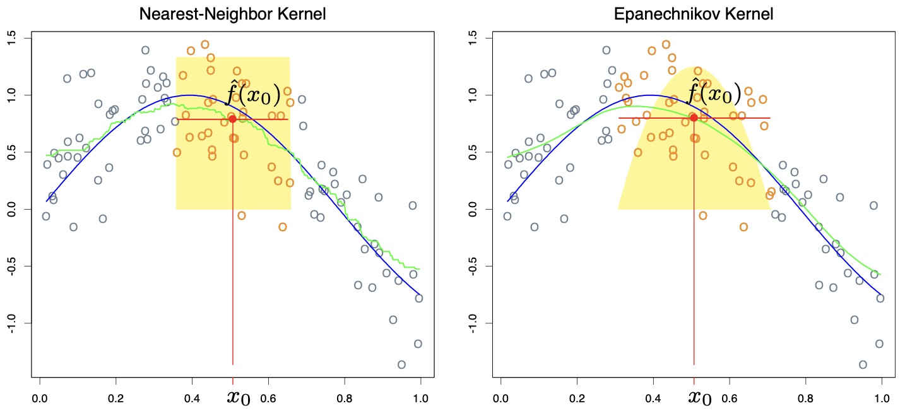
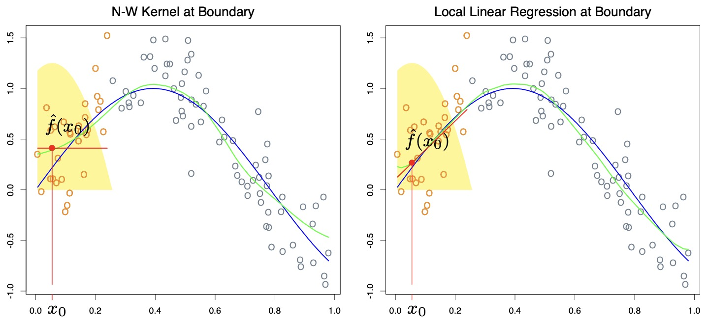
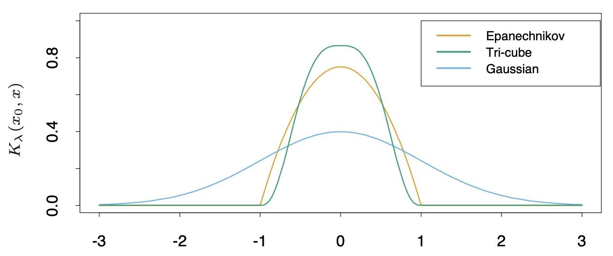

# ESL6: Kernel Smoothing Methods

本章我们介绍 __核平滑方法__。它仅利用目标点 $x_0$ 周围的观测点来拟合模型 $f(X)$，得到 $\hat{f}(X)$。相较于最近邻法，它所得到的  $\hat{f}(X)$ 是平滑 (smooth) 后的。

它平滑曲线的原理是利用一个核函数 $K_\lambda (x_0, x_i)$ 根据目标点 $x_0$ 和周围点 $x_i$ 的距离赋予权重。

这一类方法几乎不需要训练，参数也很简单，只有一个超参数 $\lambda$，用来设置“周围”的具体范围。

值得注意的是，__核平滑方法__ 和 __核方法__ 是不同的概念。__核方法__ 会在高维特征空间计算内积，用于正则化的非线性建模。

## 6.1 One-Dimensional Kernel Smoothers

相对于最近邻法，核平滑法对目标点附近选取的样本点设置了 __根据距离衰减的权重__，再进行加权平均。这样做的最大好处是使曲线更加平滑了（但是不一定可导？）

$$ \hat{f}(x_0) = \dfrac{\sum_{i=1}^N K_\lambda(x_0, x_i)y_i}{\sum_{i=1}^N K_\lambda(x_0, x_i) } $$

样本点 $x$ 的权重函数（也称为核函数）定义为其与目标点 $x_0$ 距离相关的函数：

$$ K_\lambda(x_0, x) = D( \dfrac{|x - x_0|}{h_\lambda(x_0)} ) $$

其中 $h_\lambda(x_0)$ 表示选取窗口的大小可以根据目标点的取值变化。

可以看出，右图使用核函数平滑后，相比左图的最近邻法获得的估计值更为平滑。

### 6.1.1 Local Linear Regression

我们通过引入核函数解决了平滑性问题，但是，我们发现在临近边界的地方，曲线出现了较大的 bias，这是由于边界区域样本点分布不均匀。

我们可以通过 __局部线性回归__ 解决这个问题。它在 __每个__ 目标点 $x_0$ 求解一个 __最小二乘__ 问题：

$$ \mathop{\arg \min}_{\alpha(x_0), \beta(x_0)} \sum_{i=1}^{N} K_\lambda(x_0, x_i)[y_i - \alpha(x_0) -\beta(x_0)x_i]^2 $$

即，对于每个目标点周围选取的样本点，用线性函数去拟合，得到线性方程：

$$ \hat{f}(x) = \alpha(x_0) + \beta(x_0)x $$

再代入 $x_0$ 得到估计值。该方法可以 __除去 1 阶的 bias，只保留 2 阶及更高阶的 bias__。

对于某一个目标点 $x_0$，假设其周围选取了 $N$ 个样本点，其估计结果可以写成矩阵形式：

$$\begin{align}
\hat{f}(x_0) &= b(x_0)^T (\mathbf{B}^T \mathbf{W}(x_0) \mathbf{B})^{-1} \mathbf{B}^T \mathbf{W}(x_0) \mathbf{y} \\
&= \sum_{i=1}^{N} l_i(x_0)y_i
\end{align}$$

其中 $b(x_0)^T = (1, x_0)$，矩阵：

$$ \mathbf{B} = \left[ \begin{array}{cc}
1 & x_1 \\
1 & x_2 \\
\vdots & \vdots \\
1 & x_N
\end{array} \right]_{N \times 2}$$

$$ \mathbf{W}(x_0) = \left[ \begin{array}{cccc}
K_\lambda(x_0, x_1) & & &\\
& K_\lambda(x_0, x_2) & &\\
& & & \ddots & \\
& & & & K_\lambda(x_0, x_N) \\
\end{array} \right]_{N \times N}$$

其效果如下图所示，可以看出在定义域边缘位置，使用局部线性回归（右图）拟合效果更好。

## 6.2 Selecting the Width of the Kernel

几种常用的 kernel:

对于 Epanechnikov 和 tri-cube kernel，$\lambda$ 是“周围”的半径。对于 Gaussian kernel，$\lambda$ 是其标准差 $\sigma$。

选取 $\lambda$ 实际上是 bias-variance 的 tradeoff。当选取窗口很小时，由于采用的样本点较少，得到的目标点的估计值 variance 会很大。但是同时，由于选取的点都是离目标点最近的点，它的 bias 很小。

## 6.3 Multiple Dimensional Local Regression

我们可以自然地将局部线性回归扩展到多维，用于拟合一个超平面。

当维度 $p = 2$，阶次 $d = 1$ 时，我们有：

$$ b(X) = (1, X_1, X_2) $$

当维度 $p = 2$，阶次 $d = 2$ 时，我们有：

$$ b(X) = (1, X_1, X_2, X_1^2, X_2^2, X_1X_2) $$

需要求解的优化问题变为：

$$ \mathop{\arg \min}_{\beta(x_0)} \sum_{i=1}^{N} K_\lambda(x_0, x_i)[y_i - b(x_i)^T \beta(x_0)]^2 $$

拟合的函数为 $\hat{f}(x_0) = b(x_0)^T \hat{\beta}(x_0)$。

维度变大时，由于边界上的点占总体样本的比例更大（越来越趋近于 100%），在边界上很难保持一个好的 bias-variance tradeoff。因此，局部线性回归在 3 维以上的情形时对边界 bias 的修正作用不佳。
