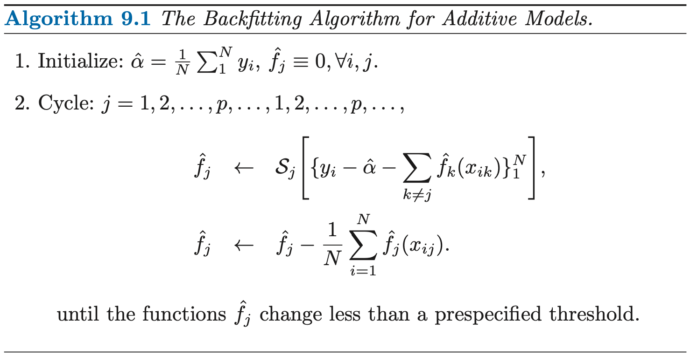
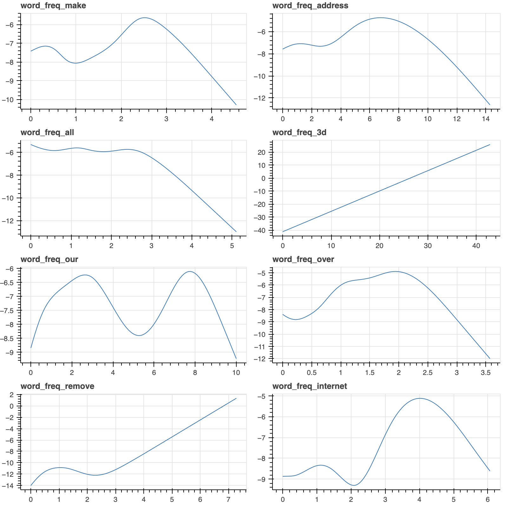

# ESL 9.1: Generalized Additive Models

实际中的很多模型并非线性，传统线性模型效果并不好。本节介绍了一种更加灵活的统计模型，可以建模非线性的影响。它将模型定义为：

$$ E(Y|X_1, X_2, ..., X_p) = \alpha + f_1(X_1) + f_2(X_2) + \cdots + f_p(X_p)$$

其中，$X_i$ 是第 $i$ 个特征，$Y$ 是预测值，$f_i$ 是第 $i$ 个特征的 "smoother"，它可以是一个 cubic spline，也可以是一个 kernel smoother。

例如，在逻辑回归中，对于二分类问题我们假设 Y=1 的概率 $\mu(X) = \text{Pr}(Y=1|X)$，我们可以将 logit 函数表示为特征的 __线性__ 组合：

$$ \ln(\dfrac{\mu(X)}{1-\mu(X)}) = \alpha + \beta_1 X_1 + \cdots + \beta_p X_p $$

在 additive model 中，我们不作线性假设，上式写为更通用的形式：

$$ \ln(\dfrac{\mu(X)}{1-\mu(X)}) = \alpha + f_1(X_1) + \cdots + f_p(X_p) $$

上式的每个估计函数 $f_i$ 是基于 scatterplot smoother 的，因此可以体现 $X_i$ 的非线性特征。

## 9.1.1 Fitting Additive Models

本节我们用 cubic spline 作为 scatterplot smoother 来拟合一个 additive model。这个 additive model 形式为：


$$ Y = \alpha + \sum_{j=1}^p f_j(X_j) + \varepsilon $$

其中 $\varepsilon$ 是均值为 0 的误差项。

我们的目标是确定 $\alpha$ 以及 $f_j$，为了描述非线性，我们假设 $f_j$ 是 __以每个样本点为节点的 cubic spline__。

### Unique Solution

如果我们不附加限制条件，常数项 $\alpha$ 不是唯一的。因为我们可以在函数 $f_j$ 的常熟项中任意进行加减。因此，我们增加了一条限制条件以获得 __唯一解__:

$$ \sum_i^N f_j(x_{ij}) = 0 $$

即限制每个函数的估计值相加为 0。此时必然有一个确定的 $\hat{\alpha} = \text{ave} (y_i)$。



上面算法需要注意的重点：

- $\alpha$ 初始值为$\hat{\alpha} = \text{ave} (y_i)$，并保持不变
- $f_j$ 初始化全系数为 0
- 循环的思路是不断地用 $f_j$ 去拟合 __残差__，直到收敛，残差由 y 减去 __其它__ 所有特征的预测值之和得到。


## 9.1.2 Example: Additive Logistic Regression

Additive model 可以应用到分类问题中。通用的 additive logistic model 的形式为：

$$ \ln \frac{\text{Pr}(Y=1 | X)}{\text{Pr}(Y=0 | X)} = \alpha + f_1(X_1) + \cdots + f_p(X_p) $$

其中, $f_1, f_2, \dots, f_p$ 用 Newton-Raphson 法估计。

### Example: Predicting Email Spam

我们分别用 logistic regression 和 additive logistic model 对垃圾邮件进行分类，以此来分析 additive model 的特点。


下面是 logistic regression 的代码：

```py
from sklearn.linear_model import LogisticRegression
from sklearn.model_selection import KFold

for train_index, test_index in KFold(n_splits=5,shuffle=True,random_state=1).split(X):
    trainX, testX = X.loc[train_index], X.loc[test_index]
    trainY, testY = y.loc[train_index], y.loc[test_index]
    model = LogisticRegression(random_state=0).fit(trainX, trainY)
    print(f"LR accuracy: {model.score(testX, testY)}")
```

logistic regression 的结果为：

```text
LR accuracy: 0.9283387622149837
LR accuracy: 0.9271739130434783
LR accuracy: 0.9119565217391304
LR accuracy: 0.9206521739130434
LR accuracy: 0.925
```

下面是 additive logistic model 的代码：

```py
from pygam import LogisticGAM

for train_index, test_index in KFold(n_splits=5,shuffle=True,random_state=1).split(X):
    trainX, testX = X.loc[train_index], X.loc[test_index]
    trainY, testY = y.loc[train_index], y.loc[test_index]
    model = LogisticGAM().fit(trainX, trainY)
    print(f"GAM accuracy: {model.accuracy(testX, testY)}")
```

additive model 的结果为：

```text
GAM accuracy: 0.9402823018458197
GAM accuracy: 0.9380434782608695
GAM accuracy: 0.9228260869565217
GAM accuracy: 0.9467391304347826
GAM accuracy: 0.9456521739130435
```

可以看出，默认参数情况下，GAM 的结果要略好于 LR 的结果。通过画出拟合出的每个特征的函数 $f_j(X_j)$，可以看出，很多特征都具有非线性的函数。而 additive model 的一大优势就是能够 capture non-linear effects.



绘图所用代码：

```py
# Plot to notebook
from bokeh.io import output_notebook
output_notebook()
from bokeh.plotting import figure, show
from bokeh import layouts


def plot_features(gam_model, feature_names):
    # exclude the intercept
    feature_count = len(gam_model.terms) - 1

    figs = []
    for i in range(feature_count):
        xx = gam_model.generate_X_grid(term=i)[:, i]
        yy = gam_model.partial_dependence(term=i)
        fig = figure(title=feature_names[i])
        fig.line(x=xx, y=yy)
        figs.append(fig)

    show(layouts.gridplot(figs, ncols=2, width=400, height=200))
```

## Reference

1. [GAM: The Predictive Modeling Silver Bullet](https://multithreaded.stitchfix.com/blog/2015/07/30/gam/)
