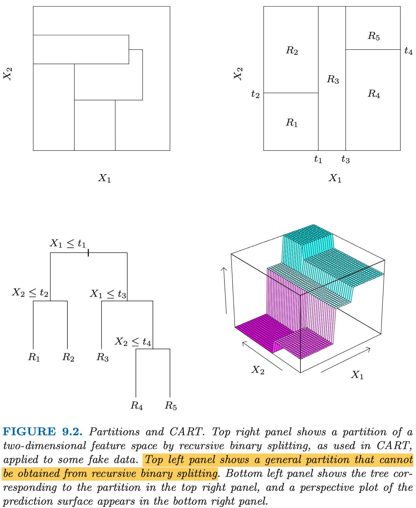

# ESL 9.2: Tree-Based Methods

## 9.2.1 Background

树方法将特征空间分割为不同区域，然后用一个简单的模型（比如常数）来拟合每个区域。

考虑一个简单的回归问题。特征是二维的 $X_1$ 和 $X_2$，响应是实数 $Y$。我们可以把特征空间分区，每个区赋予一个常数作为响应的估计值。

如下图所示，左上角的子图是一种复杂的情形，因为每个区域很难描述。我们先研究类似于右上角的子图的简单情形，它可以表示成一个简单的二叉树（左下），每个叶子节点就是其分区结果，可以赋予一个常数。



## 9.2.2 Regression Trees

现在我们可以将问题转化为如何构造一个 regression tree。假设我们的特征有 $p$ 维，共有 $N$ 个观测样本。我们需要找到一个算法能够自动决定在哪些特征的哪些值进行分割，以此决定 regression tree 的形状。如果分支数太多，显然会存在过拟合的问题。但是分支数太少又可能忽略掉重要的结构。


可调参数：

- 每个叶子节点最大样本数（用于 Step 1 终止条件）

### Step1. 递归构造二叉树

#### Step 1.1 递归切分

假设我们对第 $j$ 个特征选择了分割点 $s$，则分割成的两个部分为：

$$ R_1(j, s) = \{ X|X_j \leq s \} $$

$$ R_2(j, s) = \{ X|X_j \gt s \} $$

我们的目标是选择 $j$ 和 $s$ 让两个部分的残差平方和 (RSS) 最小，即求解如下问题：

$$ \min_{j,s} [ \sum_{x_i \in R_1} (y_i - \hat{c}_1)^2 + \sum_{x_i \in R_2} (y_i - \hat{c}_2)^2 ]$$

其中预测值的估计 $\hat{c}$ 为各部分 $y_i$ 的均值。

假设 $X_j$ 在样本中一共有 k 个不同的值，则显然最多有 k-1 种分法。可以依次尝试找到 $s$。这样我们就确定了一组 $(j, s)$ 组合。该组合将数据分为两部分，我们再对每一个部分重复上述操作。

#### Step1.2 终止条件

在 step 1.1 的每次切分之后，我们需要对每个部分判断是否停止切分。如果直接用 sum-of-squares 变小的幅度作为终止条件，可能会导致结果不理想。因为某次分割后 sum-of-squares 变化不大，可能它的后续分割能极大降低 sum-of-squares。

因此，我们采用 __限制叶子节点样本数__ 的方法作为终止条件。如果分割后的节点样本数是否低于某个给定的值（例如 5）则停止，否则重复 step 1.1 递归地进行切分。

这样的结果是我们得到了一个可能 __过拟合__ 的树。比如，某一类别的数据实际有 8 个，但是我们叶子节点的样本数上限设为了 5。因此，我们需要进行剪枝，即合并一些节点。


### Step2. 剪枝

剪枝的目的是在总节点数以及每个节点的样本的 RSS 中取一个较好的平衡。因此我们定义“复杂度成本” (cost-complexity)：

$$ \text{RSS}_m =  \sum_{x_i \in R_m} (y_i - \hat{c}_m)^2 $$

$$ C_\alpha (T) = \sum_{m=1}^{|T|} \text{RSS}_m + \alpha |T|$$

其中：

- $|T|$：剪枝后的树 T 的节点数
- $\text{RSS}_m$：第 m 个节点的残差平方和
- $\alpha$：节点个数权重，即复杂度成本，如果设为 0 则不进行剪枝

显然，对每个$\alpha$ 的取值，我们都有一个唯一确定的树 $T_\alpha$ 使 $C_\alpha (T)$ 最小。


#### Step 2.1 交叉检验法确定 $\alpha$

我们可以通过调节 $\alpha$ 来决定剪枝后的模型复杂度（节点数）。 $\alpha$ 越大，模型越简单，越不精确。$\alpha$ 太小则会造成过拟合。

为了确定合适的 $\alpha$ 我们可以把数据的 1/5 或者 1/10 留作检验数据，剩余数据作为训练数据。然后寻找使检验数据的预测误差最小的 $\hat{\alpha}$。

#### Step 2.2 最弱连接法剪枝

我们从对减少 $\text{RSS}$ 贡献最小的分叉点开始合并节点，直到我们仅剩一个根节点。我们记录这个过程中生成的每一个树（有限集），并且计算其 $C_{\hat{\alpha}} (T)$，最小的树就是最终结果 $T_{\hat{\alpha}}$。

## 9.2.3 Classification Trees

对于回归问题，我们希望最小化残差，即样本与均值的差的平方和：

$$ \text{RSS}_m =  \sum_{x_i \in R_m} (y_i - \hat{c}_m)^2 $$

对于分类问题，我们的目的是使样本正确分类的概率最高。我们定义某 __叶子节点__ 所圈定的区域为 $R_m$，该节点上共有 $N_m$ 个样本。我们定义节点的“纯洁度”为：

$$ \hat{p}_{mk} = \frac{1}{N_m} \sum_{x_i \in R_m} I(y_i = k) $$

它表示在节点 m 中第 k 类样本的比例。我们将这个区域内划分给占比最高的类型，
即 $k(m) = \mathop{\arg \max_k \hat{p}_{mk}}$。

我们可以得出对于节点 m 的 loss function：

1. （不可导）误分类，错误判断节点 m 的某些样本属于 k 类：

$$ Q_m(T) = \frac{1}{N_m} \sum_{x_i \in R_m} I(y_i != k(m)) = 1 - \hat{p}_{mk}(m)$$

对于 2 分类问题，有 $Q_m(T) = 1 - \max(p, 1-p)$。

2. （可导）Gini 指数，节点 m 上所有类别的不纯度与纯洁度之积的和。

$$ Q_m(T) = \sum_{k != k'} \hat{p}_{mk} \hat{p}_{mk'} = \sum_{k=1}^K \hat{p}_{mk}(1 - \hat{p}_{mk}) $$

对于 2 分类问题，有 $Q_m(T) = 2p(1-p)$。

3. （可导）Cross-entropy，交叉熵。

$$ Q_m(T) = \sum_{k=1}^K \hat{p}_{mk} \ln(\hat{p}_{mk}) $$

对于 2 分类问题，有 $Q_m(T) = -p \ln p - (1-p) \ln(1-p)$。

## 9.2.4 Other Issues

CART (Classification And Regression Tree) 模型的优势在于：

- 概念简单
- 可解释性强

它的缺陷在于：

- variance 比较大，训练数据上很小的改变可能导致最终生成的树差异巨大。其原因是由于树本身的层级结构，导致上层的分割会影响下层所有节点。
- 分界面不光滑。
- 难以建模加性结构。例如，我们有一个简单的函数:

$$Y = c_1 I(X_1 < t_1) + c_2 I (X_2 < t_2)$$

不同于加性模型，由于树模型没有给予“加性”的假设，我们需要足够多的训练数据才能使其偶然捕获到这种加性结构。

## 9.2.5 Spam Example

我们同样用上一章中的垃圾邮件分类作为例子。

```py
for train_index, test_index in KFold(n_splits=5,shuffle=True,random_state=1).split(X):
    # print("TRAIN:", train_index, "TEST:", test_index)
    trainX, testX = X.loc[train_index], X.loc[test_index]
    trainY, testY = y.loc[train_index], y.loc[test_index]
    model = tree.DecisionTreeClassifier().fit(trainX, trainY)
    print(f"CART accurracy: {model.score(testX, testY)}")

pd.DataFrame(model.feature_importances_,
             index=model.feature_names_in_,
             columns=["importance"]).sort_values(by="importance", ascending=False)
```

其分类准确率与线性回归相似，不如 additive model。

```text
CART accurracy: 0.9196525515743756
CART accurracy: 0.8978260869565218
CART accurracy: 0.9195652173913044
CART accurracy: 0.933695652173913
CART accurracy: 0.9152173913043479
```

我们可以看到其前十的 feature importance：

```text
                            importance
char_freq_$                   0.340080
word_freq_remove              0.158076
char_freq_!                   0.084968
word_freq_hp                  0.058652
capital_run_length_total      0.045410
capital_run_length_longest    0.036924
word_freq_edu                 0.024785
word_freq_free                0.024647
word_freq_you                 0.021009
word_freq_george              0.019951
```

还是非常符合直觉的。


# 参考

1. [使用 LightGBM 前剪枝过程](https://www.kaggle.com/alexioslyon/lgbm-baseline)
