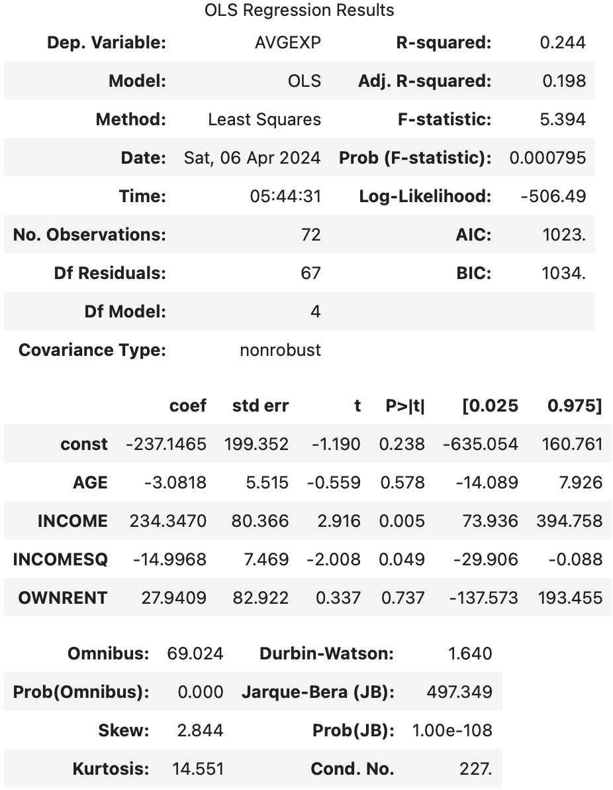

# Interpret OLS Regression Result

OLS (ordinary least square) 是一种基础的线性回归方法。本文的 “OLS result” 特指使用 `statsmodels.api.OLS` 得到的结果。

```py
import statsmodels.api as sm

data = sm.datasets.ccard.load_pandas()
X, y = data.exog.copy(), data.endog.copy()
X = sm.add_constant(X)
res = sm.OLS(y, X).fit()
res.summary()
```

运行以上代码可以得到一个表格：



表格里是评估模型有效性的指标，但是解读起来需要一定的统计基础。本文将逐个解读其含义以及背后的统计学基础知识。

该表格分为了三个子表格，分别表达：

1. 评估模型显著性
2. 评估单个模型参数显著性
3. 评估模型偏差

我们将逐个表格讲解。

## Table 1: Model Overview

跳过简单的字段。

### Df (Degree of freedom)

自由度是一个基础概念，在回归问题中，如果模型自由度=样本数，那么该回归问题退化到一个解方程的问题。因此我们一般希望有较高的 Df Residuals。自由度满足：

> No. Observations  = Df Residuals + Df Model

注意，当我们添加常数项，即：

```py
X = sm.add_constant(X)
```

因为常数项同样需要估计（也可以看作模型的一部分），该公式变为：

> No. Observations  = Df Residuals + Df Model + 1

### R-squared

R-squared 描述该模型对样本输入的拟合度。在本例中，其值为 0.244，即 24.4% 的变化可以被该模型解释。
它定义为：


$$ R^2 = 1 - \frac{\sum_{i=1}^n (y_i - \hat{y})^2}{\sum_{i=1}^n (y_i - \bar{y})^2} $$

即，1 减去（模型误差平方和/以均值为预测值的误差平方和）。

```py
1.0 - res.ssr / res.centered_tss
```
可以通过这个代码检查，算出来 R-squared 是 `0.24357791682194052`，与表格相同。

直观来看，如果模型越准确，则 R-squared 值越接近 1.0。如果直接取样本输出的平均值为预测值，则 R-squared 为 0.0。如果模型甚至不如直接取样本的平均值准确，则 R-squared 可以为负值。

似乎，R-squared 越大，拟合效果越好。但是我们忽略了一个重要的因素，即上面提到的“自由度”。
只要我们往模型中增加参数，必然可以增加 R-squared，直到模型自由度与样本数相同，最终 R-squared = 1.0。但是这样得到的并不是一个有效的模型，而是存在明显的过拟合。

因此，我们需要引入 Adjusted R-squared。

#### Adj. R-squared

Adjusted R-squared 只会在新加入的模型变量有助于提高模型拟合度时增加，加入一个与结果无关的变量会降低它的数值。

它定义为：

$$\begin{aligned}
\bar{R}^2 &= 1 - \frac{SS_{res} / df_{res}}{SS_{tot} / df_{tot}} \\
    &= 1 - \frac{\sum_{i=1}^n (y_i - \hat{y})^2 / (n - p - 1)}{\sum_{i=1}^n (y_i - \bar{y})^2 / (n - 1)} \\
    &= 1 - (1 - R^2)\frac{n-1}{n - p - 1}
\end{aligned}$$

其中 p 是模型参数数量。

```py
1 - (res.ssr / (res.nobs - res.df_model - 1)) / (res.centered_tss / (res.nobs - 1))
```
可以通过这个代码检查，算出来 Adj. R-squared 是 `0.1984183894680266`，与表格相同。

根据公式，有两个推论：

1. Adj. R-squared 可以为负
2. Adj. R-squared <= R-squared

### F-statistic

F-statistic 衡量模型整体的显著性（后面要讲到的 t-statistic 是衡量单个模型参数的显著性）。

我们的原假设是：__模型所有参数为 0__。即，该模型是无效的，无论因子如何变化，都对结果不产生影响。

F-distribution 定义为两个 variance 的比值的分布：

$$ X = \frac{S_1 / df_1}{S_2 / df_2} $$

其中 $S_1$ 服从自由度为 $df_1$ 的 chi-squared 分布，$S_2$ 服从自由度为 $df_2$ 的 chi-squared 分布。


F-value 越大，说明模型相比噪声越显著。即：

$$ \text{F-value} = \frac{\text{variance of y explained by model}}{\text{variance of y explained by error}} $$

```py
(res.ess / res.df_model) / (res.ssr / res.df_resid)
```
可以通过这个代码检查，算出来 F-value 是 `5.393721570932906`，与表格相同。

#### Prob(F-statistic)

F-distribution 由两个自由度的值确定，代入 F-statistic 可以得出其 p-value，就是这里的 Prob(F-statistic)。这个 p-value 的含义是原假设（__模型所有参数为 0__ ）成立情况下，出现当前结果的概率。它的 __值越小，说明这个模型越显著__。

### AIC and BIC

> It stands for Akaike’s Information Criteria and is used for model selection. It penalizes the errors mode in case a new variable is added to the regression equation. It is calculated as number of parameters minus the likelihood of the overall model. A lower AIC implies a better model. Whereas, BIC stands for Bayesian information criteria and is a variant of AIC where penalties are made more severe.


## Table 2: Model Parameter

这个表格主要是逐个参数的分析。

### Coef & std err

`Coef` 一列即模型参数的估计值。对于 OLS 这样的线性模型，这个值表明其对应变量 X_i 的每个单位贡献多少的 y。

`std err`表示该参数估计的不确定性。

### t

`t` 列表示 t-statistic 的值。这里的 t 是指“学生分布”。引入它是为了在不知道 __总体均值__，也不知道 __总体方差__ 的情况下，检查 __两个总体是否有显著不同__。

学生分布是用于描述 __样本均值__ 的分布。假设总体 x 符合正态分布 $N(\mu, \sigma^2)$ （均值方差都是未知）。我们采 n 个样本：

$$\begin{aligned}
\bar{x} &= \frac{x_1 + x_2 + \cdots + x_n}{n} \\
s^2 = \frac{1}{n-1} \sum_{i=1}^n (x_i - \bar{x})^2
\end{aligned}$$

其中 $\bar{x}$ 是对 $\mu$ 的无偏估计，$s^2$ 是对 $\sigma^2$ 的无偏估计。我们 __将样本均值标准化__，它应该符合 __自由度为 n-1__ 的 t 分布：

$$ t = \frac{\bar{x} - \mu_0}{\sqrt{s^2 / n}} \sim t_{n-1} $$

注意，我们并不知道真实的 $\mu$，此处的 $\mu_0$ 正是我们的 __原假设__：该总体的均值为 $\mu_0$。这个计算出来的 t-value 代入 t 分布中就能知道 p-value：


回到我们的表格中，因为我们检验的 __原假设是参数无效__，因此 $\mu_0 = 0$。`coef` 即参数的均值，`std err` 是 coef 的标准差，即 __均值的标准差__，他们直接相除就是 t-statistic：

```py
res.params / res.bse
```

执行这个命令即可以算出表格中的 t-values。

#### P > |t|

这是上面算出来的 t-values 对应的 p-values。将以上 t-values 代入自由度为 n-1 的 t 分布上即可获得 p-values。与 `Prob (F-statistic)` 类似，p-value 越小说明对应的参数越显著。

## Reference

1. [Interpreting OLS results](https://desktop.arcgis.com/en/arcmap/latest/tools/spatial-statistics-toolbox/interpreting-ols-results.htm)

2. [Regression analysis basics](https://desktop.arcgis.com/en/arcmap/latest/tools/spatial-statistics-toolbox/regression-analysis-basics.htm)

3. [Understanding t-test for linear regression](https://stats.stackexchange.com/questions/344006/understanding-t-test-for-linear-regression)
