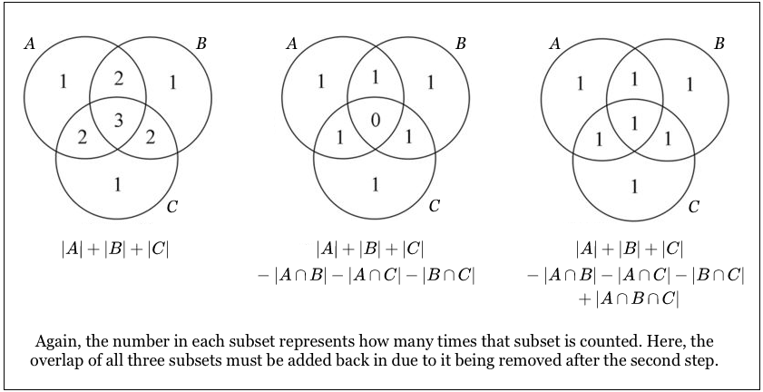

# 概率论经典题

本文收集一些经典的概率问题。

## 例1: 错排问题

> 假设有 N 位男士参加舞会，所有人都将帽子扔到房间中央混在一起，然后每人再随机拿一顶帽子，所有人都拿到别人帽子的概率是多少？

该题并不能简单利用排列组合或者条件概率求解。可以有两种思路解答，即：

1. 容斥恒等式（inclusion-exclusion identity）
2. 得出递推公式

### 容斥恒等式

容斥恒等式用于解决多个相交集合取并集的问题。它的数学定义是：

$$ P(E_1 \cup E_2 \cup \cdots \cup E_n) = \sum_{i=1}^n P(E_i) - \sum_{i_1 < i_2} P(E_{i_1} E_{i_2}) + \cdots + (-1)^{n+1} P(E_1 E_2 \cdots E_n) $$

解释为：n 个事件的并集的概率等于这些事件独自发生的概率之和减去每两个事件同时发生的概率之和，再加上三个事件同时发生的概率之和……

用图片说明比较方便：

图形中的数字是该区域参与计数的次数，如果我们需要取并集，期望能让每个区域只被计数一次。

在本例的场景下，我们设事件 $E_i$ 为 __共有 i 个人恰好拿到自己的帽子__。注意，这个定义 __并未要求其他人不能拿到自己帽子__。我们只要算出 i = 1，2，……，N 的并集概率，再用 1.0 减去这个值，就得出了没有人拿到自己帽子的概率。

我们通过排列组合可以简单得到：

$$ E_i = \frac{C_{N}^{i} (N-i-1)!}{N!} = \frac{1}{i!} $$

这里有个似乎有点反直觉的结论：$E_1 = 1.0$。这个结论是因为我们重复计算了概率，即，这个 $E_1$ 本身与其他 $E_n$ 是有交集的。

代入容斥恒等式可以得到：

$$\begin{align}
P(E_1 \cup E_2 \cup \cdots \cup E_N) &= \sum_{i=1}^{N} (-1)^{i+1} \frac{1}{i!} \\
&= 1.0 - \frac{1}{2!} + \frac{1}{3!} - \cdots + (-1)^{N+1} \frac{1}{N!}
\end{align}$$

因此，没有一个人拿到自己帽子的概率为：

$$ \frac{1}{2!} - \frac{1}{3!} + \cdots + (-1)^{N} \frac{1}{N!} $$

联系泰勒展开：

$$ e^x = 1 + x + \frac{x^2}{2!} + \frac{x^3}{3!} + \cdots + \frac{x^n}{n!}$$

当 N 足够大的时候，该式趋近于 $e^{-1} \approx 0.3679$。

### 递推解法

若不知道容斥不等式，我们也可以通过找到递推关系得到同样的结论。
