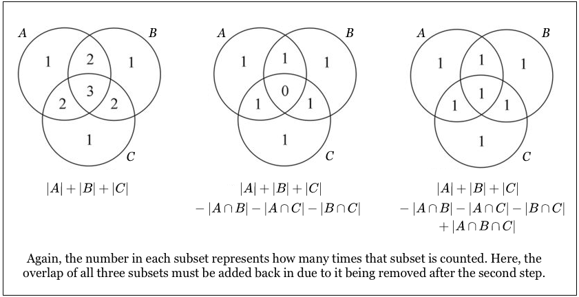

# 概率论经典题

本文收集一些经典的概率问题。

## 容斥恒等式（inclusion-exclusion identity）

容斥恒等式用于解决多个相交集合取并集的问题。它的数学定义是：

$$ P(E_1 \cup E_2 \cup \cdots \cup E_n) = \sum_{i=1}^n P(E_i) - \sum_{i_1 < i_2} P(E_{i_1} E_{i_2}) + \cdots + (-1)^{n+1} P(E_1 E_2 \cdots E_n) $$

解释为：n 个事件的并集的概率等于这些事件独自发生的概率之和减去每两个事件同时发生的概率之和，再加上三个事件同时发生的概率之和……

用图片说明比较方便：



图形中的数字是该区域参与计数的次数，如果我们需要取并集，期望能让每个区域只被计数一次。

### 例题

> 例 1: 假设有 N 位男士参加舞会，所有人都将帽子扔到房间中央混在一起，然后每人再随机拿一顶帽子，所有人都拿到别人帽子的概率是多少？

该题并不能简单利用排列组合或者条件概率求解，需要利用容斥恒等式。

在本例的场景下，我们设事件 $E_i$ 为 __第 i 个人恰好拿到自己的帽子__。注意，这个定义 __并未要求其他人不能拿到自己帽子__。我们只要利用容斥恒等式算出有任一个人拿对帽子的概率，再用 1.0 减去这个值，就得出了没有人拿到自己帽子的概率。但是，我们并不直接用 $E_i$，而是用 k 个人拿对自己帽子的概率进行计算。即直接得出每一个加减项的值。

我们通过排列组合可以得到 __至少 k 个人拿对自己帽子__ 的概率：

$$ a_k = \sum P(E_{i_1}E_{i_2}\cdots E_{i_k}) = \frac{C_{N}^{k} (N-k-1)!}{N!} = \frac{1}{k!} $$

这里有个似乎有点反直觉的结论：$a_1 = 1.0$。这个结论是因为我们重复计算了概率，即，这个 $a_1$ 本身与其他 $a_n$ 是有交集的。

代入容斥恒等式可以得到：

$$\begin{align}
P(E_1 \cup E_2 \cup \cdots \cup E_N) &= \sum_{k=1}^{N} (-1)^{k+1} \frac{1}{k!} \\
&= 1.0 - \frac{1}{2!} + \frac{1}{3!} - \cdots + (-1)^{N+1} \frac{1}{N!}
\end{align}$$

因此，没有一个人拿到自己帽子的概率为：

$$ \frac{1}{2!} - \frac{1}{3!} + \cdots + (-1)^{N} \frac{1}{N!} $$

联系泰勒展开：

$$ e^x = 1 + x + \frac{x^2}{2!} + \frac{x^3}{3!} + \cdots + \frac{x^n}{n!}$$

当 N 足够大的时候，该式趋近于 $e^{-1} \approx 0.3679$。


> 例 2: N 对夫妇随机坐成一圈，计算所有妻子都不坐在丈夫身边的概率

N 对夫妇坐成随机坐一共有 $2N!$ 种排列方式，由于坐成 __一圈__，由于圆圈的对称性，初始位置其实选哪里都一样，还需要除以 $2N$，实际有 $(2N-1)!$ 种排列。

同例题1，我们直接得出每一个加减项的概率。设 __至少 k 对夫妇坐在一起__ 的概率是 $a_k$。其本质是从 N 对夫妇种选取 k 对，每对夫妇视作一个整体来安排位置，类似于只有 $(2N-k)$ 个人的情况。一共有 $(2N - k - 1)!$ 种排列方式，还需考虑，这 k 对夫妇两两可以交换，还需要乘以 $2^k$，得到至少 k 对夫妇坐一起的概率是：

$$\begin{align}
a_k &= \frac{2^k C_{N}^k (2N - 1 - k)!}{(2N - 1)!}
\end{align}$$

利用容斥恒等式，得到 0 对夫妇坐一起的概率为：

$$\begin{align}
P &= 1.0 - \sum_{k=1}^N (-1)^{k+1} a_k \\
  &= 1.0 + \sum_{k=1}^N \frac{(-2)^k C_{N}^k (2N - 1 - k)!}{(2N - 1)!}
\end{align}$$

```py
import math

def calculate_prob(N: int):
  p = 1.0
  for k in range(1, N + 1):
    c_n_k = math.factorial(N) / math.factorial(N - k) / math.factorial(k)
    p += math.pow(-2, k) * math.factorial(2 * N - 1 - k) / math.factorial(2 * N -  1) * c_n_k
  return p
```

将 $N=10$ 输入上面程序得到 0.3395，与书本答案相同。

## Martingale

简单来讲，martingale (鞅) 定义了一类“公平的”随机游戏，即，参与者的期望收益是 0。

### 例题

> 例1: 赌徒破产问题。两个赌徒连续抛一枚硬币，该硬币正面朝上概率为 p，如果正面朝上，B 付给 A 一元，若反面朝上，A 付给 B 一元，直到某一方输完所有钱。假设游戏开始时，A 有 i 元，B 有 n - i 元，那么 A 最后获胜的概率是多大？

假设 A 有 i 元时的胜率为 $P_i$，首先我们写出其初始条件：

$$\begin{align}
P_0 &= 0.0 \\
P_n &= 1.0
\end{align}$$

当 $0 < i \leq n$ 时，上一把 A 要么有 i-1 元并且赢了 1 块，要么有 i+1 元并且输了 1 块。因此得到递推公式：

$$ P_i = p P_{i-1} + (1-p) P_{i+1} $$

因此可以得出(若 $p \neq 1$)：

$$ P_{i+1} - P_i = \frac{p}{1-p} (P_i - P_{i-1})$$

代入初始条件，可以得到：

$$\begin{align}
P_2 - P_1 = \frac{p}{1-p} (P_1 - P_0) &= \frac{p}{1-p} P_1 \\
P_3 - P_2 = \frac{p}{1-p} (P_2 - P_1) &= (\frac{p}{1-p})^2 P_1 \\
 & \vdots \\
P_{i} - P_{i-1} &= (\frac{p}{1-p})^{i-1} P_1 \\
\end{align}$$

令 $\alpha = p/(1-p)$，上式左右相加得到(若 $\alpha \neq 1$)：

$$ P_i - P_1 = \frac{1 - \alpha^{i-1}}{1 - \alpha} \alpha P_1 $$

即

$$P_i = \frac{1 - \alpha^i}{1-\alpha}P_1$$

代入 $P_n = 1.0$， 有：

$$ P_1 = \frac{1-\alpha}{1-\alpha^n} $$

$$ P_i = \frac{1 - \alpha^i}{1 - \alpha^n} $$


特殊情况，当 $p = 0.5$，即 $\alpha = 1.0$ 时：

$$ P_i = \frac{i}{n} $$

其中，$i$ 为 A 的资金，$n$ 为 A 和 B 总资金， $\alpha$ 为 A 和 B 胜率的比值。
