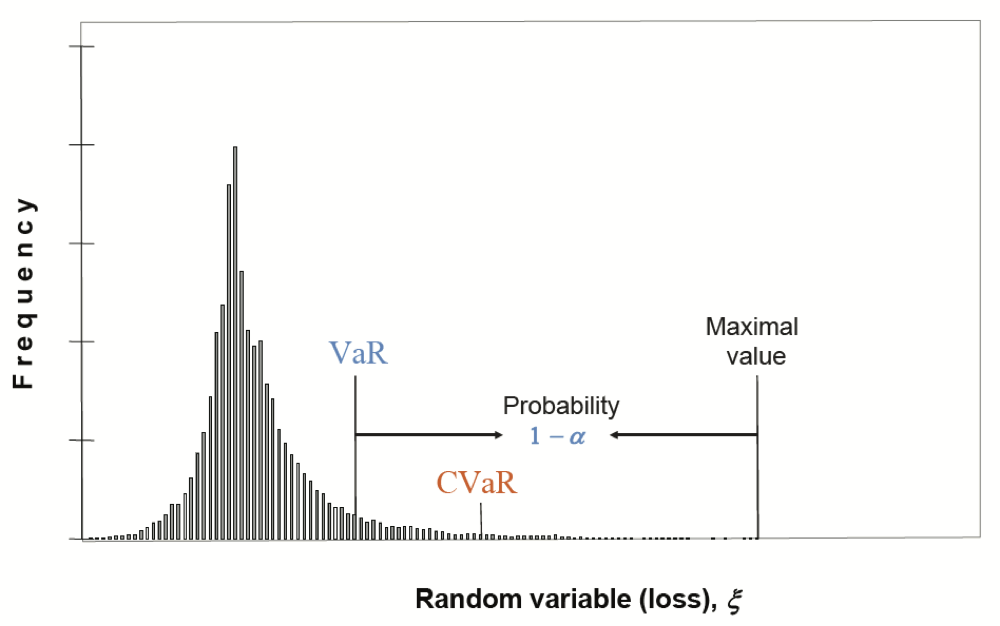

# Portfolio Optimization with CVaR

我们已经在上一篇文章中介绍了 Markowitz 经典的用 variance 作为风险测度的不足：

1. 使用 variance 同时惩罚了下跌和上涨，但是我们实际只需要惩罚下跌的情况
2. 对参数（ 预期收益 $r$ 以及 risk matrix $\Sigma$ ) 非常敏感

因此，JP Morgan 提出了 VaR (Value at Risk)，定义为 __maximum loss with a specified confidence level__，在指定概率 $\alpha$ (say, 0.95) 下损失 $\xi$ 的最大值：

$$ \text{VaR}_{\alpha} = \inf \{ \xi_0 : P(\xi \leq \xi_0) \leq \alpha \} $$

($\inf$ 指下界)。

这个衡量标准并未考虑当损失大于 $\xi_0$ 时的情况，并且，它是一个非凸函数，数学上不方便求解。作为其改进，CVaR 考虑了 $\xi$ 大于 VaR 的情况，并且是一个凸优化问题。

理论上，CVaR 是一个更理想的风险衡量标准。

## 1 Minimize CVaR Approach

我们以最小化 CVaR 为例讲解如何求这个优化问题：

$$\begin{align}
\mathop{\arg \min}_{\mathbf{w}} & & \text{CVaR}_{\alpha} (\mathbf{w}^T \mathbf{r}) \\
\text{s.t.} & & \mathbf{1}^T \mathbf{w} = 1 \\
\end{align}$$

其中：

$$ \text{CVaR}_{\alpha} (\mathbf{w}^T \mathbf{r}) =
  E[\mathbf{w}^T \mathbf{r} | \mathbf{w}^T \mathbf{r} \leq \text{VaR}_{\alpha} (\mathbf{w}^T \mathbf{r})] $$

当然，我们也可以简单将其扩展为其他形式，例如将目标函数改成：

$$ \mathop{\arg \max}_{\mathbf{w}} ~~~~ \mathbf{w}^T \mathbf{r} - \lambda \text{CVaR}_{\alpha} (\mathbf{w}^T \mathbf{r}) $$

这样可以通过调节参数 $\lambda$ 控制风险偏好，不过这里暂时先讲最小化 CVaR 场景。

### 1.1 Auxiliary Function

首先我们引入辅助函数：

$$ \begin{align}
F_{\alpha} (\mathbf{w}, \zeta) &= \zeta + \frac{1}{1 - \alpha} E[(-\mathbf{w}^T \mathbf{r} - \zeta)]^{+} \\
&= \zeta + \frac{1}{1 - \alpha} \int\limits_{-\mathbf{w}^T \mathbf{r} > \zeta} (-\mathbf{w}^T \mathbf{r} - \zeta) P(\mathbf{r}) d\mathbf{r}
\end{align} $$

这是一个 __连续可导的凸函数__，其中 $[x]^{+} = \max(x, 0)$。

对 $\zeta$ 求导，并另导数为 0 以获得极值：

$$ \begin{align}
0 &= \frac{\partial F}{\partial \zeta} \\
&= 1 - \frac{1}{1 - \alpha} \int\limits_{-\mathbf{w}^T \mathbf{r} > \zeta} P(\mathbf{r}) d\mathbf{r} \\
&= 1 - \frac{1}{1 - \alpha} \text{CDF}(\mathbf{r})
\end{align} $$

即：

$$ \text{CDF}(\mathbf{r}) = P(-\mathbf{w}^T \mathbf{r} > \zeta) = 1 - \alpha $$

那么显然有在辅助函数取极值时，$\zeta = \text{VaR}_{\alpha} (-\mathbf{w}^T \mathbf{r})$。

这个辅助函数的妙处在于：

1. 它是一个连续可导的凸函数，求解方便。
2. 在它取得极值时, VaR 和 CVaR 也自然得出：

$$ \text{VaR}_{\alpha} (-\mathbf{w}^T \mathbf{r}) = \zeta^{*} $$

$$ \text{CVaR}_{\alpha} (-\mathbf{w}^T \mathbf{r}) = \min_{\zeta} F_{\alpha} (\mathbf{w}, \zeta) $$

因此，原本的 minimize CVaR 的问题转化为 minimize 这个辅助函数的问题。

### 1.2 Optimize The Auxiliary Function

由于这个“期望”的存在，优化该辅助函数是一个随机优化问题。我们可以通过采样获取其期望的估计。值得注意的是，这里的采样是对于历史回报率的采样。

假设我们对回报率 $r$ 采样了 T 个样本：

$$\begin{align}
F_{\alpha} (\mathbf{w}, \zeta) &= \zeta + + \frac{1}{1 - \alpha} E[(-\mathbf{w}^T \mathbf{r} - \zeta)]^{+} \\
&\approx \zeta + \frac{1}{1 - \alpha} \sum_{t=1}^T [(-\mathbf{w}^T \mathbf{r}_t - \zeta)]^{+}
\end{align}$$

引入辅助变量：

$$ z_t \geq [-\mathbf{w}^T \mathbf{r}_t - \zeta]^{+} $$

优化问题转化为：

$$\begin{align}
\mathop{\arg \min}_{\mathbf{w}, \mathbf{z}, \zeta } & & \zeta + \frac{1}{T(1-\alpha)} \sum_{t=1}^T z_t & \\
\text{s.t.} & & \mathbf{1}^T \mathbf{w} = 1 & \\
 & & z_t \geq 0 & \\
 & & z_t \geq -\mathbf{w}^T \mathbf{r}_t - \zeta, & ~~ \text{for} ~~~~ t = 1,2,\dots,T
\end{align}$$

这是一个典型的线性优化问题，可以通过工具包求解。肉眼可以看出，这个优化问题的 __约束条件与采样个数成正比__。因此，计算量可能是一个不可忽略的隐患，在实际生产中值得注意。

### 1.3 Application Example

Mosek 是一款专业的商用优化求解器。它提供了一个 CVaR 优化的[例子](https://github.com/MOSEK/PortfolioOptimization/blob/main/python/notebooks/ch8_cvar_risk_measure.ipynb)。

该例子中值得注意的部分是：

1. 我们首先用历史数据拟合出多个股票的回报率均值和协方差矩阵，再用这个两个值随机生成 T 个样本，而非直接使用历史数据作为样本。
2. 在实际交易中，我们一般有一个预测的回报率 r，它并不作为样本的一部分。

## Reference

1. [CVaR Portfolio Slides](https://palomar.home.ece.ust.hk/MAFS6010R_lectures/slides_CVaR_portfolio.html)
