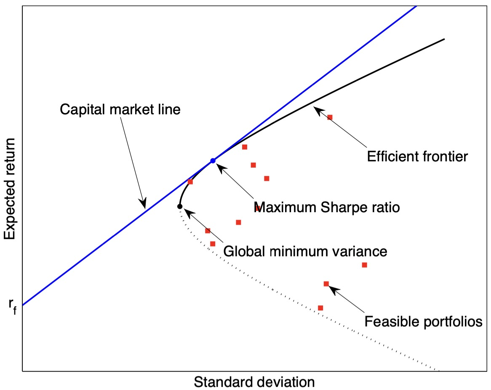
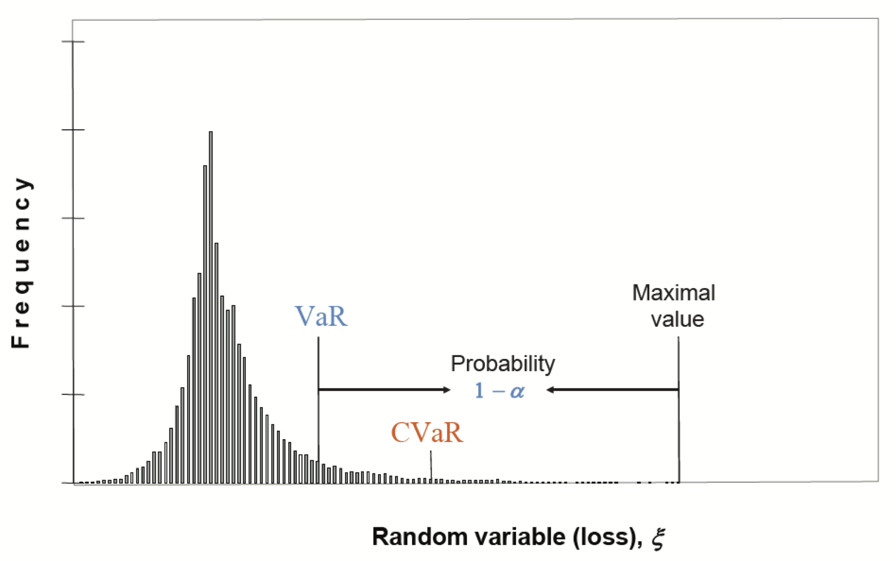

# Portfolio Optimization with Known Parameters

首先引入一些之后使用的符号定义。

In practice, a portfolio deals with a whole universe of $N$ assets. We denote the log-returns of the $N$ assets at time index $t$ with the vector $\mathbf{r}_t \in \mathbb{R}$.

The time index $t$ can denote any arbitrary period such as minutes, days, weeks, etc. The historical data before $t$ is denoted by $\mathcal{F}_{t-1}$.

已知历史数据 $\mathcal{F}_{t-1}$，我们可以将回报率分解为 __期望回报率__ 和 __噪声__：

$$ \mathbf{r}_t = \mathbf{\mu}_t + \mathbf{\varepsilon}_t $$

其中，$\mathbf{\mu}_t$ 是根据历史数据 $\mathcal{F}_{t-1}$ 计算得到的期望收益：

$$\mathbf{\mu}_t = E(\mathbf{r}_t|\mathcal{F}_{t-1})$$

$\mathbf{\varepsilon}_t$ 是均值为 0 的白噪声，其方差为：

$$ \mathbf{\Sigma}_t = E[(\mathbf{r}_t - \mathbf{\mu}_t)(\mathbf{r}_t - \mathbf{\mu}_t)^T|\mathcal{F}_{t-1}] $$

我们通过历史数据主要是希望计算出 $\mathbf{\mu}_t$ 和 $\mathbf{\Sigma}_t$。

如果我们简单假设 $\mathbf{\mu}_t$ 和 $\mathbf{\Sigma}_t$ 不随时间变化，即 $\mathbf{r}_t$ 是独立同分布的，则利用 $1, ..., t-1$ 时刻的历史数据，可以简单估计：

$$ \mathbf{\mu}_t = \mathbf{\mu} = \frac{1}{t-1}\sum_{k=1}^{t-1} \mathbf{r}_k $$

$$ \mathbf{\Sigma}_t = \mathbf{\Sigma} = \frac{1}{t-2} \sum_{k=1}^{t-1} (\mathbf{r}_k - \mathbf{\mu})(\mathbf{r}_k - \mathbf{\mu})^T $$

假设我们总资金为 $B$ 美元，假设每种资产配置的权重为 $\mathbf{w}$，我们有：

- $B \mathbf{w}$ 表示在每种资产投入的资金，可以为负数，代表 short selling
- portfolio 的期望回报率是 $\mathbf{w}^T \mathbf{\mu}$
- portfolio 的风险（即波动率）为 $\sqrt{\mathbf{w}^T \mathbf{\Sigma} \mathbf{w}}$

## 1 Markowitz Mean-Variance Portfolio Optimization

Markowitz mean-variance framework 是组合优化理论的基石。它的目标是寻找回报和风险的最佳 trade-off。

### 1.1 Mean-Variance Trade-Off Optimization

我们可以将组合优化问题表示为：

$$\begin{align}
\mathop{\arg \max}_{\mathbf{w}} & & \mathbf{w}^T \mathbf{\mu} - \lambda \mathbf{w}^T\mathbf{\Sigma}\mathbf{w} \\
\text{s.t.} & &\mathbf{w} \mathbf{\mu} >= \mu_0, \\
& &\mathbf{1}^T \mathbf{w} = 1
\end{align}$$

其中，$\lambda$ 参数反映投资者的风险厌恶程度。

该优化问题可以简单用 Lagrange multiplier 解决，令：

$$ L(\mathbf{w}, \alpha) = \mathbf{w}^T \mathbf{\mu} - \lambda \mathbf{w}^T\mathbf{\Sigma}\mathbf{w} + \alpha (\mathbf{1}^T\mathbf{w} - 1) $$

解方程组：

$$\begin{cases}
\dfrac{\partial L}{\partial \mathbf{w}} &= \mathbf{\mu} - 2\lambda \mathbf{\Sigma}\mathbf{w} + \alpha\mathbf{1} = 0 \\
\dfrac{\partial L}{\partial \alpha} &=  \mathbf{1}^T\mathbf{w} - \mathbf{1} = 0
\end{cases}$$

从 1 式得到：

$$ \mathbf{w} = \frac{1}{2\lambda} \mathbf{\Sigma}^{-1}(\mathbf{\mu} + \alpha\mathbf{1})$$

将 $\mathbf{w}$ 带入 2 式，得到上式的 $\alpha$：

$$ \alpha = \dfrac{2\lambda - \mathbf{1}^T\mathbf{\Sigma}^{-1}\mathbf{\mu} }{\mathbf{1}^T\mathbf{\Sigma}^{-1}\mathbf{1}}$$

至此，该优化问题的最优解确定。

### Efficient Frontier

有效边界

所谓 capital market line，是指当一个交易者可以以无风险利率贷款和借款（理想状况）时的投资组合。

### 1.2 Sharpe Ratio Optimization

夏普率(Sharpe Ratio) 表示每单位风险（波动率）的超额收益：

$$ \text{SR} = \frac{\mathbf{w}^T \mathbf{\mu} - r_f}{\sqrt{\mathbf{w}^T \mathbf{\Sigma} \mathbf{w}}}$$

如果以最大夏普率为优化目标，则组合优化问题可以表示为：

$$\begin{align}
\mathop{\arg \max}_{\mathbf{w}} & & \dfrac{\mathbf{w}^T \mathbf{\mu} - r_f}{\sqrt{\mathbf{w}^T\mathbf{\Sigma}\mathbf{w}}} \\
\text{s.t.} & &\mathbf{1}^T \mathbf{w} = 1
\end{align}$$

该问题不是一个凸优化问题，因此无法直接求解。注意到 $\mathbf{w}^T \mathbf{1} = 1$，可以改写为：

$$\begin{align}
\mathop{\arg \max}_{\mathbf{w}} & & \dfrac{\mathbf{w}^T (\mathbf{\mu} - r_f \mathbf{1})}{\sqrt{\mathbf{w}^T\mathbf{\Sigma}\mathbf{w}}} \\
\text{s.t.} & &\mathbf{1}^T \mathbf{w} = 1
\end{align}$$

这样转化的意义是让目标函数与 $\mathbf{w}$ 的尺度无关。这是显然的，假设把 $\mathbf{w}$ 放大为 $k \mathbf{w}$，由于分子和分母抵消，目标函数不变。

因此，条件 $\mathbf{1}^T \mathbf{w} = 1$ 可以放宽为 $\mathbf{1}^T \mathbf{w} > 0$。因此，我们总能找到一组 $\mathbf{w}$ 使得：

$$\mathbf{w}^T (\mathbf{\mu} - r_f \mathbf{1}) = 1$$

那么，我们就可以固定这个分子为 1，转而寻找使分母最小的解，转化为一个凸优化问题：

$$\begin{align}
\mathop{\arg \min}_{\mathbf{w}} & & \mathbf{w}^T\mathbf{\Sigma}\mathbf{w} \\
\text{s.t.} & &\mathbf{w}^T (\mathbf{\mu} - r_f \mathbf{1}) = 1 \\
& & \mathbf{1}^T \mathbf{w} > 0
\end{align}$$

如果忽略 $\mathbf{1}^T \mathbf{w} > 0$ 这个条件，则上式的解为：

$$\mathbf{w}_{\text{SR}} = \dfrac{\mathbf{\Sigma}^{-1}(\mathbf{\mu} - r_f \mathbf{1})}{(\mathbf{\mu} - r_f \mathbf{1})^T \mathbf{\Sigma}^{-1} (\mathbf{\mu} - r_f \mathbf{1})}$$

这个最优解也有效边界上（图中蓝色的点），它是 capital market line 与 effective frontier 的交点。

## 2 Drawbacks of Markowitz Framework

虽然 Markowitz 的方法简单易懂，但是实际中却并不实用。因为它有两个主要缺陷：

- 波动率并不是一个好的风险评价指标
- 对参数变化极其敏感

### 2.1 Variance Is Not a Good Risk Measurement

在评价一个投资组合的时候，我们更加在意是否出现大的亏损，小额的亏损是可接受的波动，同时，我们不应该去惩罚大额的上涨。

因此，组合优化问题我们可以 __只惩罚大额亏损__ 的情形。比较常用的风险测度是 Conditional Value at Risk (CVaR)。

#### 2.1.1 CVaR Portfolio Optimization

首先介绍 VaR (Value at Risk)。"p VaR" 表示损失高于 VaR 的可能性为 $1-p$。换言之，损失低于 VaR 的概率至多为 $p$。数学上定义，对于随机变量 $X$，$\text{VaR}_{p}(X)$ 就是 $X$ 的 $p-\text{quantile}$。

举例说明，假设某个 portfolio 的 95% VaR 是 100 万。则表示有 5% 的几率这个 portfolio 会亏损 100 万以上。

CVaR 是 VaR 的 __条件期望值__，即加权平均值。如下图所示：

VaR 并不是一个 coherent risk measure，但是 CVaR 是，并且还能转化为凸优化问题。因此，得益于其良好的数学特性，CVaR 得到了广泛的实际应用。

$$ \text{CVaR}_{1 - \varepsilon}(X) = E[X| X > \text{VaR}_{1 - \varepsilon} (X)] $$

假设 $\mathbf{r}$ 是各个资产的回报率，portfolio 亏损是 $-\mathbf{w}^T \mathbf{r}$，则组合优化问题为：

$$\begin{align}
\mathop{\arg \min}_{\mathbf{w}} & & \text{CVaR}_{1 - \varepsilon} (-\mathbf{w}^T \mathbf{r}) \\
\text{s.t.} & & \mathbf{1}^T \mathbf{w} = 1 \\
\end{align}$$

这个优化问题是一个非凸优化。Rockafellar 和 Uryasev 引入了一个辅助函数来将其转化为凸优化问题：

$$\begin{align}
F_{\varepsilon}(\mathbf{w}, \gamma) &= \gamma +  \frac{1}{\varepsilon} E[\mathbf{w}^T \mathbf{r} - \gamma]^{+}\\
&=\gamma + \frac{1}{\varepsilon} \int_{\mathbf{w}^T \mathbf{r} \geq \gamma}[\mathbf{w}^T \mathbf{r} - \gamma]p(x) dx
\end{align}$$

其中：

1. $\gamma = \text{VaR}_{1 - \varepsilon} (X)$，显然，它与 $\mathbf{w}$ 的取值有关。
2. $p(x)$ 是密度函数，代表使得 1 成立的 $x$ 的概率

Rockafellar 和 Uryasev 证明了 $F_{\alpha}(\textbf{w}, \gamma)$ 对于 $\gamma$ 是凸函数。并且有：

$$ \text{CVaR}_{1-\varepsilon} (X) = \mathop{\arg \min}_{\gamma} ~ F_{\varepsilon}(\textbf{w}, \gamma)$$

虽然转化为了一个凸优化问题，但是 $E[\mathbf{w} \mathbf{r} - \gamma]^{+}$ 同样不是很好计算，我们可以使用历史回报 $\mathbf{r}_t$ 来近似：

$$\begin{align}
\mathop{\arg \min}_{\mathbf{w}, \mathbf{z}, \gamma} & & \gamma + \frac{1}{\varepsilon T} \sum_{t=1}^T z_t \\
\text{s.t.} & & \mathbf{1}^T \mathbf{w} = 1 \\
& & - \mathbf{w}^T\mathbf{r}_t - \gamma \leq z_t \leq 0
\end{align}$$

于是，该问题转化为了一个线性规划问题，可以简单求解。

### 2.2 Markowitz Framework Is Too Sensitive

Markowitz 方法的第二个缺点是对参数过于敏感。$\mathbf{\mu}$ 和 $\mathbf{\Sigma}$ 的微小变化都能引起 $\mathbf{w}$ 的大幅变化，导致它要求频繁调整仓位。

## Reference

1. [Portfolio Optimization with Known Parameters](https://palomar.home.ece.ust.hk/papers/2016/Feng&Palomar-FnT2016.pdf)
2. [Asset Allocation using Convex Portfolio Optimization](https://medium.com/where-quant-meets-data-science/asset-allocation-using-convex-portfolio-optimization-f47398d4d613)
